# Ads Setting

>Introduction

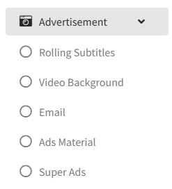 

In the advertisement, administrators can publish information and advertisements for room devices.

## Rolling Subtitles 

>Introduction

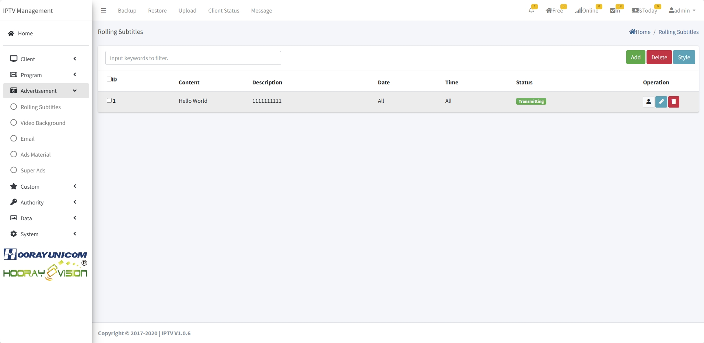 

In hotel IPTV system, the administrator can send different contents of rolling subtitles for different category groups, and the rolling subtitles can be set with font color and background color.

Press `Add` button to create the `Rolling Subtitles`

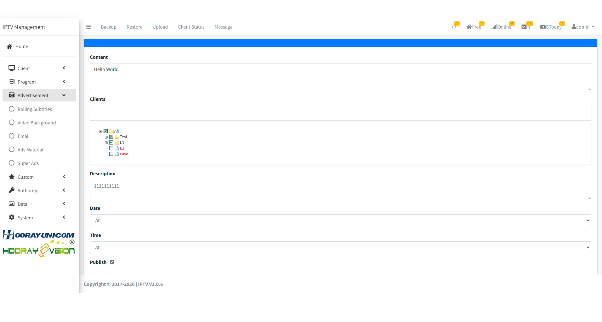 

**Content**:Enter the content to be sent in `Content`

**Client**: In `Client`, select a group or specify a device to send rolling subtitle.

**Description**:Describe the details of this rolling subtitle

**Date**: In `Date`, the administrator can specify the start date and end date of the rolling subtitle.

**Time**: In `Time`, the administrator can specify the start time and end time of the rolling subtitle.

## Email 

>Introduction

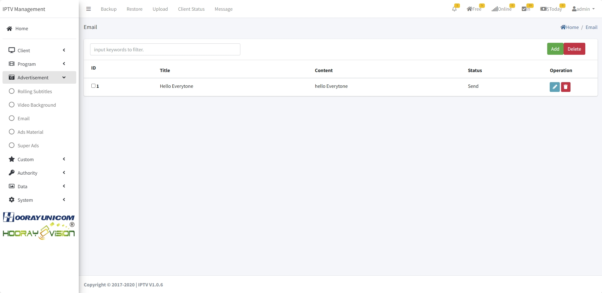 

In the IPTV system, it is possible to send a message in the form of an Email, which can be pushed directly to the corresponding customer, and the customer needs to confirm and open it in the terminal to view the details.

Press `Add` button to create the `Email Message`

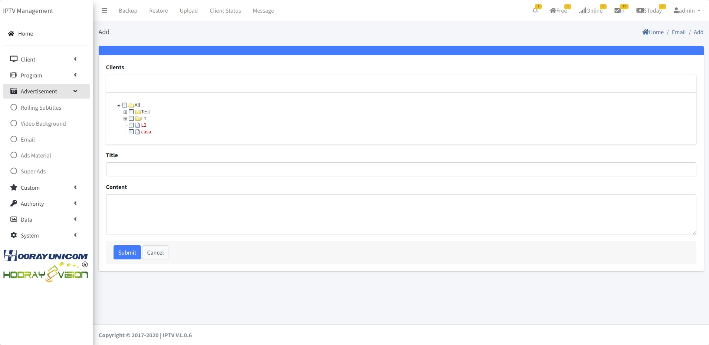

**Client**: In `Client`, select a group or specify a device to send email message.

**Title**: The `Title` is used to display the subject of the email.

**Content**: Enter the content to be sent in Content

## Video Background 

>Introduction

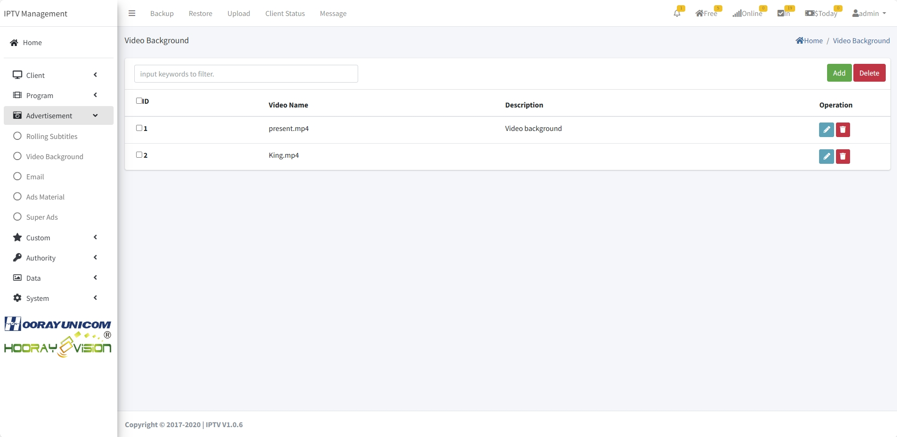 

In the `Video Background` menu, administrators can manage and control the video background. After enabling the video background feature in the setting, upload the MP4 video format file to be displayed in this menu, and the terminal device will automatically download and play the video file.

Press `Add` button to create the `Email Message`

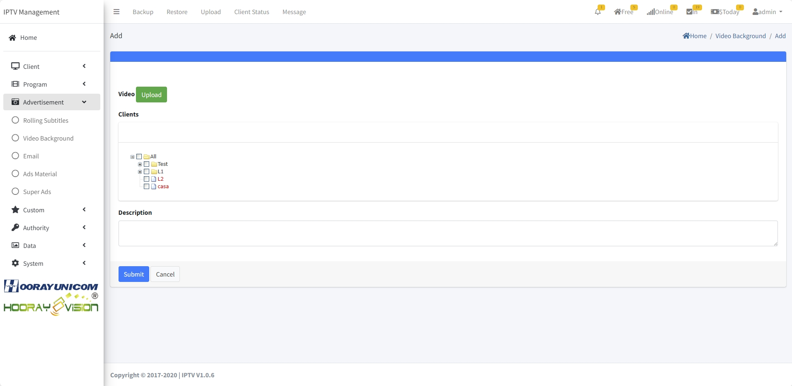

**Video**: Select the MP4 video format file you want to upload at Video, MP4 file needs to meet the video format H.264, audio format AAC.
**Clients**: In `Clients`, select a group or specify a device to display the video background.

**Description**: Describe the details of this video background opreation.

## Ads Material

>Introduction

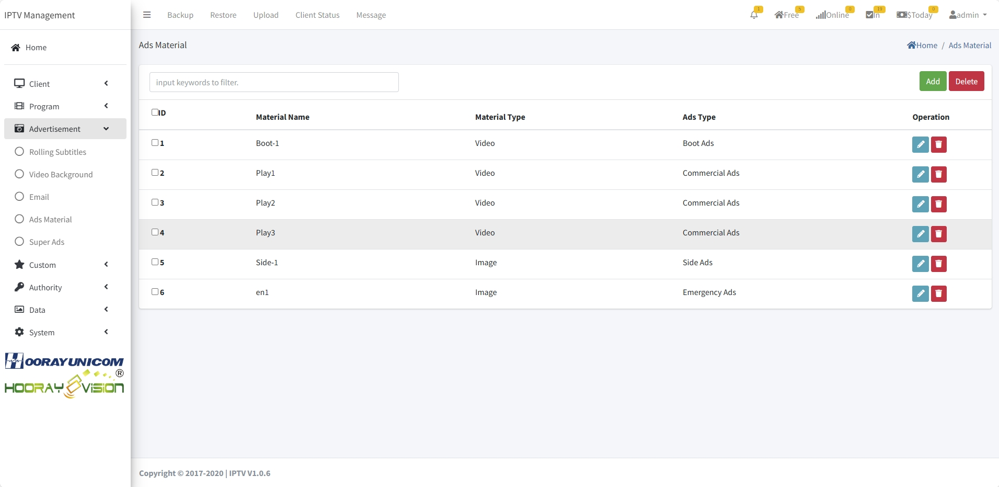

In `Ads Material`, the uploaded material will be displayed in the page as a list, and the administrator can manage the material by using the `Add`, `Edit` and `Delete` buttons.

### Ads Material-Add/Edit

>Introduction

Press `Add` button to upload the material to the list.

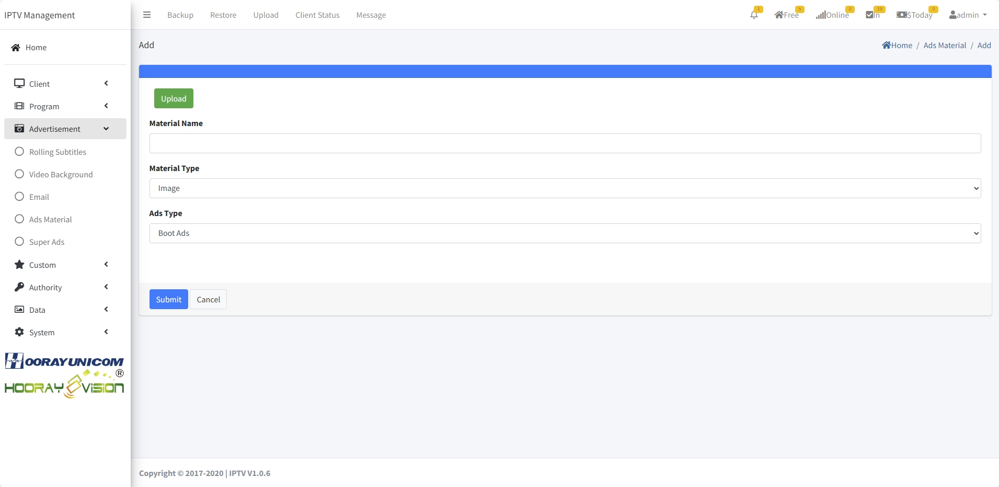

**Upload** Click the `Upload button1`, the administrator selects the image or video material that needs to be uploaded, and the system will automatically upload the selected material into the system.

**Material Name** Label the `Material Name` with the name of the uploaded material, which will be used in subsequent material selections.

**Material Type** In `Material Type`, the administrator needs to assign whether the uploaded material belongs to the `image` category or `video` category, and select the corresponding category by dropping down.

**Ads Type** In `Ads Type`, the administrator needs to scroll down and select the material to the corresponding ad type. there is 4 ad types to select, make sure you select the right ad type to work.

### Ads Material-Delete

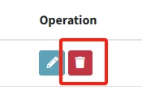 Press `Del` button to del uploaded material from list, when the material del and the Ads still working, the terminal side will not receive the material.

## Super Ads

>Introduction

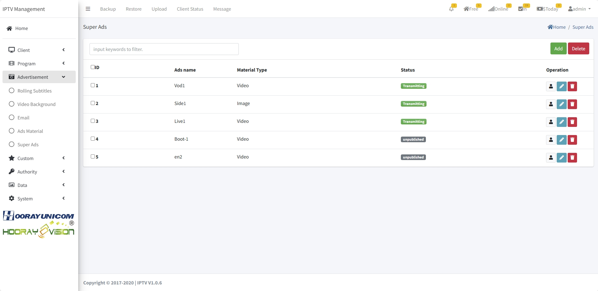

In Super Ads page, administrator needs to create, edit and delete 4 different categories of ads, 4 types of ads are `boot ads`, `Commerical ads`, `side ads` and `emergency ads`.

**Boot Ads**: If there are startup ads in the device group, when the app starts, the app will show picture or video ads first before entering the login screen.

**Commerical Ads**: If there are playing ads in the device group, when the device plays a live or on-demand program, the device needs to finish playing the video ads before he/she can watch the live or on-demand program.

**Side Ads**: When there are ads in the device group, when the device is playing a live program, the picture ads will appear in the live screen, and the ads will appear on one side of the screen and the live program on the other side of the screen.

**Emergency Ads**: All devices will receive pictures or videos sent by IPTV system briefly, when emergency pictures or videos are played, regardless of whether the device is watching or not, as long as the device opens the APP, he/she will receive emergency ads.

### Super Ads-Add/Edit

>Introduction

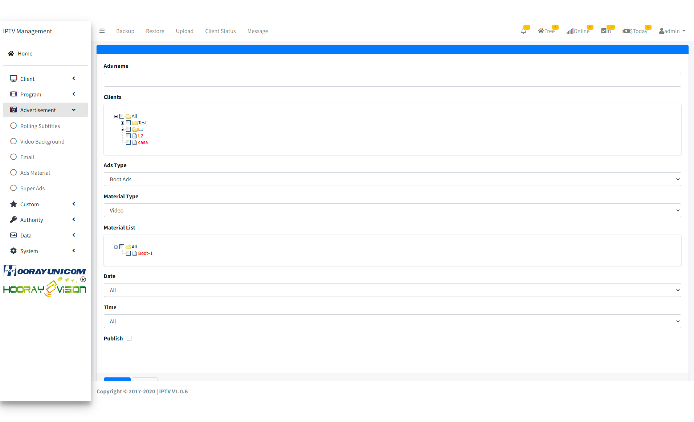

After clicking the `Add` or `Edit` button, the administrator enters the Create or Edit page, where the corresponding information needs to be filled in for the created or modified advertisement.

>Introduction **Boot Ads Setting**

**Ads Name**: The `Ads Name` is used to distinguish between different ads.

**Clients**: The `Client` selects the device group, and the checked group will enable this advertisement to play.

**Ads Type**: Here's `Boot Ads` as an example

**Material Type**: In `Material Type`, Boot Ads supports image and video materials, and selecting the corresponding Type indicates the type that the terminal needs to play when opening the APP.

**Material List**: In the `Material List`, select the corresponding advertisement material by checking it.

**Date**: In `Date`, the administrator can specify the start date and end date of the advertisement.

**Time**: In `Time`, the administrator can specify the start time and end time of the advertisement.

**Publish**: After checking `Pulish`, the advertisement will start to send, if Date and Time have been set, then the advertisement will be processed according to the Date and Time that has been set.

>Introduction **Commercial Ads Setting**

**Ads Name**: The `Ads Name` is used to distinguish between different ads.

**Clients**: The `Client` selects the device group, and the checked group will enable this advertisement to play.

**Ads Type**: Here's `Commercial Ads` as an example

**Material Type**: In `Material Type`, Commercial Ads Only supports video.

**Program Setting**: In `Program Setting`, In Program Setting, the administrator needs to select whether the advertisement is to be used for live or VOD.

**Play Setting**: In `Play Setting`, administrator can select Manual boardcast or Random boardcast, when selecting Manual boardcast, administrator needs to select the advertisement material to be played in Material selection box, if selecting Random boardcast, the terminal will automatically select the advertisement material to be played.

**Material**: In the `Material`, select the corresponding advertisement material by checking it.

**Date**: In `Date`, the administrator can specify the start date and end date of the advertisement.

**Time**: In `Time`, the administrator can specify the start time and end time of the advertisement.

**Publish**: After checking `Pulish`, the advertisement will start to send, if Date and Time have been set, then the advertisement will be processed according to the Date and Time that has been set.

**Turn on channel switching**: In `Turn on channel switching`, Commercial Ads play when a device switches live channel in a live program or switches VOD in VOD program.

>Introduction **Side Ads Setting**

**Ads Name**: The `Ads Name` is used to distinguish between different ads.

**Clients**: The `Client` selects the device group, and the checked group will enable this advertisement to play.

**Ads Type**: Here's `Side Ads` as an example

**Material Type**: In `Material Type`, Side Ads Only supports image.

**Program Setting**: In `Program Setting`, In Program Setting, the administrator needs to select whether the advertisement is to be used for live or VOD.

**Show Position**: In `Show Position`, administrators need to choose the location of the advertisement picture insertion, currently support the left side, the right side, top side and bottom side insertion, the effect is as shown in the figure.

 

 

**Interval**: In `Interval`, the administrator sets the interval time between the appearance of Side Ads. When Side Ads are within the validity period, they are repeatedly displayed on the terminal according to the interval time.

**Material**: In the `Material`, select the corresponding advertisement material by checking it.

**Images show time**: In `Image Show Time`, the administrator sets the image material show time, which is the number of seconds to show a single image, and if there are multiple images, each image will be shown for the same amount of time.

**Date**: In `Date`, the administrator can specify the start date and end date of the advertisement.

**Time**: In `Time`, the administrator can specify the start time and end time of the advertisement.

**Publish**: After checking `Pulish`, the advertisement will start to send, if Date and Time have been set, then the advertisement will be processed according to the Date and Time that has been set.

>Introduction **Emergency Ads Setting**

**Ads Name**: The `Ads Name` is used to distinguish between different ads.

**Clients**: The `Client` selects the device group, and the checked group will enable this advertisement to play.

**Ads Type**: Here's `Emergency Ads` as an example

**Material Type**: In `Material Type`, Emergency Ads supports video and image.

**Program Setting**: In `Program Setting`, In Program Setting, the administrator needs to select whether the advertisement is to be used for live or VOD.

**Interval**: In `Play Setting`, administrator can select Manual boardcast or Random boardcast, when selecting Manual boardcast, administrator needs to select the advertisement material to be played in Material selection box, if selecting Random boardcast, the terminal will automatically select the advertisement materials to be played.

**Material**: In the `Material`, select the corresponding advertisement material by checking it.

**Images show time**: In `Image Show Time`, the administrator sets the image material show time, which is the number of seconds to show a single image, and if there are multiple images, each image will be shown for the same amount of time.

**Date**: In `Date`, the administrator can specify the start date and end date of the advertisement.

**Time**: In `Time`, the administrator can specify the start time and end time of the advertisement.
**Publish**: After checking `Pulish`, the advertisement will start to send, if Date and Time have been set, then the advertisement will be processed according to the Date and Time that has been set.
