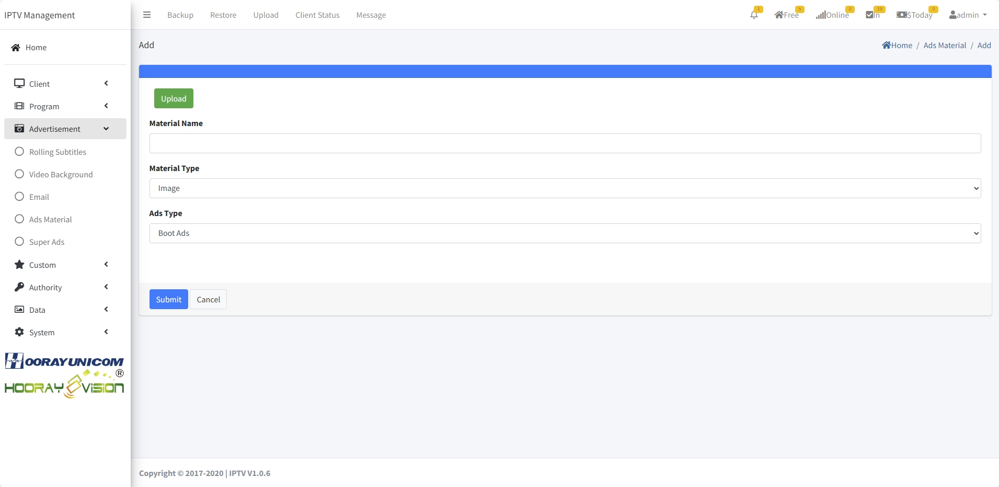

# Ads Setting

>مقدمة

 

في `Advertisement`، يمكن للمسؤولين نشر المعلومات والإعلانات لأجهزة الغرف.

## Rolling Subtitles 

>مقدمة

 

في نظام Hotel IPTV، يمكن للمسؤول إرسال محتويات مختلفة من الترجمات المتحركة لمجموعات فئات مختلفة، ويمكن تعيين الترجمات المتحركة بلون الخط ولون الخلفية.

اضغط على زر `Add` لإنشاء `Rolling Subtitles`

 

**Content**: أدخل المحتوى المراد إرساله في `Content`

**Client**: في `Client`، حدد مجموعة أو حدد جهازًا لإرسال الترجمة المتحركة.

**Description**: صف تفاصيل هذه الترجمة المتحركة

**Date**: في `Date`، يمكن للمسؤول تحديد تاريخ البداية وتاريخ النهاية للترجمة المتحركة.

**Time**: في `Time`، يمكن للمسؤول تحديد وقت البداية ووقت النهاية للترجمة المتحركة.

## Email 

>مقدمة

 

في نظام IPTV، من الممكن إرسال رسالة في شكل `Email`، والتي يمكن دفعها مباشرة إلى العميل المقابل، ويحتاج العميل إلى تأكيدها وفتحها في الجهاز الطرفي لعرض التفاصيل.

اضغط على زر `Add` لإنشاء `Email Message`

**Client**: في `Client`، حدد مجموعة أو حدد جهازًا لإرسال رسالة البريد الإلكتروني.

**Title**: يُستخدم `Title` لعرض موضوع البريد الإلكتروني.

**Content**: أدخل المحتوى المراد إرساله في `Content`

## Video Background 

>مقدمة

 

في قائمة `Video Background`، يمكن للمسؤولين إدارة والتحكم في خلفية الفيديو. بعد تمكين ميزة خلفية الفيديو في الإعدادات، قم بتحميل ملف بتنسيق MP4 ليتم عرضه في هذه القائمة، وسيقوم الجهاز الطرفي تلقائيًا بتنزيل وتشغيل ملف الفيديو.

اضغط على زر `Add` لإنشاء `Email Message`

**Video**: حدد ملف بتنسيق فيديو MP4 الذي تريد تحميله في `Video`، يجب أن يلبي ملف MP4 تنسيق الفيديو H.264، وتنسيق الصوت AAC.
**Clients**: في `Clients`، حدد مجموعة أو حدد جهازًا لعرض خلفية الفيديو.

**Description**: صف تفاصيل عملية خلفية الفيديو هذه.

## Ads Material

>مقدمة

في `Ads Material`، سيتم عرض المواد المحملة في الصفحة كقائمة، ويمكن للمسؤول إدارة المواد باستخدام أزرار `Add` و `Edit` و `Delete`.

### Ads Material-Add/Edit

>مقدمة

اضغط على زر `Add` لتحميل المادة إلى القائمة.

**Upload** انقر على `Upload button1`، يختار المسؤول مادة الصورة أو الفيديو التي يجب تحميلها، وسيقوم النظام تلقائيًا بتحميل المادة المحددة إلى النظام.

**Material Name** قم بتسمية `Material Name` باسم المادة المحملة، والتي سيتم استخدامها في اختيارات المواد اللاحقة.

**Material Type** في `Material Type`، يحتاج المسؤول إلى تحديد ما إذا كانت المادة المحملة تنتمي إلى فئة `image` أو فئة `video`، وحدد الفئة المقابلة عن طريق القائمة المنسدلة.

**Ads Type** في `Ads Type`، يحتاج المسؤول إلى التمرير لأسفل وتحديد المادة إلى نوع الإعلان المقابل. هناك 4 أنواع من الإعلانات للاختيار من بينها، تأكد من اختيار نوع الإعلان الصحيح للعمل.

### Ads Material-Delete

 اضغط على زر `Del` لحذف المادة المحملة من القائمة، عندما يتم حذف المادة والإعلان لا يزال يعمل، لن يتلقى الجانب الطرفي المادة.

## Super Ads

>مقدمة

في صفحة `Super Ads`، يحتاج المسؤول إلى إنشاء وتحرير وحذف 4 فئات مختلفة من الإعلانات، 4 أنواع من الإعلانات هي `boot ads` و `Commerical ads` و `side ads` و `emergency ads`.

**Boot Ads**: إذا كانت هناك إعلانات بدء التشغيل في مجموعة الأجهزة، عندما يبدأ التطبيق، سيعرض التطبيق إعلانات الصور أو الفيديو أولاً قبل الدخول إلى شاشة تسجيل الدخول.

**Commerical Ads**: إذا كانت هناك إعلانات تشغيل في مجموعة الأجهزة، عندما يقوم الجهاز بتشغيل برنامج مباشر أو حسب الطلب، يحتاج الجهاز إلى إنهاء تشغيل إعلانات الفيديو قبل أن يتمكن من مشاهدة البرنامج المباشر أو حسب الطلب.

**Side Ads**: عندما تكون هناك إعلانات في مجموعة الأجهزة، عندما يقوم الجهاز بتشغيل برنامج مباشر، ستظهر إعلانات الصور في الشاشة المباشرة، وستظهر الإعلانات على جانب واحد من الشاشة والبرنامج المباشر على الجانب الآخر من الشاشة.

**Emergency Ads**: ستتلقى جميع الأجهزة صورًا أو مقاطع فيديو يرسلها نظام IPTV بشكل مؤقت، عندما يتم تشغيل صور أو مقاطع فيديو الطوارئ، بغض النظر عما إذا كان الجهاز يشاهد أم لا، طالما أن الجهاز يفتح التطبيق، فسوف يتلقى إعلانات الطوارئ.

### Super Ads-Add/Edit

>مقدمة

بعد النقر على زر `Add` أو `Edit`، يدخل المسؤول إلى صفحة الإنشاء أو التحرير، حيث يجب ملء المعلومات المقابلة للإعلان الذي تم إنشاؤه أو تعديله.

>Introduction **Boot Ads Setting**

**Ads Name**: يُستخدم `Ads Name` للتمييز بين الإعلانات المختلفة.

**Clients**: يحدد `Client` مجموعة الأجهزة، وستقوم المجموعة المحددة بتشغيل هذا الإعلان.

**Ads Type**: هنا `Boot Ads` كمثال

**Material Type**: في `Material Type`، تدعم إعلانات التمهيد مواد الصور والفيديو، واختيار النوع المقابل يشير إلى النوع الذي يحتاج الطرفية لتشغيله عند فتح التطبيق.

**Material List**: في `Material List`، حدد مادة الإعلان المقابلة عن طريق تحديدها.

**Date**: في `Date`، يمكن للمسؤول تحديد تاريخ البدء وتاريخ الانتهاء للإعلان.

**Time**: في `Time`، يمكن للمسؤول تحديد وقت البدء ووقت الانتهاء للإعلان.

**Publish**: بعد تحديد `Pulish`، سيبدأ الإعلان في الإرسال، إذا تم تعيين التاريخ والوقت، فسيتم معالجة الإعلان وفقًا للتاريخ والوقت المحددين.

>مقدمة **Commercial Ads Setting**

**Ads Name**: يُستخدم `Ads Name` للتمييز بين الإعلانات المختلفة.

**Clients**: يحدد `Client` مجموعة الأجهزة، وستقوم المجموعة المحددة بتشغيل هذا الإعلان.

**Ads Type**: هنا `Commercial Ads` كمثال

**Material Type**: في `Material Type`، تدعم الإعلانات التجارية الفيديو فقط.

**Program Setting**: في `Program Setting`، يحتاج المسؤول إلى تحديد ما إذا كان الإعلان سيُستخدم للبث المباشر أو VOD.

**Play Setting**: في `Play Setting`، يمكن للمسؤول تحديد البث اليدوي أو البث العشوائي، عند تحديد البث اليدوي، يحتاج المسؤول إلى تحديد مادة الإعلان المراد تشغيلها في مربع تحديد المواد، وإذا تم تحديد البث العشوائي، فسيقوم الطرفية تلقائيًا بتحديد مادة الإعلان المراد تشغيلها.

**Material**: في `Material`، حدد مادة الإعلان المقابلة عن طريق تحديدها.

**Date**: في `Date`، يمكن للمسؤول تحديد تاريخ البدء وتاريخ الانتهاء للإعلان.

**Time**: في `Time`، يمكن للمسؤول تحديد وقت البدء ووقت الانتهاء للإعلان.

**Publish**: بعد تحديد `Pulish`، سيبدأ الإعلان في الإرسال، إذا تم تعيين التاريخ والوقت، فسيتم معالجة الإعلان وفقًا للتاريخ والوقت المحددين.

**Turn on channel switching**: في `Turn on channel switching`، يتم تشغيل الإعلانات التجارية عندما يقوم الجهاز بتبديل القناة المباشرة في برنامج مباشر أو تبديل VOD في برنامج VOD.

>مقدمة **Side Ads Setting**

**Ads Name**: يُستخدم `Ads Name` للتمييز بين الإعلانات المختلفة.

**Clients**: يحدد `Client` مجموعة الأجهزة، وستقوم المجموعة المحددة بتشغيل هذا الإعلان.

**Ads Type**: هنا `Side Ads` كمثال

**Material Type**: في `Material Type`، تدعم الإعلانات الجانبية الصور فقط.

**Program Setting**: في `Program Setting`، يحتاج المسؤول إلى تحديد ما إذا كان الإعلان سيُستخدم للبث المباشر أو VOD.

**Show Position**: في `Show Position`، يحتاج المسؤولون إلى اختيار موقع إدراج صورة الإعلان، حاليًا يدعم الإدراج من الجانب الأيسر والجانب الأيمن والجانب العلوي والجانب السفلي، والتأثير كما هو موضح في الشكل.

 

 

**Interval**: في `Interval`، يقوم المسؤول بتعيين الفترة الزمنية بين ظهور الإعلانات الجانبية. عندما تكون الإعلانات الجانبية ضمن فترة الصلاحية، يتم عرضها بشكل متكرر على الطرفية وفقًا للفترة الزمنية.

**Material**: في `Material`، حدد مادة الإعلان المقابلة عن طريق تحديدها.

**Images show time**: في `Image Show Time`، يقوم المسؤول بتعيين وقت عرض مادة الصورة، وهو عدد الثواني لعرض صورة واحدة، وإذا كانت هناك صور متعددة، فسيتم عرض كل صورة لنفس المدة الزمنية.

**Date**: في `Date`، يمكن للمسؤول تحديد تاريخ البدء وتاريخ الانتهاء للإعلان.

**Time**: في `Time`، يمكن للمسؤول تحديد وقت البدء ووقت الانتهاء للإعلان.

**Publish**: بعد تحديد `Pulish`، سيبدأ الإعلان في الإرسال، إذا تم تعيين التاريخ والوقت، فسيتم معالجة الإعلان وفقًا للتاريخ والوقت المحددين.

>مقدمة **Emergency Ads Setting**

**Ads Name**: يُستخدم `Ads Name` للتمييز بين الإعلانات المختلفة.

**Clients**: يحدد `Client` مجموعة الأجهزة، وستقوم المجموعة المحددة بتشغيل هذا الإعلان.

**Ads Type**: هنا `Emergency Ads` كمثال

**Material Type**: في `Material Type`، تدعم إعلانات الطوارئ الفيديو والصور.

**Program Setting**: في `Program Setting`، يحتاج المسؤول إلى تحديد ما إذا كان الإعلان سيُستخدم للبث المباشر أو VOD.

**Interval**: في `Play Setting`، يمكن للمسؤول تحديد البث اليدوي أو البث العشوائي، عند تحديد البث اليدوي، يحتاج المسؤول إلى تحديد مادة الإعلان المراد تشغيلها في مربع تحديد المواد، وإذا تم تحديد البث العشوائي، فسيقوم الطرفية تلقائيًا بتحديد مواد الإعلان المراد تشغيلها.

**Material**: في `Material`، حدد مادة الإعلان المقابلة عن طريق تحديدها.

**Images show time**: في `Image Show Time`، يقوم المسؤول بتعيين وقت عرض مادة الصورة، وهو عدد الثواني لعرض صورة واحدة، وإذا كانت هناك صور متعددة، فسيتم عرض كل صورة لنفس المدة الزمنية.

**Date**: في `Date`، يمكن للمسؤول تحديد تاريخ البدء وتاريخ الانتهاء للإعلان.

**Time**: في `Time`، يمكن للمسؤول تحديد وقت البدء ووقت الانتهاء للإعلان.

**Publish**: بعد تحديد `Pulish`، سيبدأ الإعلان في الإرسال، إذا تم تعيين التاريخ والوقت، فسيتم معالجة الإعلان وفقًا للتاريخ والوقت المحددين.
