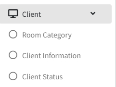
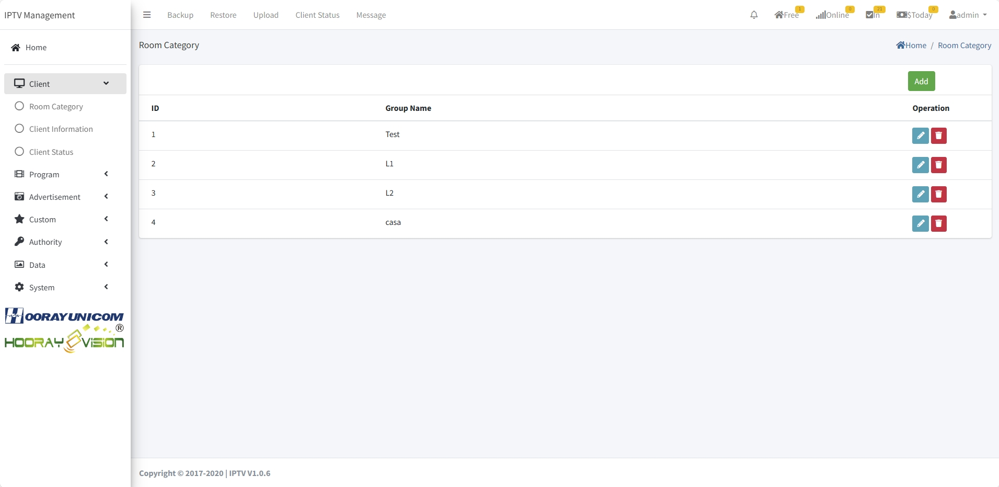
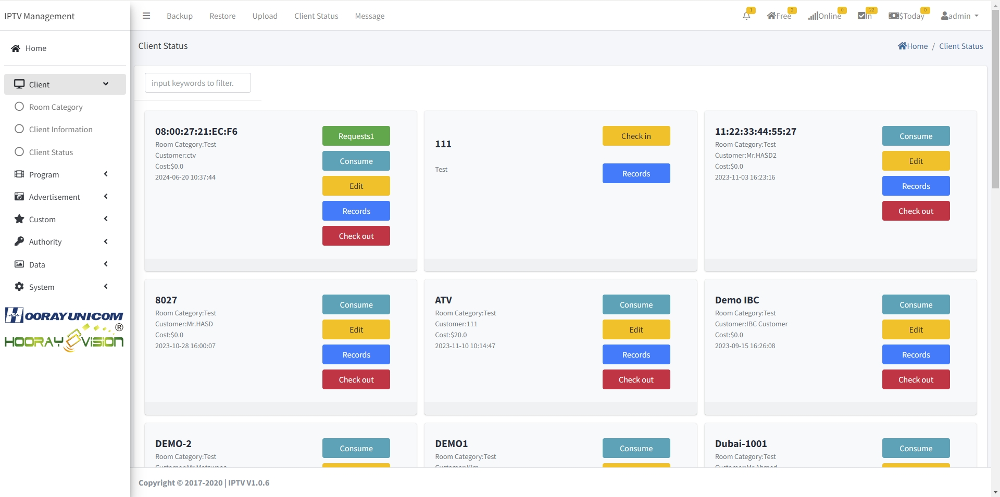

# Client Management Setting

>مقدمة

في `Client Menu`، يحتاج المسؤول إلى تكوين معلومات المعدات المقابلة في `Room Category` و `Client Information` و `Client Status` وإجراء عمليات تسجيل الدخول والخروج للزوار.

## Room Category

>مقدمة

في `Room Category`، يحتاج المسؤول إلى تعيين اسم التصنيف المنطقي، في نظام Hooray hotel IPTV يُستخدم التصنيف المنطقي لتمييز المعدات التي تنتمي إلى طوابق مختلفة أو استخدامات مختلفة، على سبيل المثال، إذا كان هناك أكثر من قطعة معدات موضوعة في الطابق الأول، فقم بتعيين اسم التصنيف كـ L1، وهكذا.

اضغط على زر `Add` لإنشاء `Room Category`

1. **Group Name**: في `Group Name`، يقوم المسؤول بتعيين اسم الفئة المنطقية.

## Client Information

>مقدمة

في `Client information`، تعرض هذه الصفحة جميع الأجهزة المتصلة وغير المتصلة حاليًا، يمكن للمسؤول إدارة اسم الجهاز و `WIFI hotspot status` (مهجور) من خلال هذه الصفحة، وفي قائمة الأجهزة، يمكنك عرض التصنيف الذي ينتمي إليه الجهاز ورقم الغرفة المقابل ومعلومات الجهاز الأخرى وما إلى ذلك.

اضغط على زر `Add` لإنشاء `Client Information`

 

**MAC Address** في `Mac Address`، إذا لم يكن الجهاز في `Client Information`، فيمكن إضافته يدويًا عن طريق إدخال عنوان MAC، وإذا تم اكتشاف الجهاز بواسطة خادم hotel IPTV، فلا يمكن إلا عرض MAC.

**IP** في `IP`، يعرض معلومات حول عنوان IP لآخر مرة كان فيها الجهاز متصلاً.

**Room Name** في `Room Name`، أدخل اسم الغرفة التي ينتمي إليها الجهاز.

**Room Category** في `Room Category`، حدد فئة الغرفة التي ينتمي إليها الجهاز.

**WiFi** في `WIFI`، يمكن للمسؤول تشغيل وإيقاف وظيفة نقطة الاتصال للجهاز، ويمكنه تعيين اسم WIFI لوظيفة نقطة الاتصال وكلمة المرور. بسبب حماية Google لنظام Android، لم يعد من الممكن تمكين هذه الميزة.

## Client Status

>مقدمة

في صفحة `Client Status`، يمكن للمسؤول إجراء عمليات تسجيل الدخول والخروج للمعدات المقابلة، ويمكن للمعدات غير المسجلة الدخول عرض معلومات العملاء المسجلين مسبقًا وسجلات استهلاكهم. يمكن للأجهزة المسجلة الدخول إجراء عمليات الطلبات عبر الإنترنت، وسجلات الاستهلاك، وتحرير معلومات الضيف، وعرض سجلات تسجيل الدخول السابقة وعمليات تسجيل الخروج.

**Request** انقر على زر `request`، وسينتقل إلى صفحة عملية الحجز الحالية للضيف، في الصفحة، يمكن للمسؤول عرض حجز الضيف للغرفة، ويقوم المسؤول من خلال زر العملية بتأكيد الطلب أو حذف الطلب. بعد العملية المقابلة، سيتم إرجاع النتيجة إلى الضيف وعرض حالة تطبيق الفندق.

**Consume** انقر على زر `Consume` وسيتم إعادة توجيهك إلى صفحة سجل الاستهلاك الحالي للضيف، والتي تعرض الطلب المكتمل للضيف الحالي من التطبيق.

**Edit** انقر على زر `Edit`، يمكن للمسؤول إعادة تعيين اسم ضيف تسجيل الدخول ورسالة الترحيب.

**Records** انقر على زر `Record`، يمكن للمسؤول عرض سجل تسجيل الدخول للجهاز، بما في ذلك اسم الشاغل ووقت تسجيل الدخول ووقت تسجيل الخروج وسجل الاستهلاك.

**Check-Out** بعد النقر على زر `Check-Out`، يدخل الجهاز تلقائيًا إلى حالة تسجيل الخروج، حيث تكون جميع الخدمات غير متاحة.

**Check-In** انقر على زر `Check-In`، يحتاج المسؤول إلى ملء اسم عميل تسجيل الدخول ورسالة الترحيب المعروضة على الشاشة الكبيرة.