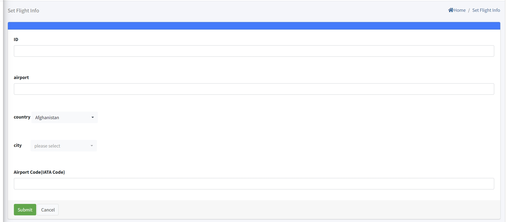

# Flight Info Setting

> مقدمة

في `Flight Info Menu`، يمكن للمسؤولين إضافة وحذف وتعديل معلومات المطارات في مدن الوجهة. سيحصل نظام IPTV تلقائيًا على معلومات وصول ومغادرة الرحلات لهذه المطارات من خلال واجهة طرف ثالث بناءً على معلومات المطار، ثم يرسل هذه المعلومات إلى الأجهزة الطرفية من خلال الواجهة. ستعرض الأجهزة الطرفية المعلومات على الشاشة.

اضغط على زر `Add` لإنشاء معلومات المطار الجديدة

**ID**: رقم المعرف هو رقم التعريف. كلما كان رقم التعريف أصغر، كان موضعه أعلى في القائمة. تجدر الإشارة إلى أن رقم التعريف يجب أن يكون فريدًا.

**Airport**: يشير `Airport` إلى اسم المطار الذي يحتاج إلى عرضه على الجهاز.

**Country**: يمثل `Country` البلد الذي يقع فيه المطار.

**City**: يمثل `City` المدينة التي يقع فيها المطار.

**Airport Code(IATA Code)**: في عمود "Airport Code (IATA Code)"، تحتاج إلى ملء رمز المطار بدقة. إذا لم تتمكن من توفير رمز المطار بدقة، يمكنك الحصول عليه من خلال محركات البحث أو وسائل أخرى. فقط بعد ملء الرمز الصحيح يمكنك الحصول على معلومات وصول ومغادرة الرحلات الصحيحة.

> Terminal Screen

