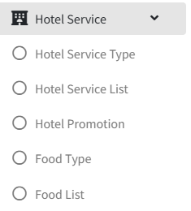

# Food Setting

>مقدمة

 

في `Hotel Service`، يقوم المسؤولون بتكوين أنواع الطعام وعناصر القائمة لنظام طلب IPTV داخل الغرفة، ويمكنهم عرض وقبول وإكمال أو إلغاء طلبات الضيوف في الوقت الفعلي. يقدم الضيوف الطلبات مباشرة من التلفزيون، ويدير المسؤولون سير عمل الطلب بالكامل من خلال المنصة.

## Food Type

>مقدمة

 

في `Food Type`، يقوم المسؤول بإنشاء وتعديل وحذف فئات العناصر.

اضغط على زر `Add` لإنشاء فئة عنصر جديدة

**ID**: في `ID`، ينشئ نظام IPTV تلقائيًا رقم معرف، والذي يستخدم لترتيب الفئات المختلفة، كلما كان الرقم أصغر، كلما كان العرض أكثر تقدمًا

**Name**: يُستخدم `Name` لعرض طعام الفئة.

## Food List

>مقدمة

في صفحة `Food List`، يدير المسؤول عناصر الطعام المتاحة للطلب داخل الغرفة عن طريق إنشاء أو تحرير أو حذف المنتجات حسب الحاجة.

اضغط على زر `Add` لإنشاء عنصر جديد للتسوق عبر الإنترنت.

**Image**: في `Image`، قم بتحميل صور المنتج في الصورة وسيتم عرض الصور على الجهاز، حاليًا يدعم تحميل صورة واحدة فقط.

**Backgroud picture**: الصورة الخلفية التي سيتم عرضها على الجهاز عندما يختار المستخدم أو ينقر على عنصر الطعام.

**Name**: يُستخدم `Name` لتحديد اسم الطعام المعروض في الجهاز.

**Price**: في `Price`، يُستخدم لعرض سعر الوحدة الذي يُباع به الطعام.

**Food Type**: حدد `Food Type` للطعام، وسيظهر الطعام في قائمة الفئة المقابلة على الجهاز.

**Description**: في `Description` يُستخدم لوصف المعلومات المحددة والتفاصيل حول هذا الطعام.

## Order Status

>مقدمة

 

في هذه الصفحة، يمكن للمسؤول عرض تفاصيل طلب العنصر الذي أرسله المشترك من الجهاز. عندما يتلقى المسؤول طلب المشترك، يمكنه `استلام` الطلب باستخدام زر RECEIVE أو `إلغاء` طلب المشترك باستخدام زر DELETE. بعد قبول طلب المشترك، عندما يتم إكمال الطلب، يمكن للمسؤول النقر فوق زر Finish مرة أخرى لـ `إكمال` عملية الطلب بالكامل.