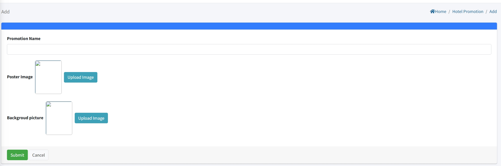

# إعداد ترويج الفندق

> مقدمة

في قسم "ترويج الفندق"، يمكن للمسؤولين إنشاء وتعديل وحذف إعلانات ترويج الفندق.

انقر على زر "إضافة" لإنشاء ترويج فندقي جديد.

**اسم الترويج**: أدخل اسمًا فريدًا لهذا الترويج الفندقي. سيظهر هذا الاسم مباشرة على جهاز IPTV للضيوف.

**صورة الملصق**: قم بتحميل الصورة المصغرة أو صورة الغلاف الرئيسية لهذا الترويج. ستظهر هذه الصورة في قائمة الترويج على IPTV. (يمكن تحميل صورة واحدة فقط.)

**صورة الخلفية**: قم بتحميل صورة خلفية لصفحة تفاصيل الترويج. عند نقر الضيف على الترويج، ستُعرض هذه الصورة كخلفية رئيسية.

## إضافة تفاصيل ترويج الفندق

> مقدمة

يظهر هذا القسم عند تعديل ترويج موجود. يمكنك هنا تحميل صور إضافية لتقديم مزيد من التفاصيل حول النشاط أو الخدمة للضيوف.

**دعم صور متعددة:** بخلاف الحقول أحادية الصورة (الملصق والخلفية)، يمكنك هنا تحميل عدة صور لصفحة تفاصيل الترويج.

**صورة**: قم بتحميل صور ترويج الفندق ليتم عرضها على الجهاز. حاليًا، يمكن تحميل صورة واحدة فقط.

**المحتوى**: استخدم "المحتوى" لوصف معلومات وتفاصيل محددة حول الصورة المحملة.
