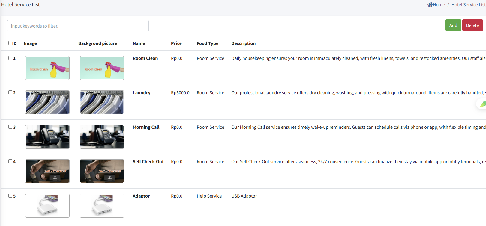

# Hotel Service

>مقدمة

 

تتيح وحدة `Hotel Service` للمسؤولين تكوين فئات الخدمة والعناصر لنظام IPTV داخل الغرفة. يمكن للمسؤولين عرض وقبول وإكمال أو إلغاء طلبات الضيوف في الوقت الفعلي. يمكن للضيوف تقديم طلبات الخدمة مباشرة من التلفزيون، بينما يدير المسؤولون سير عمل الطلب بالكامل من خلال المنصة.

## Hotel Service Type

>مقدمة

 

في `Hotel Service Type`، يقوم المسؤول بإنشاء وتعديل وحذف فئات خدمة الفندق.

اضغط على زر `Add` لإنشاء فئة خدمة فندق جديدة

**ID**: في `ID`، ينشئ نظام IPTV تلقائيًا رقم معرف، والذي يُستخدم لفرز الفئات المختلفة، كلما كان الرقم أصغر، كان العرض أكثر تقدمًا

**Name**: يُستخدم `Name` لعرض خدمة الفندق للفئة.

## Hotel Service List

>مقدمة

في صفحة `Hotel Service List`، يدير المسؤول عناصر خدمة الفندق المتاحة للطلب داخل الغرفة عن طريق إنشاء أو تحرير أو حذف المنتجات حسب الحاجة.

اضغط على زر `Add` لإنشاء خدمة جديدة للطلب عبر الإنترنت.

**Image**: في `Image`، قم بتحميل صور خدمة الفندق في `Image` ويتم عرض الصور على الجهاز الطرفي، حاليًا يتم دعم تحميل صورة واحدة فقط.

**Backgroud picture**: صورة الخلفية التي سيتم عرضها على الجهاز الطرفي عندما يختار المستخدم أو ينقر على عنصر خدمة الفندق.

**Name**: يُستخدم `Name` لتحديد اسم خدمة الفندق المعروضة في الجهاز الطرفي.

**Price**: في `Price`، يُستخدم لعرض سعر الوحدة الذي تُباع به خدمة الفندق.

**Hotel Service Type**: حدد `Hotel Service Type` للخدمة، وستظهر الخدمة في قائمة الفئة المقابلة على الجهاز الطرفي.

**Description**: في `Description` يُستخدم لوصف معلومات وتفاصيل محددة حول خدمة الفندق هذه.

## Order Status

>مقدمة

 

في هذه الصفحة، يمكن للمسؤول عرض تفاصيل طلب العنصر المرسل من المشترك من الجهاز الطرفي. عندما يتلقى المسؤول طلب المشترك، يمكنه `receive` الطلب باستخدام زر RECEIVE أو `cancel` طلب المشترك باستخدام زر DELETE. بعد قبول طلب المشترك، عند اكتمال الطلب، يمكن للمسؤول النقر على زر Finish مرة أخرى لـ `complete` عملية الطلب بالكامل.