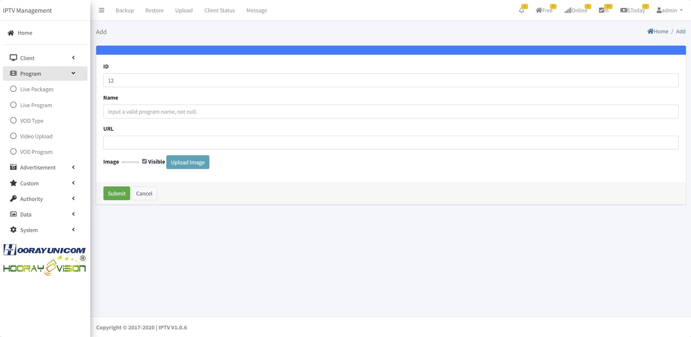

# Live Setting

>مقدمة

تسمح قائمة البرنامج للمسؤولين بإنشاء وتعديل وحذف إعدادات `Live` و `VOD`.

## Live Packages

>مقدمة

في ميزة Live Package، يمكن للمسؤولين إنشاء وتعديل وحذف فئات مصادر القنوات المباشرة. من خلال إنشاء فئات مباشرة، يمكن للمسؤولين تنظيم مصادر القنوات المباشرة المقابلة بشكل أفضل وربطها بالفئات المعنية. يتيح ذلك للمشتركين البحث بشكل ملائم وتصنيف القنوات المباشرة التي يريدون مشاهدتها.

يمكن للمسؤولين إنشاء فئات مباشرة جديدة بالنقر فوق زر `Add`. تحتاج كل فئة قناة إلى أن تكون مرتبطة بمصدر قناة مباشرة مقابل؛ يمكن لكل فئة قناة تحميل ملصق لتحديد اختلافها.

1. **ID**: يتم إنشاء `ID` تلقائيًا بواسطة النظام، كلما كان المعرف أصغر، كلما كان أعلى في الفئة المباشرة، يمكنك ضبط المعرف في صفحة التحرير لترتيب ترتيب الفئات المختلفة.

2. **Name**: يميز `Name` بين أسماء الفئات المختلفة.

3. **Price**: يمكن للمسؤول تعيين `price` لرسوم الفئة المباشرة، عندما يكون السعر 0، فهذا يعني أن الفئة مجانية، إذا لم يكن السعر 0، سيُطلب من الضيف الوصول إلى الفئة المباشرة بالشحن.

4. **Image**: عن طريق تحميل `images` الفئة المقابلة، سيتم عرض `image` في قائمة فئة مباشرة لصندوق الإعداد.

!>  **تحذير: يجب أن يكون حجم صورة تحميل Live Package 300x210**

5. **Live Program Select**: لـ `select` البرنامج المباشر المقابل للفئة المباشرة المحددة، يحتاج المسؤول إلى تحديد البرنامج المباشر المقابل للفئة المباشرة الحالية، وسيتم عرض البرنامج المباشر المحدد تحت الفئة المقابلة في قائمة فئة المحطة المباشرة.

6. **STB Select**: يحدد المسؤول الجهاز المقابل في قائمة الأجهزة، والجهاز المحدد فقط يمكنه عرض هذه الفئة المباشرة.

## Live Program

>مقدمة

في قسم "Live Program"، يمكن للمسؤولين إضافة برامج مباشرة يدويًا أو دفعة إلى الصفحة، ثم إضافة برامج مباشرة، يمكن للمسؤولين تحرير وحذف البرامج المباشرة المحددة. وهو يدعم بث UDP(unicast)/RTP(unicast)/HTTP-TS/HTTP-FLV/RTMP/RTMPS/HLS/DASH وبروتوكولات رئيسية أخرى.

يمكن للمسؤولين إنشاء قناة مباشرة جديدة بالنقر فوق زر `Add`.

1.  **ID** : يتم إنشاء هذا `ID` تلقائيًا بواسطة النظام ويمكن تحريره يدويًا. عند التحرير يدويًا، يجب ألا يتعارض مع `ID numbers` أخرى. هذا `ID` هو رقم تسلسل القناة المباشرة، وكلما انخفض `ID number`، كلما تم عرض القناة المباشرة في وقت سابق على صندوق الإعداد للبث المباشر.

2.  **Name** : يُستخدم `Name` بشكل أساسي لعرض اسم القناة المباشرة على صندوق الإعداد. سيتم عرض النص المدخل في مربع إدخال `Name` بالكامل كاسم القناة المباشرة على صندوق الإعداد.

4.  **URL** : املأ `URL` بالعنوان الذي يجب تشغيله في الجهاز

5.  **Image** : عن طريق تحميل `program logo` المقابل، سيتم عرض `program logo` في قائمة القناة المباشرة لصندوق الإعداد وتفاصيل القناة.
