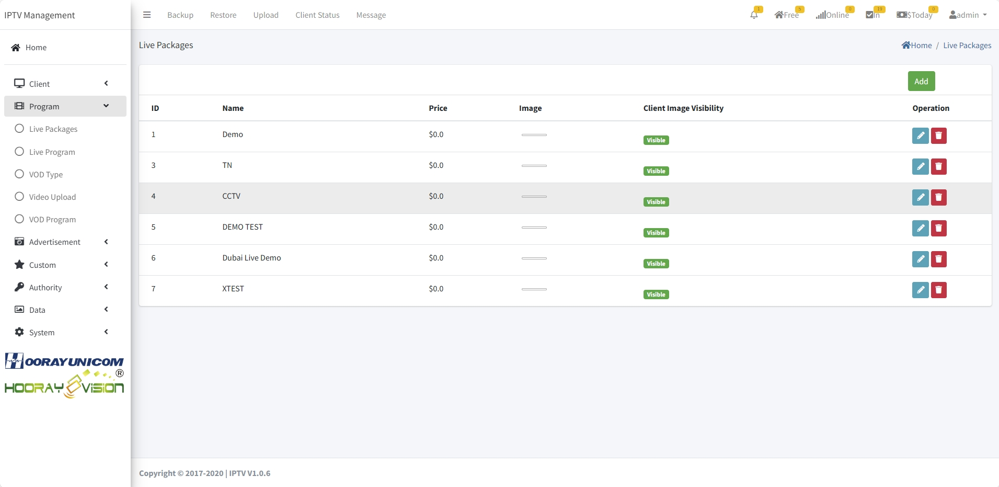
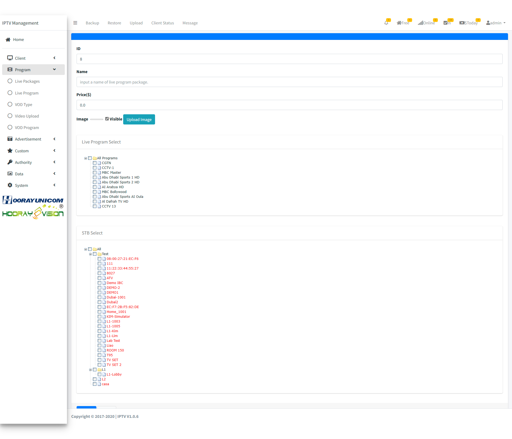

# Live Setting

>مقدمة

تسمح قائمة البرنامج للمسؤولين بإنشاء وتعديل وحذف إعدادات `Live` و `VOD`.

## Live Packages

>مقدمة

في ميزة Live Package، يمكن للمسؤولين إنشاء وتعديل وحذف فئات مصادر القنوات المباشرة. من خلال إنشاء فئات مباشرة، يمكن للمسؤولين تنظيم مصادر القنوات المباشرة المقابلة بشكل أفضل وربطها بالفئات المعنية. يتيح ذلك للمشتركين البحث بشكل ملائم وتصنيف القنوات المباشرة التي يريدون مشاهدتها.

يمكن للمسؤولين إنشاء فئات مباشرة جديدة بالنقر فوق زر `Add`. تحتاج كل فئة قناة إلى أن تكون مرتبطة بمصدر قناة مباشرة مقابل؛ يمكن لكل فئة قناة تحميل ملصق لتحديد اختلافها.

1. **ID**: يتم إنشاء `ID` تلقائيًا بواسطة النظام، كلما كان المعرف أصغر، كلما كان أعلى في الفئة المباشرة، يمكنك ضبط المعرف في صفحة التحرير لترتيب ترتيب الفئات المختلفة.

2. **Name**: يميز `Name` بين أسماء الفئات المختلفة.

3. **Price**: يمكن للمسؤول تعيين `price` لرسوم الفئة المباشرة، عندما يكون السعر 0، فهذا يعني أن الفئة مجانية، إذا لم يكن السعر 0، سيُطلب من الضيف الوصول إلى الفئة المباشرة بالشحن.

4. **Image**: عن طريق تحميل `images` الفئة المقابلة، سيتم عرض `image` في قائمة فئة مباشرة لصندوق الإعداد.

!>  **تحذير: يجب أن يكون حجم صورة تحميل Live Package 300x210**

5. **Live Program Select**: لـ `select` البرنامج المباشر المقابل للفئة المباشرة المحددة، يحتاج المسؤول إلى تحديد البرنامج المباشر المقابل للفئة المباشرة الحالية، وسيتم عرض البرنامج المباشر المحدد تحت الفئة المقابلة في قائمة فئة المحطة المباشرة.

6. **STB Select**: يحدد المسؤول الجهاز المقابل في قائمة الأجهزة، والجهاز المحدد فقط يمكنه عرض هذه الفئة المباشرة.

## Live Program

>مقدمة

في قسم "Live Program"، يمكن للمسؤولين إضافة برامج مباشرة يدويًا أو دفعة إلى الصفحة، ثم إضافة برامج مباشرة، يمكن للمسؤولين تحرير وحذف البرامج المباشرة المحددة. وهو يدعم بث UDP(unicast)/RTP(unicast)/HTTP-TS/HTTP-FLV/RTMP/RTMPS/HLS/DASH وبروتوكولات رئيسية أخرى.

يمكن للمسؤولين إنشاء قناة مباشرة جديدة بالنقر فوق زر `Add`.

1.  **ID** : يتم إنشاء هذا `ID` تلقائيًا بواسطة النظام ويمكن تحريره يدويًا. عند التحرير يدويًا، يجب ألا يتعارض مع `ID numbers` أخرى. هذا `ID` هو رقم تسلسل القناة المباشرة، وكلما انخفض `ID number`، كلما تم عرض القناة المباشرة في وقت سابق على صندوق الإعداد للبث المباشر.

2.  **Name** : يُستخدم `Name` بشكل أساسي لعرض اسم القناة المباشرة على صندوق الإعداد. سيتم عرض النص المدخل في مربع إدخال `Name` بالكامل كاسم القناة المباشرة على صندوق الإعداد.

4.  **URL** : املأ `URL` بالعنوان الذي يجب تشغيله في الجهاز

5.  **Image** : عن طريق تحميل `program logo` المقابل، سيتم عرض `program logo` في قائمة القناة المباشرة لصندوق الإعداد وتفاصيل القناة.

## قناة الراديو

> مقدمة

<!-- 📷 لقطة شاشة قيد الإضافة: صفحة قائمة قنوات الراديو -->

في `قناة الراديو`، يمكن للمسؤولين إضافة معلومات قنوات الراديو وتعديلها وحذفها. تُبث قنوات الراديو كبرامج صوتية إلى الأجهزة الطرفية، مما يتيح للضيوف الاستماع إلى محطات الراديو في غرفهم.

اضغط على زر `إضافة` لإنشاء قناة راديو جديدة.

<!-- 📷 لقطة شاشة قيد الإضافة: نافذة إضافة/تعديل قناة الراديو -->

1. **المعرف**: يتم إنشاء `المعرف` تلقائيًا بواسطة النظام. كلما كان `المعرف` أصغر، ظهرت قناة الراديو مبكرًا في القائمة.

2. **الرقم**: في `الرقم`، حدد ترتيب عرض قناة الراديو. كلما كان الرقم أصغر، ارتفع موضعه في القائمة.

3. **الاسم**: في `الاسم`، أدخل اسم قناة الراديو، مثل `BBC World Service`. سيتم عرض هذا الاسم على الجهاز الطرفي.

4. **URL**: في `URL`، املأ عنوان تشغيل قناة الراديو. سيستخدم الجهاز الطرفي هذا العنوان لتشغيل البرنامج الإذاعي.

5. **الصورة**: عن طريق تحميل `صورة` القناة المقابلة، سيتم عرض الصورة في قائمة قنوات الراديو على الجهاز الطرفي.

## البث المباشر الإجباري

> مقدمة

<!-- 📷 لقطة شاشة قيد الإضافة: صفحة إدارة البث المباشر الإجباري -->

في `البث المباشر الإجباري`، يمكن للمسؤولين إنشاء مهمة بث مباشر إجباري: سيتم إجبار جميع أجهزة الاستقبال المسجلة (أو المحددة) على الانتقال إلى مصدر مباشر محدد خلال نافذة زمنية، وسيتم قفل صفحة التشغيل أثناء المهمة. إذا حاول الضيف الخروج، يعود الجهاز الطرفي تلقائيًا. يُستخدم هذا عادةً لإعلانات الفندق أو البث الإلزامي (مثل فيديوهات السلامة من الحرائق).

### إنشاء مهمة بث إجباري

<!-- 📷 لقطة شاشة قيد الإضافة: نافذة إنشاء مهمة البث الإجباري -->

اضغط على زر `إضافة` / `إنشاء مهمة` لإنشاء مهمة بث إجباري جديدة. يمكن أن تكون مهمة واحدة نشطة فقط في كل مرة؛ إنشاء مهمة جديدة سيُلغي المهمة النشطة السابقة.

1. **نوع مصدر التشغيل**: حدد مصدر البث الإجباري:
   - `قناة تلفزيون مباشر`: اختر قناة مباشرة موجودة من القائمة.
   - `URL مخصص`: املأ عنوان بث مخصصًا (يجب أن يكون `http`/`https`، ولا يمكن أن يكون عنوانًا للشبكة الداخلية).

2. **وقت البدء**: وقت بدء المهمة، بالتنسيق `yyyy-MM-dd HH:mm`. يمكن أيضًا البدء فورًا مع مدة.

3. **وقت الانتهاء**: وقت انتهاء المهمة، بالتنسيق `yyyy-MM-dd HH:mm`. يجب أن يكون وقت الانتهاء لاحقًا لوقت البدء.

### مراقبة حالة المهمة

<!-- 📷 لقطة شاشة قيد الإضافة: مراقبة المهمة/تفاصيل الجهاز -->

بعد إنشاء المهمة، تعرض صفحة الإدارة إحصائيات التنفيذ لجميع الأجهزة الطرفية المستهدفة في الوقت الفعلي:

- العدادات **قيد الانتظار / تم الإرسال / تم التنفيذ / فشل / منتهي** وإجمالي عدد الأجهزة الطرفية.
- **تفاصيل الجهاز**: حالة أمر كل جهاز (قيد الانتظار / تم الإرسال / تم التنفيذ / فشل / منتهي)، ووقت الإرسال، ووقت التأكيد، وسبب الفشل.
- **المهام السابقة**: عرض جميع مهام البث الإجباري السابقة.
- **إعادة الإرسال**: إعادة إرسال جماعية للأوامر الفاشلة لمهمة ما.
- **تصدير CSV**: تصدير تفاصيل أوامر المهمة كملف CSV لحفظ السجلات.

اضغط على زر `إلغاء` لإلغاء المهمة النشطة الحالية في أي وقت. بعد الإلغاء، ستتوقف الأجهزة الطرفية عن البث الإجباري وتعود إلى الوضع الطبيعي.
