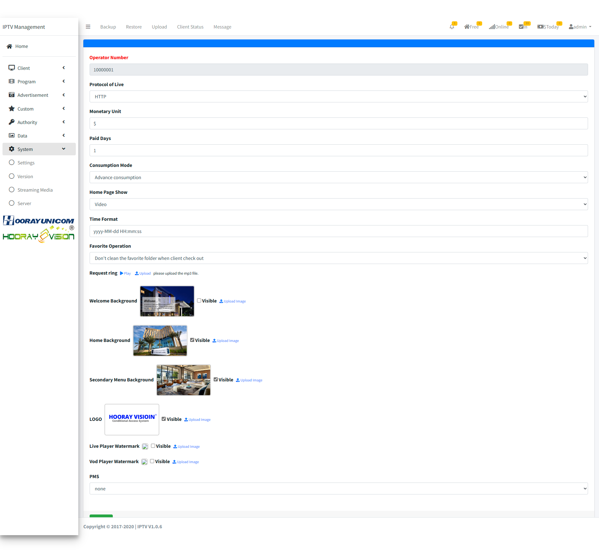

# System Setting

>مقدمة

 

في `System`، يمكن للمسؤول تعديل معلومات نظام IPTV، بما في ذلك استيراد معلومات التفويض، والنسخ الاحتياطي لقاعدة البيانات، وإعدادات الأمان لواجهة API الخارجية.

## Setting

>مقدمة

 

في `Setting`، يقوم المسؤول بتكوين المعلومات الأساسية التي يجب مزامنتها مع الجهاز الطرفي، وصورة الخلفية لكل صفحة هرمية، وتنسيق الوقت وبعض المعلمات التفصيلية الأخرى.

**Monetary Unit**: في `Monetary Unit`، يدخل المسؤول المعادل المحلي لرمز الدولار، والذي يُستخدم لعرض رمز الدولار المحلي في `Shopping`.

**Paid Days**: في `Paid Days`، عندما ينقر الضيف لشراء باقة بث مباشر أو فيلم، فهو وقت انتهاء الصلاحية المحدد.

**Consumption Mode**: في `Consumption Mode`، يختار المسؤول طريقة الدفع للضيف. في `Prepaid consumption`، عندما يستهلك الضيف، يحتاج أولاً إلى إعادة شحن المبلغ إلى الحساب. فقط عندما يكون هناك مبلغ كافٍ في الحساب يمكنهم الاستهلاك. إذا كان المبلغ غير كافٍ، فلا يمكنهم الاستهلاك. في `Advance Consumption`، يمكن للضيوف الاستهلاك بدون إعادة شحن، ويتم تسجيل الاستهلاك في مبلغ الغرفة في شكل حسابات مستحقة القبض.

**Home Page Show**: في `Home Page Show`، يختار المسؤول طريقة عرض خلفية الصفحة الرئيسية في القائمة المنسدلة. عند اختيار `Image`، يتم عرض صورة الخلفية المحملة. عند اختيار `Video`، يتم عرض ملف الفيديو المحمل.

**Time Format**: في `Time Format`، يقوم المسؤول بتعيين تنسيق الوقت المعروض على الواجهة الأمامية يدويًا.

**Favorite Operation**: في `Favorite Operation`، يقوم المسؤولون بتعيين ما إذا كان يجب مسح قائمة المفضلة المحفوظة بواسطة الضيف عند المغادرة.

**Request ring**: في `Request ring`، يقوم المسؤول بتحميل نغمة تنبيه الطلب المقابلة. هذا الخيار متوقف حاليًا بسبب عوامل تقنية في المتصفح.

**Welcome Background**: في `Welcome Background`، يحتاج المسؤول إلى تحميل صورة خلفية الترحيب التي ستتم مزامنتها مع جانب التلفزيون.

**Home Background**: في `Home Background`، يحتاج المسؤول إلى تحميل صورة خلفية الصفحة الرئيسية التي ستتم مزامنتها مع جانب التلفزيون.

**Secondary Menu Background**: في `Secondary Menu Background`، يحتاج المسؤول إلى تحميل صورة خلفية القائمة الثانوية التي ستتم مزامنتها مع جانب التلفزيون.

**LOGO**: في `LOGO`، يحتاج المسؤول إلى تحميل صورة الشعار التي ستتم مزامنتها مع جانب التلفزيون والجوال.

**Live Player Watermark**: هذه الميزة متوقفة حاليًا.

**Vod Player Watermark**: هذه الميزة متوقفة حاليًا.

**City**: في `City`، يدخل المسؤول اسم المدينة المقابل، وسيحصل خادم IPTV على معلومات الطقس ويعيد توجيهها إلى محطات مختلفة.

**Enable Remote Assistance**: هذه الميزة متوقفة حاليًا.

**البروتوكول**: في `البروتوكول`، حدد بروتوكول البث المباشر المستخدم بواسطة الأجهزة الطرفية (مثل `http`، `udp`، `rtsp`).

**رقم المشغل**: في `رقم المشغل`، أدخل رقم المشغل الفريد المطلوب لصيانة النظام والدعم الفني. **بمجرد ملئه، لا يمكن تعديله.**

**PMS**: في `PMS`، حدد وضع تكامل نظام إدارة العقارات (PMS):
- `لا شيء`: تكامل PMS معطل.
- عند تحديد نوع PMS، املأ `معلومات خادم PMS` (عنوان خادم PMS). سيتكامل نظام IPTV مع PMS (مثل تسجيل دخول/خروج الضيوف تلقائيًا ومزامنة الفواتير). يتم تكوين مفتاح PMS وعنوانه ومنفذه بواسطة المسؤول.

## Version

>مقدمة

 

في `APK Version Management`، يمكن للمسؤولين تكوين سياسات الترقية لمحطات مختلفة، مع دعم كل من طرق الترقية الإلزامية وغير الإلزامية.

اضغط على زر `APK Upgrade` لتحميل apk. بعد النقر على زر `APK upgrade`، ستظهر صفحة تحميل. بعد تحديد ملف APK المراد ترقيته، سيقوم النظام تلقائيًا بمعالجة معلومات إصدار الملف وعرضها في قائمة الترقية. يحتاج المسؤول إلى التحقق مما إذا كانت صحيحة.

## إعداد وسائط البث

> مقدمة

<!-- 📷 لقطة شاشة قيد الإضافة: صفحة إعداد وسائط البث -->

في `إعداد وسائط البث`، يقوم المسؤول بتكوين عناوين خادم وسائط البث وخادم الإزاحة الزمنية (تلفزيون التأجيل)، والتي تستخدمها الأجهزة الطرفية لتشغيل البث المباشر والبرامج المؤجلة.

**IP وسائط البث**: في `IP وسائط البث`، أدخل عنوان IP لخادم وسائط البث.

**منفذ وسائط البث**: في `منفذ وسائط البث`، أدخل منفذ خادم وسائط البث.

**IP خادم الإزاحة الزمنية**: في `IP خادم الإزاحة الزمنية`، أدخل عنوان IP لخادم الإزاحة الزمنية.

**منفذ خادم الإزاحة الزمنية**: في `منفذ خادم الإزاحة الزمنية`، أدخل منفذ خادم الإزاحة الزمنية.

**ساعات الإزاحة الزمنية**: في `ساعات الإزاحة الزمنية`، حدد عدد ساعات البرامج التي يحتفظ بها خادم الإزاحة الزمنية، مما يتيح للضيوف مشاهدة البرامج السابقة خلال هذه النافذة.

## الرسوم البيانية للبيانات

> مقدمة

<!-- 📷 لقطة شاشة قيد الإضافة: صفحة إحصائيات البيانات -->

في `الرسوم البيانية للبيانات`، يمكن للمسؤولين عرض إحصائيات تشغيل نظام IPTV، بما في ذلك:

- **إحصائيات الإيرادات**: إجمالي إحصائيات إيرادات الأعمال.
- **إحصائيات الفيديو حسب الطلب**: إحصائيات مشاهدات الفيديو حسب الطلب.
- **نوع الاستهلاك**: إحصائيات مجمعة حسب نوع الاستهلاك.
- رسوم بيانية شهرية بالأعمدة ورسوم دائرية، قابلة للتصفية حسب السنة.
