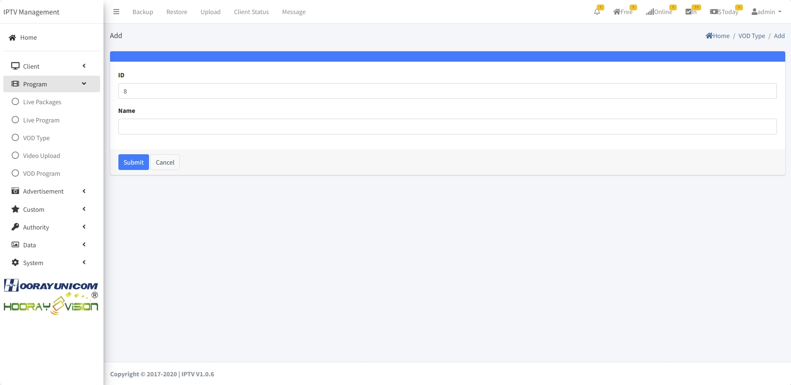

# Video On Demand Setting

>مقدمة

يسمح `Video On Demand` للمسؤولين بإنشاء وتعديل وحذف إعدادات `VDO Category` و `VOD Program` و `VOD Upload`.

## VOD Category

>مقدمة

في ميزة `VOD Category`، يمكن للمسؤولين إنشاء وتعديل وحذف فئات الأفلام. من خلال إنشاء فئات VOD، يمكن للمسؤولين تنظيم الأفلام المقابلة بشكل أفضل وربطها بالفئات المعنية. يتيح ذلك للمشتركين البحث بشكل ملائم وتصنيف الأفلام التي يريدون مشاهدتها.

يمكن للمسؤولين إنشاء `VOD category` جديدة بالنقر فوق زر `Add`. 

1. **ID**: يتم إنشاء هذا `ID` تلقائيًا بواسطة النظام ويمكن تحريره يدويًا. عند التحرير يدويًا، يجب ألا يتعارض مع معرف آخر. هذا `ID` هو رقم تسلسل فئة VOD، وكلما انخفض رقم المعرف، كلما تم عرض فئة VOD في وقت سابق على صندوق الإعداد لقائمة VOD.

2. **Name**: يُستخدم `Name` بشكل أساسي لعرض اسم فئة VOD على صندوق الإعداد.

## VOD Program

>مقدمة

يمكن للمسؤول إضافة وتحرير وحذف معلومات الفيلم وربط ملفات الفيلم بالأفلام المقابلة في قائمة `VOD Program`. بعد إضافة معلومات الفيلم، يمكن للمسؤول عرض ملصق الفيلم الجديد والمعلومات المقابلة في قائمة `VOD Program`، ويمكن للمسؤول أيضًا عرض عدد المرات التي تم فيها طلب الفيلم الجديد.

يمكن للمسؤولين إنشاء `movie` جديد بالنقر فوق زر `Add`. 

1. **Poster**: يقوم المسؤول بتحميل `Poster` الفيلم المقابل من خلال الصفحة، وسيظهر `poster` على الجهاز للتمييز بين معلومات الفيلم وجذب المشتركين للنقر على الفيلم المقابل للتشغيل.

2. **Name**: يُستخدم `Name` لعرض اسم الفيلم على صندوق الإعداد.

3. **Price**: يمكن للمسؤول تعيين `price` لرسوم الفيلم، عندما يكون السعر 0، فهذا يعني أن الفيلم مجاني، إذا لم يكن السعر 0، سيُطلب من الضيف الوصول إلى الفيلم بالشحن.

4. **Director**: يتم عرض `Director` في تفاصيل الفيلم، ويمكن للمشتركين عرض المعلومات المقابلة عندما ينقرون على ملصق الفيلم لدخول تفاصيل الفيلم.

5. **Actors**: يتم عرض `Actors` في تفاصيل الفيلم، ويمكن للمشتركين عرض المعلومات المقابلة عندما ينقرون على ملصق الفيلم لدخول تفاصيل الفيلم.

6. **Area**: يعرض `Area` منطقة الإصدار في تفاصيل الفيلم، ويمكن للمشتركين عرض المعلومات المقابلة عندما ينقرون على ملصق الفيلم لدخول تفاصيل الفيلم.

7. **Language**: يعرض `Language` لغة الصوت الافتراضية في الفيلم، ويمكن للمشتركين عرض المعلومات المقابلة عندما ينقرون على ملصق الفيلم لدخول تفاصيل الفيلم.

8. **Screen Time**: يتم عرض `Screen Time` هذا في تفاصيل الفيلم، ويمكن للمشتركين عرض المعلومات المقابلة عندما ينقرون على ملصق الفيلم لدخول تفاصيل الفيلم.

9. **VOD Type**: يحدد `VOD Type` فئة الفيلم التي ينتمي إليها الفيلم، يتم استخدام فئة الفيلم لتقسيم فئة الفيلم بحيث يمكن للمشترك العثور بسرعة على الفيلم المقابل عند البحث عن الفئة المقابلة.

10. **Tag**: يُستخدم `Tag` للإشارة إلى ما إذا كان الفيلم ينتمي إلى الأفلام الساخنة أم لا، عندما يُشار إليه كفيلم ساخن، سيظهر الفيلم في الفئة الساخنة ويتم عرضه في أعلى صفحة VOD.

12. **Off Sale**: `Off Sale` لإعداد الفيلم غير متصل من التطبيق

12. **Introduction**: يُستخدم `Introduction` هذا لتقديم تفاصيل الفيلم

## VOD Upload

>مقدمة

في صفحة VOD Upload، يمكن للمسؤول تحميل وحذف ملفات الأفلام، يجب أن يتوافق تنسيق ملف الفيلم مع معيار Hooray VOD. تنسيق ترميز فيديو ملف الفيلم هو `HEVC/H.254/AV1`، ترميز الصوت هو `AAC/MP3/AC-3/E-AC-3/FLAC/DTS`، تنسيق ملف الفيلم المحمل يجب أن يكون `.MP4`.

!> :warning: **تحذير: أسماء الملفات المحملة `يجب` أن تكون خالية من الرموز الخاصة والمسافات.**

انقر فوق `Choose File` سينبثق نافذة التحميل، حدد ملف الفيلم المراد تحميله، عندما يتم تحميل الملف، يتم تحديث صفحة التحميل تلقائيًا للملف المحمل. ويتم عرضه في قائمة التحميل.

!> بعد تحميل ملف الفيلم، انقر فوق `VOD Program` للانتقال إلى قائمة معلومات الفيلم، حدد معلومات الفيلم المقابلة وانقر فوق الأيقونة لربط الفيلم بالملف المحمل.

انقر فوق زر `Add` للانتقال إلى صفحة الإضافة

1. **ID**: يتم إنشاء `ID` تلقائيًا بواسطة نظام IPTV، يتم استخدام رقم المعرف المُنشأ لفرز عرض ملف الفيلم، كلما كان الرقم أصغر، يتم عرض الملف في التطبيق في المقدمة.

2. **Source**: ينسدل `Source` لتحديد عنوان تخزين ملف الفيلم `URL` أو `Local File`، المحمل من خلال نظام IPTV لتحديد `Local File`، من خلال طرق أخرى للتخزين لتحديد `URL`.

3. **URL**: عندما يتم تحديد URL في قسم `Source`، ثم املأ URL في مربع الإدخال بعنوان URL المقابل من الخادم البعيد.

