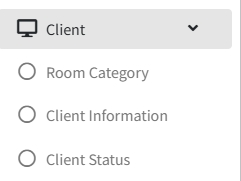
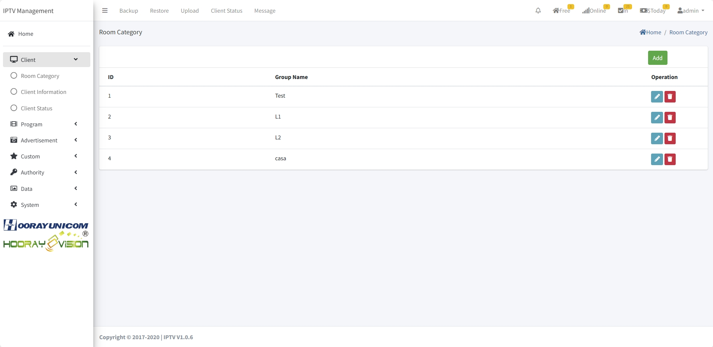
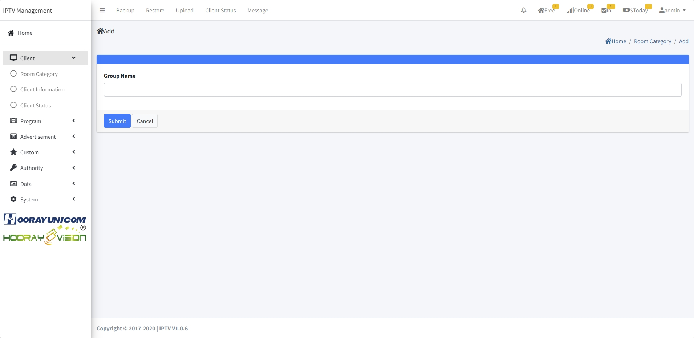
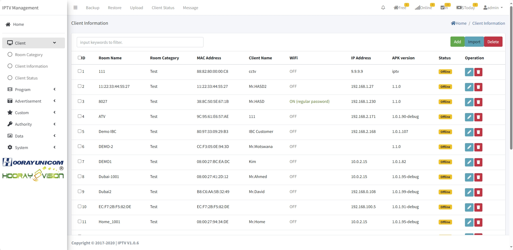
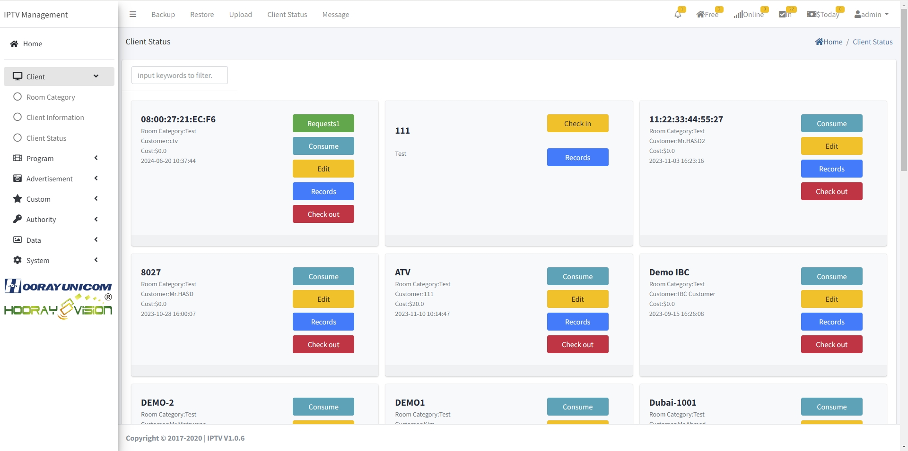
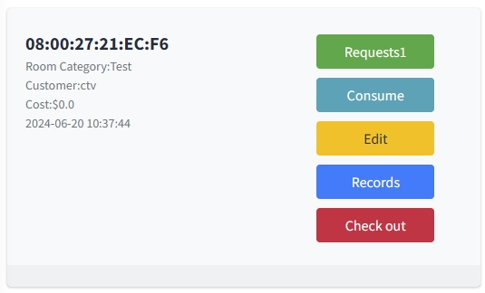
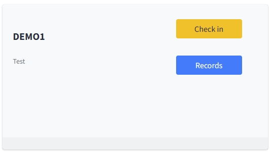

# Client Management Setting

>Introduction

In `Client Menu`, the administrator needs to configure the corresponding equipment information in `Room Category`, `Client Information` and `Client Status` and operate the check-in and check-out of visitors.

## Room Category

>Introduction

In `Room Category`, the administrator needs to set the logical classification name, in Hooray hotel IPTV logical classification named for distinguishing equipment belonging to different floors or different usage, for example, there are more than one piece of equipment placed on the 1st floor, then set the classification name for L1, and so on.

Press `Add` button to create the `Room Category`

1. **Group Name**: In `Group Name`, the administrator sets the logical category name.

## Client Information

>Introduction

In `Client information`, this page displays all the current online and offline devices, the administrator can manage the device name and `WIFI hotspot status` (abandoned) through this page, and in the device list, you can view the classification to which the device belongs, the corresponding room number and other device information and so on.

Press `Add` button to create the `Client Information`

 

**MAC Address** In `Mac Address`, if the device is not in Client Information, then it can be added manually by entering the MAC address, and if the device has been discovered by the hotel IPTV server, the MAC can only be viewed.

**IP** In `IP`, displays information about the IP address of the last time the device was online.

**Room Name** In `Room Name`, enter the name of the room to which the device belongs.

**Room Category** In `Room Category`, select the room category to which the device belongs.

**WiFi** In `WIFI`, the administrator can ON and OFF the device hotspot function, and can set the hotspot function WIFI name and password. Due to Google's protection for Android this feature can no longer be enabled.

## Client Status

>Introduction

In the Client Status page, the administrator can operate the check-in and check-out of the corresponding equipment, and the unchecked-in equipment can view the information of the previously checked-in customers and their consumption records. The checked-in devices can operate online orders, consumption records, edit guest information, view previous check-in records and check-out operations.

**Request** Click the `request` button, will jump to the guest's current booking operation page, in the page, administrator can view the guest's booking of the room, the administrator through the operation button to confirm the order or delete the order. After the corresponding operation, the result will be returned to the guest and presented status of the hotel app.

**Consume** Click `Consume` button will redirect you to the guest's current consumption record page, which displays the current guest's completed order from app.

**Edit** Click `Edit` button, the administrator can reset the name of the check-in guest and the welcome message.

**Records** Click `Record` button, administrator can view the device check-in record, including the name of the occupant, check-in time, check-out time and consumption record.

**Check-Out** After clicking the `Check-Out` button, the device automatically enters the Check-Out state, in which all services are unavailable.

**Check-In** Click the `Check-In` button, the administrator needs to fill in the name of the check-in customer and the welcome message displayed on the big screen.