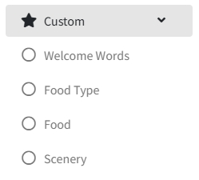
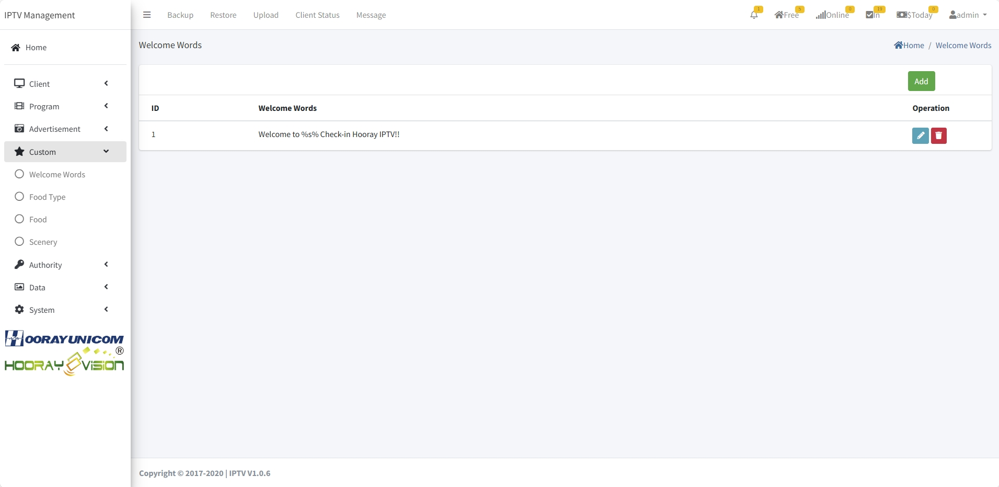
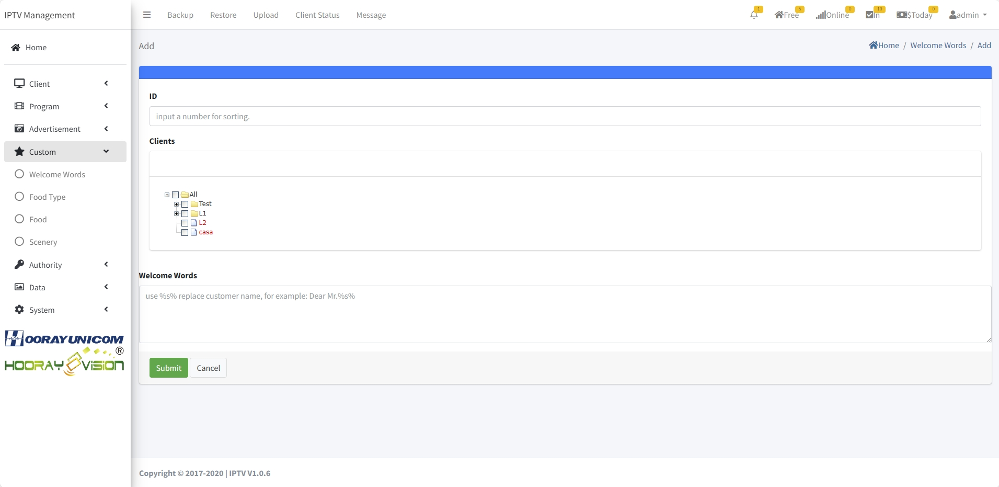
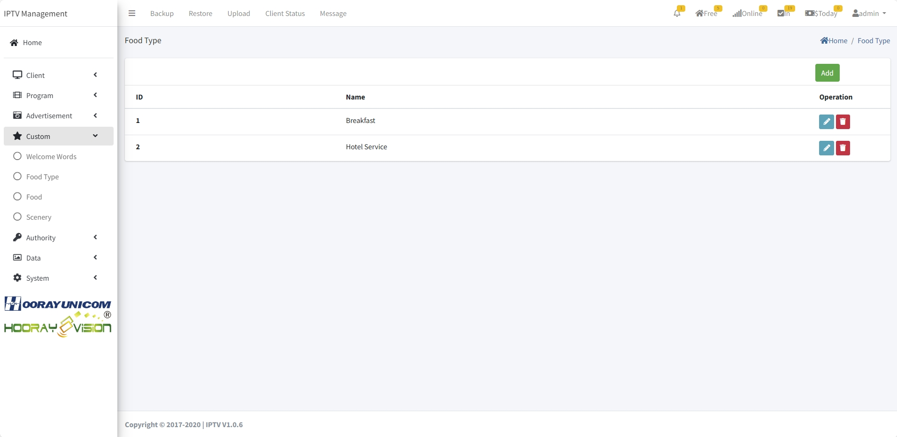
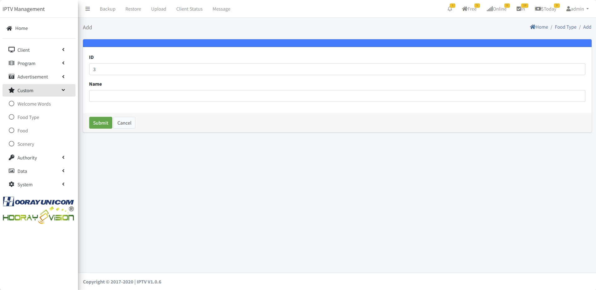
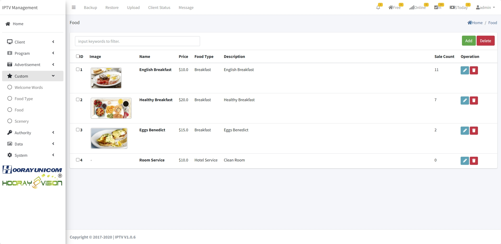
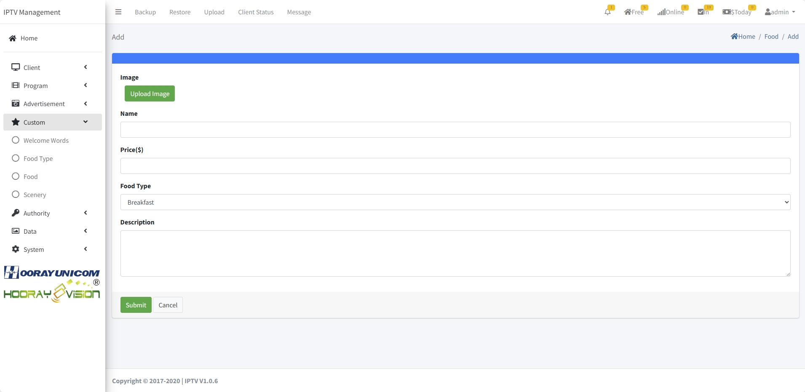
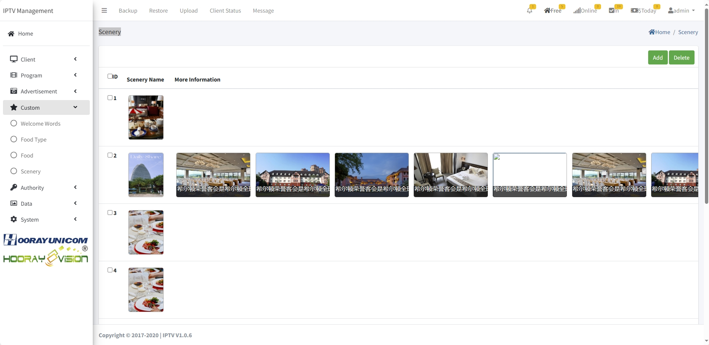
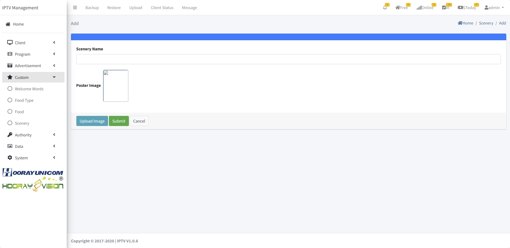

# Custom Setting

>Introduction

In `Custom Menu`, administrators control whether to display the welcome message on the home page, as well as the configuration of online meal ordering and the setting of information on surrounding scenic spots.

## Welcome Words

>Introduction

In `Welcome Words`, the administrator configures the welcome message displayed on the terminal page. When the administrator checks in the terminal device, the terminal device will automatically display the corresponding text information on the home page.

Press `Add` button to create new welcome words

**ID** In `ID`, IDs are managed and generated by the system. It does not need to be filled in.

**Clients** In `Clients`, the administrator selects the device on which the welcome message is displayed. The selected device will display the welcome message information when checked in.

**Welcome Words** In `Welcome Words`, the administrator needs to input the welcome message information. The welcome message will be displayed on the home page of the terminal device when checked in.

## Food Type

>Introduction

In `Food Type`, administrators create categories for different food types. To facilitate the distinction between different foods.

Press `Add` button to create new food type

**ID** In `ID`, IDs are managed and generated by the system. It does not need to be filled in.

**Name** In `Name`, Enter the name used to identify this food type

## Food

>Introduction

In `Food` menu, This page displays all the reservable food information, including pictures, names, prices, categories, descriptions, and the number of reservations. Administrators can add, edit, and delete specified reservation food information.

Press `Add` button to create new reservable food information.

**Image** In `Image`, The administrator uploads the picture of the corresponding sales food, the picture format supports PNG,JPG.

**Name** In `Name`, Enter the name used to identify the food

**Price($)** In `Prices`, The administrator sets the price of this food reservation

**Food Type** In `Food Type`, Select the food type to which the food belongs.

**Description** In `Description`, The description is used to introduce the food information, which will be displayed on the user's terminal.

## Scenery

>Introduction

In `Scenery`, administrators can add picture and introduction information, which can be an introduction to hotel facilities, hotel services, or surrounding attractions.

Press `Add` button to create new information

Upload the preview image and title information of the general introduction in this layer. After the operation is completed, click the Submit button to submit. After submission, start adding detailed pictures and information, and click the plus icon to enter the detailed page setting. On this page, you can upload corresponding pictures and add text information.

 

