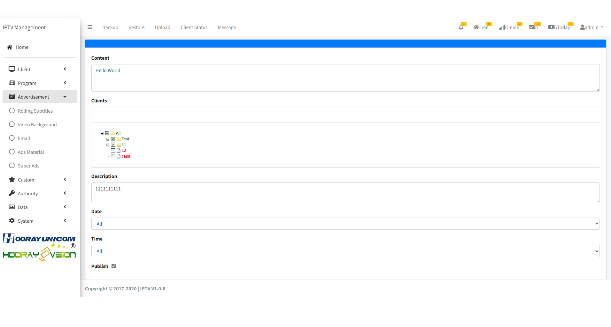

# Configuración de publicidad

>Introduction

En la sección de publicidad, los administradores pueden publicar información y anuncios para los dispositivos en las habitaciones.

## Subtítulos rodantes

>Introduction

En el sistema IPTV del hotel, el administrador puede enviar contenidos de subtítulos rodantes distintos para diferentes grupos de categoría. Los subtítulos rodantes pueden configurarse con color de fuente y color de fondo.

Presione el botón `Add` para crear `Rolling Subtitles`.

**Content**: Introduzca el contenido a enviar en `Content`.

**Client**: En `Client`, seleccione un grupo o especifique un dispositivo al que enviar el subtítulo rodante.

**Description**: Describa los detalles de este subtítulo rodante.

**Date**: En `Date`, el administrador puede especificar la fecha de inicio y fin del subtítulo rodante.

**Time**: En `Time`, el administrador puede especificar la hora de inicio y fin.

## Correo electrónico

>Introduction

En el sistema IPTV es posible enviar un mensaje en forma de correo electrónico, que puede ser enviado directamente al cliente correspondiente. El cliente debe confirmar y abrirlo en el terminal para ver los detalles.

Presione `Add` para crear `Email Message`.

**Client**: En `Client`, seleccione un grupo o especifique un dispositivo para enviar el correo.

**Title**: El `Title` se usa para mostrar el asunto del correo.

**Content**: Introduzca el contenido en `Content`.

## Fondo de video

>Introduction

En el menú `Video Background`, los administradores pueden gestionar y controlar el fondo de video. Tras habilitar esta función, suba un archivo de video en formato MP4 para mostrarse en este menú; el dispositivo terminal descargará y reproducirá automáticamente el archivo.

Presione `Add` para crear el `Email Message`.

**Video**: Seleccione el archivo MP4 que desea subir; el archivo debe cumplir el formato de video H.264 y audio AAC.
**Clients**: En `Clients`, seleccione un grupo o especifique un dispositivo para mostrar el fondo de video.

**Description**: Describa los detalles de esta operación de fondo de video.

## Material publicitario

>Introduction

En `Ads Material`, el material subido se muestra en la página como una lista, y el administrador puede gestionar el material mediante los botones `Add`, `Edit` y `Delete`.

### Ads Material - Añadir/Editar

>Introduction

Presione `Add` para subir material a la lista.

**Upload**: Haga clic en el botón `Upload` para seleccionar la imagen o video a subir; el sistema cargará automáticamente el material.

**Material Name**: Etiquete el `Material Name` con el nombre del material subido, se usará en selecciones posteriores.

**Material Type**: En `Material Type`, asigne si el material es `image` o `video`.

**Ads Type**: En `Ads Type`, seleccione el tipo de anuncio correspondiente; hay 4 tipos disponibles.

### Ads Material - Eliminar

 Presione `Del` para eliminar material subido de la lista. Si el material se elimina mientras el anuncio sigue activo, el dispositivo terminal no recibirá más ese material.

## Súper anuncios

>Introduction

En la página de Super Ads, el administrador debe crear, editar y eliminar 4 categorías de anuncios: `boot ads`, `Commercial ads`, `side ads` y `emergency ads`.

**Boot Ads**: Si existen anuncios de arranque en el grupo de dispositivos, cuando la app se inicia mostrará una imagen o video antes de entrar en la pantalla de login.

**Commercial Ads**: Anuncios que se reproducen antes de poder ver un programa en vivo o un VOD cuando el dispositivo reproduce contenido.

**Side Ads**: Anuncios que aparecen en un lado de la pantalla mientras se reproduce un programa en vivo.

**Emergency Ads**: Todos los dispositivos recibirán imágenes o videos de emergencia enviados por el sistema IPTV; al reproducirse, el dispositivo mostrará el anuncio aunque el usuario esté viendo otro contenido.

### Super Ads - Añadir/Editar

>Introduction

Tras pulsar `Add` o `Edit`, el administrador entra en la página de creación/edición donde debe rellenar la información correspondiente.

>Introduction **Boot Ads Setting**

**Ads Name**: El `Ads Name` sirve para distinguir distintos anuncios.

**Clients**: En `Client`, seleccione el grupo de dispositivos que reproducirá el anuncio.

**Ads Type**: Por ejemplo, `Boot Ads`.

**Material Type**: Boot Ads admite imágenes y videos; seleccionar el tipo indica qué debe reproducir el terminal al arrancar.

**Material List**: En `Material List`, seleccione el material publicitario marcando el elemento.

**Date**: En `Date`, especifique fecha de inicio y fin del anuncio.

**Time**: En `Time`, especifique hora de inicio y fin.

**Publish**: Al marcar `Publish`, el anuncio empezará a enviarse; si Date y Time están configurados, se procesará según ellos.

>Introduction **Commercial Ads Setting**

**Ads Name**: Nombre del anuncio.

**Clients**: Seleccione el grupo de dispositivos que reproducirá el anuncio.

**Ads Type**: `Commercial Ads`.

**Material Type**: Commercial Ads solo admite video.

**Program Setting**: En `Program Setting`, seleccione si el anuncio se usará para Live o VOD.

**Play Setting**: En `Play Setting`, el administrador puede elegir `Manual broadcast` o `Random broadcast`. En `Manual`, seleccione el material en la caja de selección; en `Random`, el terminal seleccionará aleatoriamente.

**Material**: Seleccione el material marcándolo.

**Date**: Especifique la fecha de inicio y fin.

**Time**: Especifique la hora de inicio y fin.

**Publish**: Marque `Publish` para activar el anuncio.

**Turn on channel switching**: Al activar esta opción, Commercial Ads se reproducen al cambiar de canal en Live o al cambiar VOD.

>Introduction **Side Ads Setting**

**Ads Name**: Nombre del anuncio.

**Clients**: Seleccione el grupo de dispositivos.

**Ads Type**: `Side Ads`.

**Material Type**: Side Ads solo admite imágenes.

**Program Setting**: Seleccione si el anuncio se usa para Live o VOD.

**Show Position**: Seleccione la posición de inserción: izquierda, derecha, arriba o abajo. El efecto se muestra en las figuras.

 

 

**Interval**: En `Interval`, el administrador establece el tiempo entre apariciones de Side Ads. Durante la validez, los anuncios se mostrarán según el intervalo.

**Material**: Seleccione el material marcándolo.

**Images show time**: En `Image Show Time`, establezca el número de segundos que muestra cada imagen.

**Date**: Fecha de inicio y fin.

**Time**: Hora de inicio y fin.

**Publish**: Marque `Publish` para activar.

>Introduction **Emergency Ads Setting**

**Ads Name**: Nombre del anuncio.

**Clients**: Seleccione el grupo de dispositivos.

**Ads Type**: `Emergency Ads`.

**Material Type**: Emergency Ads admite video e imagen.

**Program Setting**: Seleccione Live o VOD para el uso del anuncio.

**Interval**: En `Play Setting`, puede elegir `Manual broadcast` o `Random broadcast`. En `Manual`, seleccione el material; en `Random`, el terminal seleccionará automáticamente.

**Material**: Seleccione el material.

**Images show time**: Tiempo de visualización por imagen.

**Date**: Fecha de inicio y fin.

**Time**: Hora de inicio y fin.

**Publish**: Marque `Publish` para activar el anuncio según la configuración de fecha y hora.

