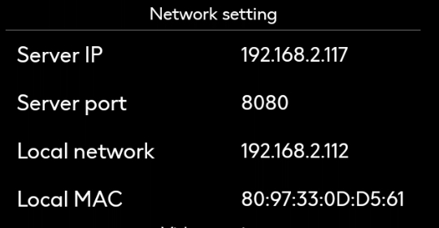

# APK

>Introducción

En el menú `Setting` del APK, puede configurar la dirección de comunicación entre el dispositivo terminal y el servidor IPTV, así como otra información de configuración del APK.

## Network Setting

>Introducción

En `Network Setting`, puede ver y configurar la dirección IP y el puerto del servidor IPTV, así como la dirección IP local y la dirección MAC de comunicación.

**Server IP**: En `Server IP`, se pueden introducir tanto direcciones IP como nombres de dominio, y deben apuntar al servidor IPTV. Si la IP o el dominio introducidos no pueden acceder al servidor IPTV, será necesario reconfigurar el dispositivo para que pueda acceder a la IP o dominio del servidor IPTV y así establecer la comunicación de datos.

**Server Port**: En `Server Port`, sólo completando el número de puerto correcto se podrá establecer la comunicación con el servidor. El `Server Port` es el mismo número que aparece en la página web. Rellene ese número de puerto.

**Local Network**: `Local network` indica la dirección IP adquirida por el dispositivo actual, proporcionada por el sistema Android. Por favor confirme que esta dirección pueda comunicarse con la IP o dominio del servidor.

**Local MAC**: `Local MAC` representa la información MAC obtenida por el dispositivo actual. Esta información MAC se almacenará en el sistema como credencial única. En el sistema de gestión, la información MAC se utilizará para gestionar el dispositivo correspondiente y asignar el número de habitación del hotel.
