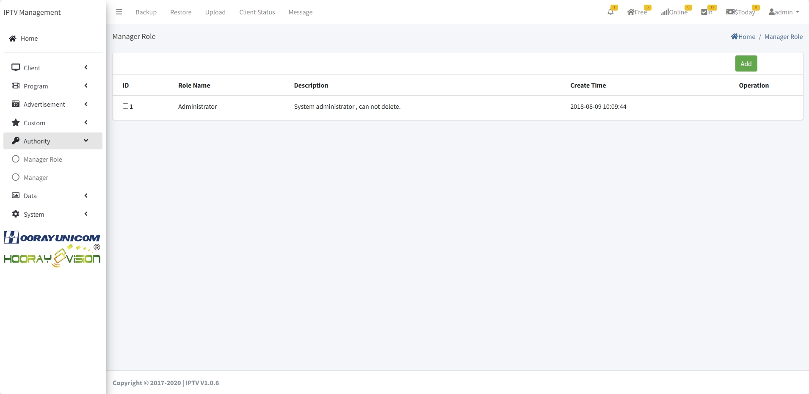

# Autorización

Gestione permisos y autoridades en la plataforma Hooray Hotel IPTV.

## Sistema de roles

### Roles predefinidos

- **Administrador:** acceso total
- **Gerente:** gestión de contenido y dispositivos
- **Operador:** operaciones diarias
- **Soporte técnico:** resolución de problemas
- **Huésped:** acceso limitado a contenido

### Crear roles personalizados

1. Vaya a **Autorización** → **Roles**
2. Haga clic en **Nuevo rol**
3. Nombre el rol
4. Asigne permisos específicos
5. Guarde

## Permisos

### Áreas de permisos

- Gestión de dispositivos
- Gestión de contenido
- Gestión de usuarios
- Reportes
- Configuración del sistema
- Facturación

### Asignar permisos

1. Seleccione un rol
2. Marque permisos permitidos
3. Configure restricciones
4. Guarde cambios

## Operadores

### Gestión de operadores

1. Vaya a **Operadores**
2. Agregue nuevo operador
3. Asigne rol
4. Configure credenciales
5. Establezca períodos activos

### Credenciales

- Nombre de usuario único
- Contraseña segura
- Validación de correo
- Autenticación de dos factores

## Acceso de huésped

### Permisos de huésped

- Contenido permitido
- Restricciones de compra
- Límites de tiempo de visualización
- Canales permitidos

### Control parental

- Restricciones por edad
- Bloqueo de contenido
- PIN requerido
- Horarios de visualización

## Auditoría

### Registros de acceso

- Quién accedió
- Cuándo y desde dónde
- Qué acciones realizó
- Cambios realizados

### Reportes

1. Generar reportes de actividad
2. Exportar registros
3. Analizar tendencias
4. Identificar problemas

## Resolución de problemas

- Restablecer contraseña
- Resolver bloqueos de cuenta
- Revisar registros de acceso
- Verificar permisos
