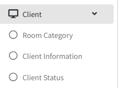
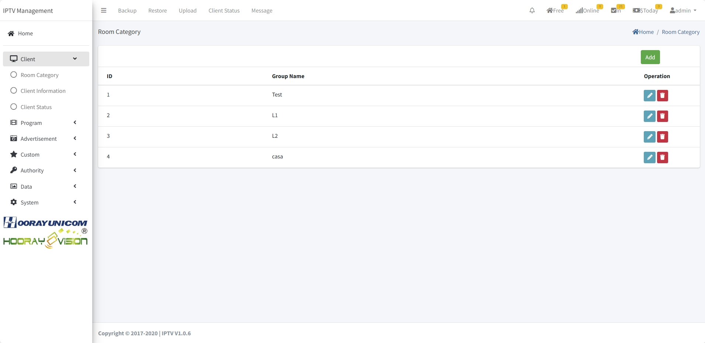
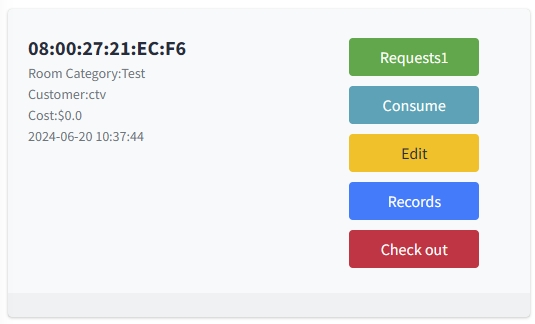

# Configuración de Gestión de Clientes

>Introducción

En `Client Menu`, el administrador necesita configurar la información de equipo correspondiente en `Room Category`, `Client Information` y `Client Status` y operar el check-in y check-out de visitantes.

## Categoría de Sala

>Introducción

En `Room Category`, el administrador necesita establecer el nombre de clasificación lógica. En la clasificación lógica de Hooray Hotel IPTV se utiliza para distinguir equipos pertenecientes a diferentes pisos o diferentes usos. Por ejemplo, si hay más de una pieza de equipo colocada en el 1er piso, entonces establezca el nombre de clasificación como L1, y así sucesivamente.

Presione el botón `Add` para crear la `Room Category`

1. **Group Name**: En `Group Name`, el administrador establece el nombre de categoría lógica.

## Información de Cliente

>Introducción

En `Client information`, esta página muestra todos los dispositivos actualmente en línea y fuera de línea. El administrador puede administrar el nombre del dispositivo y el estado del `WIFI hotspot status` (abandonado) a través de esta página. En la lista de dispositivos, puede ver la clasificación a la que pertenece el dispositivo, el número de habitación correspondiente y otra información de dispositivo, etc.

Presione el botón `Add` para crear la `Client information`

 

**MAC Address**: En `Mac Address`, si el dispositivo no está en Información de Cliente, entonces se puede agregar manualmente ingresando la dirección MAC. Si el dispositivo ha sido descubierto por el servidor IPTV del hotel, la dirección MAC solo se puede ver.

**IP**: En `IP`, se muestra información sobre la dirección IP de la última vez que el dispositivo estuvo en línea.

**Room Name**: En `Room Name`, ingrese el nombre de la sala a la que pertenece el dispositivo.

**Room Category**: En `Room Category`, seleccione la categoría de sala a la que pertenece el dispositivo.

**WiFi**: En `WiFi`, el administrador puede ENCENDER y APAGAR la función de punto de acceso del dispositivo, y puede establecer el nombre y contraseña del WiFi de la función de punto de acceso. Debido a la protección de Google para Android, esta función ya no se puede habilitar.

## Estado de Cliente

>Introducción

En la página Estado de Cliente, el administrador puede operar el check-in y check-out del equipo correspondiente. En el equipo sin check-in, puede ver la información de los clientes que realizaron check-in anteriormente y sus registros de consumo. En los dispositivos con check-in, puede operar pedidos en línea, registros de consumo, editar información de huéspedes, ver registros de check-in anteriores y operaciones de check-out.

**Request**: Haga clic en el botón `Request`, se abrirá la página actual de operación de reserva del huésped. En la página, el administrador puede ver la reserva de la sala del huésped. El administrador puede confirmar o eliminar el pedido a través del botón de operación. Después de la operación correspondiente, el resultado se devolverá al huésped y se mostrará el estado en la aplicación del hotel.

**Consume**: Haga clic en el botón `Consume`, se le redirigirá a la página de registro de consumo actual del huésped, que muestra el pedido completado actual del huésped desde la aplicación.

**Edit**: Haga clic en el botón `Edit`, el administrador puede restablecer el nombre del huésped que realizó check-in y el mensaje de bienvenida.

**Records**: Haga clic en el botón `Record`, el administrador puede ver el registro de check-in del dispositivo, incluyendo el nombre del ocupante, hora de check-in, hora de check-out y registro de consumo.

**Check-Out**: Después de hacer clic en el botón `Check-Out`, el dispositivo entra automáticamente en estado de Check-Out, en el cual todos los servicios no están disponibles.

**Check-In**: Haga clic en el botón `Check-In`, el administrador necesita rellenar el nombre del cliente que realiza check-in y el mensaje de bienvenida que se muestra en la pantalla grande.

## Gestión de dispositivos

> Introducción

<!-- 📷 Captura pendiente: vista de gestión de dispositivos en Información del cliente -->

En `Información del cliente`, la lista de dispositivos incorpora capacidades de gestión de dispositivos. Cuando un decodificador informa su estado, el administrador puede operar el dispositivo de forma remota sin entrar en la habitación, lo que reduce en gran medida el coste de mantenimiento informático.

### Telemetría del dispositivo

La lista de dispositivos muestra la telemetría en tiempo real reportada por cada decodificador, incluido el **uso de CPU** y el **uso de memoria**, de modo que el administrador pueda detectar rápidamente los dispositivos con problemas de rendimiento (p. ej. bloqueos o uso elevado de memoria).

### Detalle del dispositivo

<!-- 📷 Captura pendiente: ventana de detalle del dispositivo -->

Haga clic en el botón `Detalle` del dispositivo para abrir el diálogo de detalle, donde la información se agrupa para facilitar su consulta:

- **Información del dispositivo**: dirección MAC, IP, nombre de habitación, categoría de habitación, modelo del dispositivo, etc.
- **Capacidades**: las capacidades de comando declaradas por el dispositivo (p. ej. si soporta `clear_guest_data`, `get_logs`, `get_telemetry`).
- **Historial de comandos**: las últimas instrucciones del dispositivo (hasta 10 registros), con su estado y resultado.
- **Ver registro**: abrir el registro del dispositivo en un diálogo independiente.

### Comandos del dispositivo

El administrador puede enviar de forma remota los siguientes comandos a un dispositivo:

| Comando | Descripción |
|---|---|
| **reboot** | Reiniciar el decodificador de forma remota. |
| **clear_guest_data** | Borrar los datos de huésped de las aplicaciones de terceros del dispositivo (p. ej. estado de inicio de sesión y caché de Netflix/YouTube). Los paquetes a limpiar se controlan mediante la lista blanca de limpieza al hacer check-out configurada en la página `Información del cliente` (véase `Lista blanca de limpieza al check-out`). |
| **get_telemetry** | Pedir al dispositivo que informe inmediatamente una ronda completa de telemetría (CPU/memoria), en lugar de esperar al siguiente informe periódico. |
| **get_logs** | Pedir al dispositivo que devuelva su texto de registro (hasta 100KB). El contenido devuelto puede consultarse en el historial de comandos. |

> **Nota**: los comandos solo se entregan a los dispositivos que declaran la capacidad correspondiente. Los dispositivos que no han reportado capacidades no recibirán los comandos de nueva generación.

### Limpieza masiva manual

<!-- 📷 Captura pendiente: entrada de limpieza masiva manual -->

En la lista de dispositivos, el administrador puede seleccionar varios dispositivos y realizar una **limpieza masiva manual** (`clear_guest_data`), que se suele utilizar antes de que un nuevo huésped se registre para proteger la privacidad del huésped anterior.

### Lista blanca de limpieza al check-out

<!-- 📷 Captura pendiente: ventana de lista blanca de limpieza al check-out -->

La lista blanca de limpieza al check-out se configura en la página `Información del cliente`: pulse el botón `Lista blanca` para abrir el diálogo e introduzca los nombres de paquete de las aplicaciones de terceros a limpiar (separados por comas, p. ej. `com.netflix.ninja,com.google.android.youtube`). Cuando un huésped hace check-out (o se activa un comando de limpieza), el terminal borrará los datos de estos paquetes localmente. Déjelo vacío para desactivar la limpieza automática al check-out.
