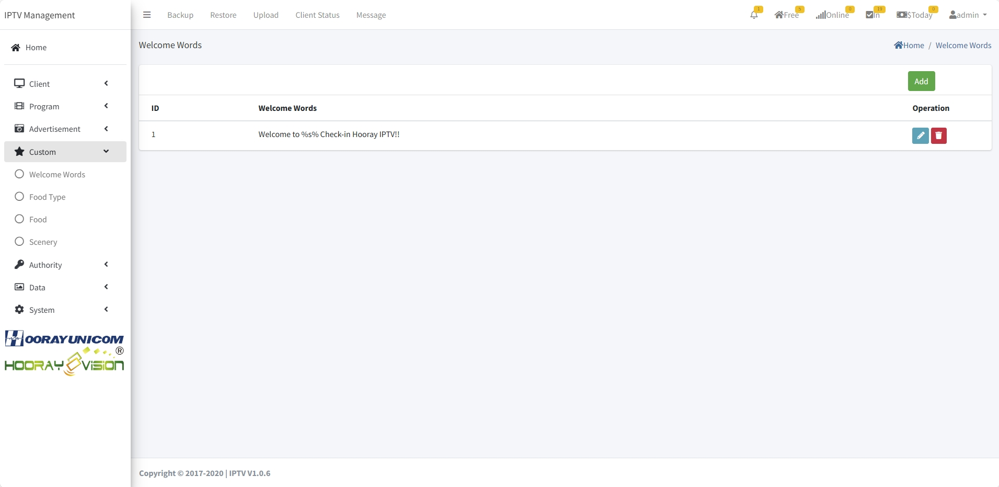
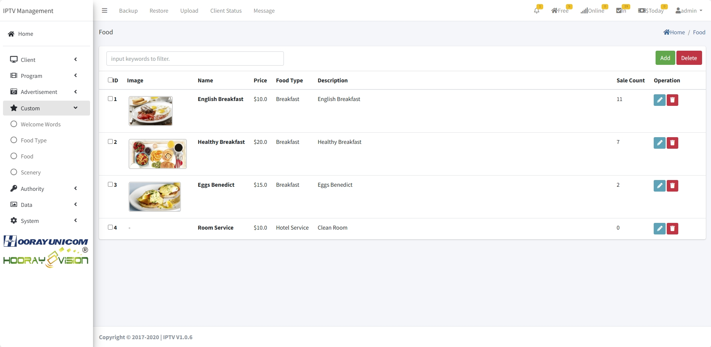

# Configuración personalizada

>Introducción

En el menú `Custom Menu`, los administradores controlan si se muestra el mensaje de bienvenida en la página de inicio, así como la configuración del pedido de comidas en línea y la configuración de información sobre lugares de interés cercanos.

## Palabras de bienvenida

>Introducción

En `Welcome Words`, el administrador configura el mensaje de bienvenida que se muestra en la página del terminal. Cuando el administrador registra el dispositivo terminal, el dispositivo mostrará automáticamente la información de texto correspondiente en la página de inicio.

Presione el botón `Add` para crear nuevas palabras de bienvenida

**ID** En `ID`, los IDs son administrados y generados por el sistema. No es necesario rellenarlo.

**Clients** En `Clients`, el administrador selecciona el dispositivo en el que se mostrará el mensaje de bienvenida. El dispositivo seleccionado mostrará la información del mensaje de bienvenida al registrarse.

**Welcome Words** En `Material Type`, el administrador debe asignar si el material subido pertenece a la categoría `image` o `video`, y seleccionar la categoría correspondiente desplegando el menú.

## Tipo de comida

>Introducción

En `Food Type`, los administradores crean categorías para diferentes tipos de comida. Para facilitar la distinción entre diferentes alimentos.

Presione el botón `Add` para crear un nuevo tipo de comida

**ID** En `ID`, los IDs son administrados y generados por el sistema. No es necesario rellenarlo.

**Name** En `Name`, ingrese el nombre utilizado para identificar este tipo de comida

## Comida

>Introducción

En el menú `Food`, esta página muestra toda la información de comida reservable, incluyendo imágenes, nombres, precios, categorías, descripciones y el número de reservas. Los administradores pueden agregar, editar y eliminar información específica de comida reservable.

Presione el botón `Add` para crear nueva información de comida reservable.

**Image** En `Image`, el administrador sube la imagen de la comida correspondiente en venta, el formato de imagen admite PNG, JPG.

**Name** En `Name`, ingrese el nombre utilizado para identificar la comida

**Price($)** En `Prices`, el administrador establece el precio de esta reserva de comida

**Food Type** En `Food Type`, seleccione el tipo de comida al que pertenece la comida.

**Description** En `Description`, la descripción se utiliza para introducir la información de la comida, que se mostrará en el terminal del usuario.

## Paisajes

>Introducción

En `Scenery`, los administradores pueden agregar imágenes e información de introducción, que puede ser una introducción a las instalaciones del hotel, servicios del hotel o atracciones cercanas.

Presione el botón `Add` para crear nueva información

Suba la imagen de vista previa y la información del título de la introducción general en esta capa. Después de completar la operación, haga clic en el botón Submit para enviar. Después del envío, comience a agregar imágenes detalladas e información, y haga clic en el icono más para entrar en la configuración de la página detallada. En esta página, puede subir las imágenes correspondientes y agregar información de texto.

 
- Comprobar disponibilidad de servicios

# Configuración de Instalaciones

>Introducción

En el `Menú Personalizado`, los administradores controlan si mostrar el mensaje de bienvenida en la página de inicio, así como la configuración de pedidos de comida en línea y la configuración de información sobre lugares turísticos cercanos.

## Palabras de Bienvenida

>Introducción

En `Palabras de Bienvenida`, el administrador configura el mensaje de bienvenida que se muestra en la página del terminal. Cuando el administrador realiza el check-in del dispositivo terminal, el dispositivo terminal mostrará automáticamente la información de texto correspondiente en la página de inicio.

Presione el botón `Agregar` para crear nuevas palabras de bienvenida

**ID**: En `ID`, los ID se administran y generan automáticamente por el sistema. No es necesario completarlos.

**Clientes**: En `Clientes`, el administrador selecciona el dispositivo en el que se muestra el mensaje de bienvenida. El dispositivo seleccionado mostrará la información del mensaje de bienvenida cuando realice check-in.

**Palabras de Bienvenida**: En `Tipo de Material`, el administrador necesita asignar si el material cargado pertenece a la categoría `imagen` o `video`, y selecciona la categoría correspondiente abriendo la lista desplegable.

## Tipo de Comida

>Introducción

En `Tipo de Comida`, los administradores crean categorías para diferentes tipos de comida. Esto facilita la distinción entre diferentes alimentos.

Presione el botón `Agregar` para crear un nuevo tipo de comida

**ID**: En `ID`, los ID se administran y generan automáticamente por el sistema. No es necesario completarlos.

**Nombre**: En `Nombre`, ingrese el nombre utilizado para identificar este tipo de comida.

## Comida

>Introducción

En el menú `Comida`, esta página muestra toda la información de comida reservable, incluyendo imágenes, nombres, precios, categorías, descripciones y el número de reservas. Los administradores pueden agregar, editar y eliminar la información de comida de reserva especificada.

Presione el botón `Agregar` para crear nueva información de comida reservable.

**Imagen**: En `Imagen`, el administrador carga la imagen de la comida de venta correspondiente. El formato de imagen admite PNG y JPG.

**Nombre**: En `Nombre`, ingrese el nombre utilizado para identificar la comida.

**Precio($)**: En `Precio`, el administrador establece el precio de esta reserva de comida.

**Tipo de Comida**: En `Tipo de Comida`, seleccione el tipo de comida al que pertenece la comida.

**Descripción**: En `Descripción`, la descripción se utiliza para presentar la información de la comida, que se mostrará en el terminal del usuario.

## Escenario

>Introducción

En `Escenario`, los administradores pueden agregar información de imagen e introducción, que puede ser una introducción de las instalaciones del hotel, servicios del hotel o atracciones cercanas.

Presione el botón `Agregar` para crear nueva información

Cargue la imagen de vista previa e información del título de la introducción general en esta capa. Después de completar la operación, haga clic en el botón Enviar para enviar. Después del envío, comience a agregar imágenes y información detalladas. Haga clic en el icono más para acceder a la página de configuración detallada. En esta página, puede cargar imágenes correspondientes y agregar información de texto.

 
