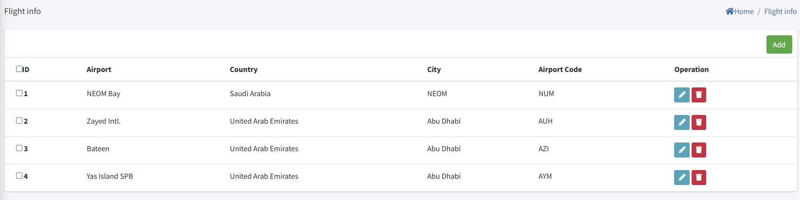
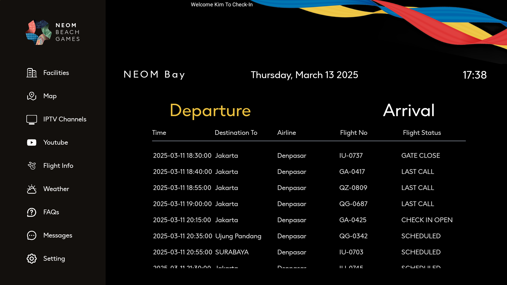

 # Configuración de Información de Vuelos

> Introducción

En el `Flight Info Menu`, los administradores pueden agregar, eliminar y modificar información sobre aeropuertos en ciudades de destino. El sistema IPTV obtendrá automáticamente la información de llegadas y salidas de vuelos de estos aeropuertos a través de una interfaz de terceros basada en la información del aeropuerto, y luego reenviará esta información a los dispositivos terminales a través de la interfaz. Los dispositivos terminales mostrarán la información en pantalla.

Presione el botón `Add` para crear la nueva información del aeropuerto

**ID**: El número de ID es el número de identificación. Cuanto menor sea el número de identificación, más alta será su posición en la lista. Cabe señalar que el número de identificación debe ser único.

**Airport**: `Airport` se refiere al nombre del aeropuerto que necesita mostrarse en el terminal.

**Country**: `Country` representa el país donde se encuentra el aeropuerto.

**City**: `City` representa la ciudad donde se encuentra el aeropuerto.

**Airport Code(IATA Code)**: En la columna "Airport Code(IATA Code)", debe completar con precisión el código del aeropuerto. Si no puede proporcionar el código del aeropuerto con precisión, puede obtenerlo a través de motores de búsqueda u otros medios. Solo después de completar el código correcto podrá obtener la información correcta de llegadas y salidas de vuelos.

> Pantalla del Terminal

