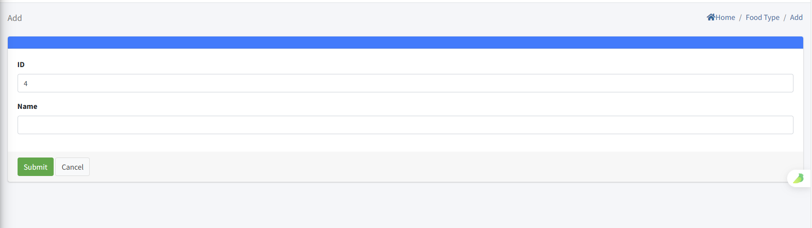
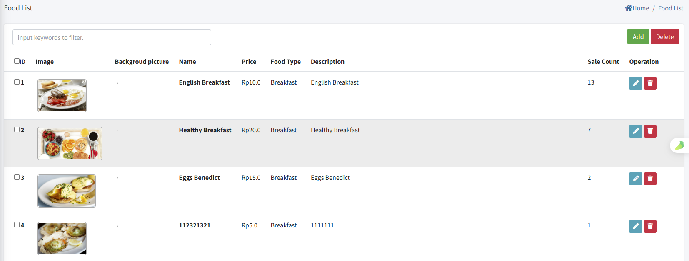

# Food Setting

>Introducción

 

En el `Hotel Service`, los administradores configuran los tipos de alimentos y los elementos del menú para el sistema de pedidos IPTV en la habitación, y pueden ver, aceptar, completar o cancelar los pedidos de los huéspedes en tiempo real. Los huéspedes realizan pedidos directamente desde su televisor, y los administradores gestionan todo el flujo de trabajo de pedidos a través de la plataforma.

## Food Type

>Introducción

 

En `Food Type`, el administrador crea, modifica y elimina categorías de artículos.

Presione el botón `Add` para crear una nueva categoría de artículo

**ID**: En `ID`, el sistema IPTV crea automáticamente un número de ID que se utiliza para ordenar las diferentes categorías; cuanto menor sea el número, más avanzada será su posición en la lista.

**Name**: El `Name` se usa para mostrar el alimento de la categoría.

## Food List

>Introducción

En la página `Food List`, el administrador gestiona los elementos de alimentos disponibles para pedidos en habitaciones mediante la creación, edición o eliminación de productos según sea necesario.

Presione el botón `Add` para crear un nuevo elemento para pedidos en línea.

**Image**: En `Image`, cargue imágenes de productos y las imágenes se mostrarán en el terminal; actualmente solo se admite la carga de una imagen.

**Backgroud picture**: La imagen de fondo que se mostrará en el terminal cuando el usuario seleccione o haga clic en el elemento de alimento.

**Name**: `Name` se usa para identificar el nombre del alimento que se muestra en el terminal.

**Price**: En `Price`, se usa para mostrar el precio unitario al que se vende el alimento.

**Food Type**: Seleccione el `Food Type` para el alimento, y el alimento aparecerá en la lista de categorías correspondiente en el terminal.

**Description**: En `Description` se usa para describir información específica y detalles sobre este alimento.

## Order Status

>Introducción

 

En esta página, el administrador puede ver los detalles del pedido de artículos enviado por el suscriptor desde el terminal. Cuando el administrador recibe el pedido del suscriptor, puede `receive` el pedido usando el botón RECEIVE o `cancel` el pedido del suscriptor usando el botón DELETE. Después de aceptar el pedido del suscriptor, cuando el pedido se complete, el administrador puede hacer clic en el botón Finish nuevamente para `complete` todo el proceso del pedido.

