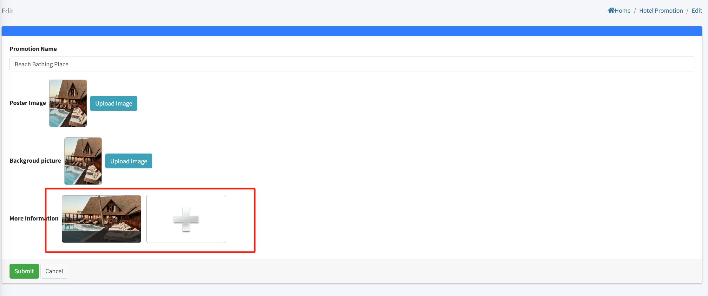

# Configuración de Promociones del Hotel

> Introducción

En la sección "Promociones del Hotel", los administradores pueden crear, modificar y eliminar anuncios promocionales del hotel.

Haz clic en el botón "Agregar" para crear una nueva promoción del hotel.

**Nombre de la promoción**: Ingresa un nombre único para la promoción del hotel. Este nombre se mostrará en el terminal IPTV para los huéspedes.

**Imagen del cartel**: Sube la miniatura principal o la imagen de portada de esta promoción. Esta imagen se mostrará en la lista de promociones del IPTV. (Solo se puede subir una imagen.)

**Imagen de fondo**: Sube una imagen de fondo para la página de detalles de la promoción. Cuando un huésped haga clic en la promoción, esta imagen se usará como fondo principal.

## Agregar Detalles de la Promoción del Hotel

> Introducción

Esta sección está disponible al editar una promoción existente. Aquí puedes subir imágenes adicionales para proporcionar más detalles sobre la actividad o servicio a los huéspedes.

**Soporte de múltiples imágenes:** A diferencia de los campos de imagen única (cartel y fondo), esta sección permite subir varias imágenes para la página de detalles de la promoción.

**Contenido detallado:** Estas imágenes enriquecen la descripción de la promoción que se muestra en el terminal IPTV, permitiendo a los huéspedes ver más aspectos de la oferta (por ejemplo, vistas de instalaciones, platos específicos o escenas de actividades).

**Imagen**: Sube imágenes de la promoción del hotel para que se muestren en el terminal. Actualmente, solo se puede subir una imagen.

**Contenido**: Utiliza "Contenido" para describir información y detalles específicos sobre la imagen subida.
