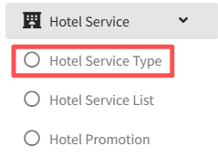
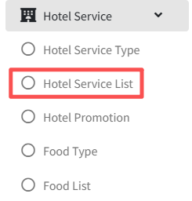

# Servicio del Hotel

>Introducción

 

El módulo `Hotel Service` permite a los administradores configurar categorías y artículos de servicio para el sistema IPTV en la habitación. Los administradores pueden ver, aceptar, completar o cancelar pedidos de huéspedes en tiempo real. Los huéspedes pueden realizar pedidos de servicio directamente desde su televisor, mientras que los administradores gestionan todo el flujo de trabajo de pedidos a través de la plataforma.

## Tipo de Servicio del Hotel

>Introducción

 

En el `Hotel Service Type`, el administrador crea, modifica y elimina categorías de servicio del hotel.

Presione el botón `Add` para crear la nueva categoría de servicio del hotel

**ID**: En `ID`, el sistema IPTV crea automáticamente un número de ID, que se utiliza para ordenar las diferentes categorías; cuanto menor sea el número, más avanzada será la visualización

**Name**: El `Name` se usa para mostrar el servicio del hotel de la categoría.

## Lista de Servicios del Hotel

>Introducción

En la página `Hotel Service List`, el administrador gestiona los artículos de servicio del hotel disponibles para pedidos en habitaciones mediante la creación, edición o eliminación de productos según sea necesario.

Presione el botón `Add` para crear el nuevo servicio para pedidos en línea.

**Image**: En `Image`, cargue imágenes del servicio del hotel en Imagen y las imágenes se muestran en el terminal; actualmente solo se admite la carga de una imagen.

**Background picture**: La imagen de fondo que se mostrará en el terminal cuando el usuario seleccione o haga clic en el artículo de servicio del hotel.

**Name**: `Name` se usa para identificar el nombre del servicio del hotel que se muestra en el terminal.

**Price**: En `Price`, se usa para mostrar el precio unitario al que se vende el servicio del hotel.

**Hotel Service Type**: Seleccione el `Hotel Service Type` para el servicio, y el servicio aparecerá en la lista de categorías correspondiente en el terminal.

**Description**: En `Description` se usa para describir información específica y detalles sobre este servicio del hotel.

## Estado de Pedidos

>Introducción

 

En esta página, el administrador puede ver los detalles del pedido de artículos enviado por el suscriptor desde el terminal. Cuando el administrador recibe el pedido del suscriptor, puede `receive` el pedido usando el botón RECEIVE o `cancel` el pedido del suscriptor usando el botón DELETE. Después de aceptar el pedido del suscriptor, cuando el pedido se complete, el administrador puede hacer clic en el botón Finish nuevamente para `complete` todo el proceso del pedido.
