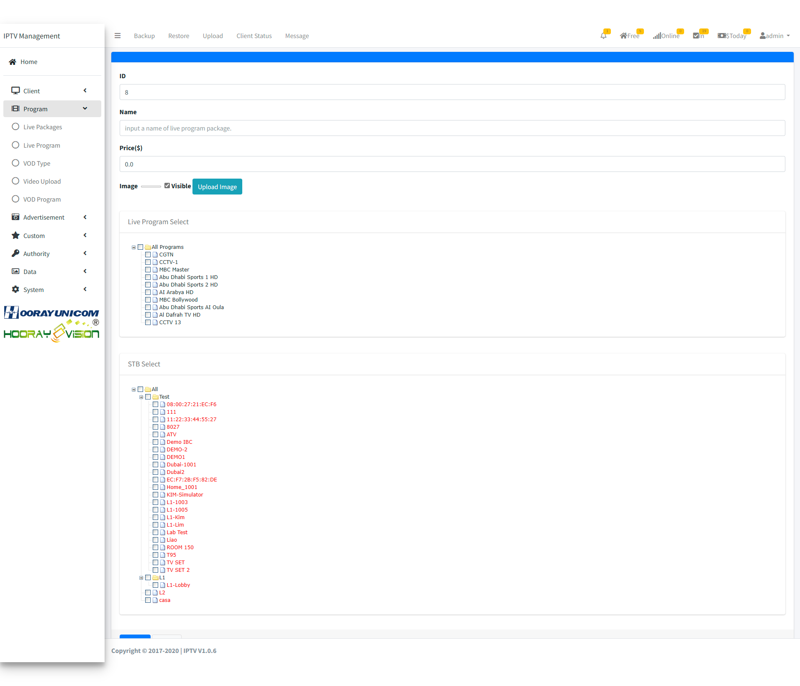

# Configuración de transmisión en vivo

Configure y gestione canales de transmisión en vivo en la plataforma Hooray Hotel IPTV.

## Paquetes en vivo

## Configuración de fuentes

### Agregar una fuente

1. Vaya a **Configuración de transmisión en vivo** → **Fuentes**
2. Haga clic en **Nueva fuente**
3. Ingrese la información:
   - Nombre de la fuente
   - URL de transmisión (RTMP, HLS, etc.)
   - Tipo de codec
4. Haga clic en **Guardar**

### Verificar la conexión

- Pruebe la fuente antes de guardar
- Monitoree la calidad de la señal
- Configure redundancia si es necesario

## Gestión de canales

### Agregar canales

1. Vaya a **Canales en vivo**
2. Haga clic en **Agregar canal**
3. Seleccione la fuente
4. Configure:
   - Número de canal
   - Nombre visible
   - Icono/logo
   - Descripción
5. Haga clic en **Guardar**

### Organizar canales

- Agrupar por categoría (noticias, deportes, películas)
- Establecer orden de visualización
- Configurar permisos de acceso

## Guía electrónica de programas (EPG)

### Importar EPG

1. Vaya a **Configuración de transmisión en vivo** → **EPG**
2. Haga clic en **Importar**
3. Cargue el archivo EPG (XML)
4. Asigne canales a programas

### Actualizar EPG

- Configure actualizaciones automáticas
- Especifique intervalos de actualización
- Verifique la integridad de los datos

## Paquetes de canales

### Crear un paquete

1. Vaya a **Paquetes de canales**
2. Haga clic en **Nuevo paquete**
3. Seleccione canales
4. Configure permisos
5. Asigne precios (si es aplicable)

### Asignación de clientes

- Asigne paquetes a habitaciones o grupos
- Configure acceso basado en permisos
- Monitoree el uso

## Programación

- Establecer horarios de transmisión
- Configurar transmisiones en vivo automáticas
- Gestionar cambios de programación

## Resolución de problemas

- Verificar calidad de la fuente
- Revisar registros de transmisión
- Comprobar ancho de banda disponible
