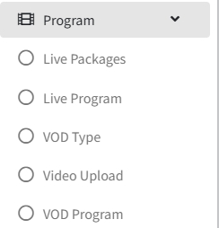
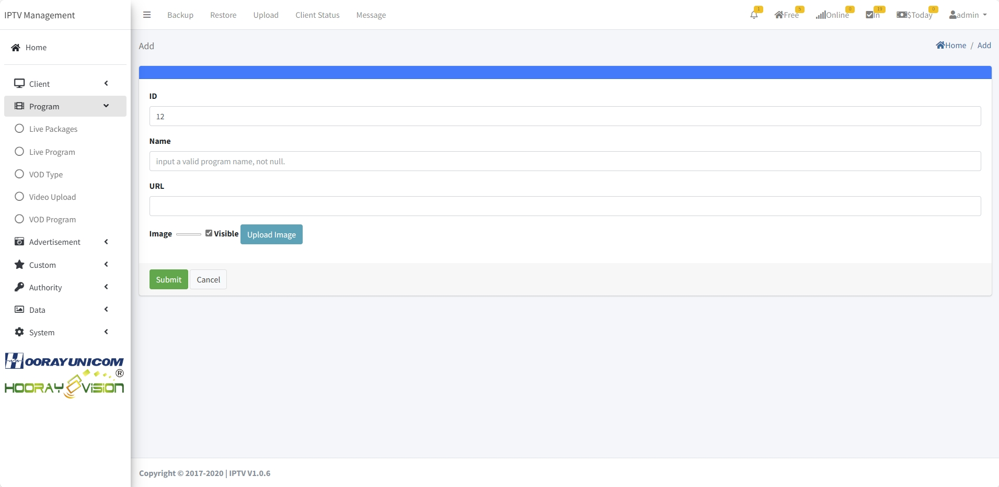

# Configuración de Transmisión en Vivo

>Introducción

El menú de programas permite a los administradores crear, modificar y eliminar configuraciones de `Live` y `VOD`.

## Paquetes en Vivo

>Introducción

En la función de Paquetes en Vivo, los administradores pueden crear, modificar y eliminar categorías para las fuentes de canales en vivo. Al crear categorías, se facilita la organización y asociación de las fuentes con sus categorías correspondientes, permitiendo a los suscriptores buscar y clasificar los canales en vivo que desean ver.

Los administradores pueden crear nuevas categorías en vivo haciendo clic en el botón `Add`. Cada categoría debe asociarse a una fuente de canal en vivo; cada categoría puede subir un póster distintivo.

1. **ID**: El `ID` se genera automáticamente por el sistema; cuanto menor sea el `ID`, más arriba se mostrará la categoría en la lista. Puede ajustar el `ID` en la página de edición para ordenar las categorías.

2. **Name**: El `Name` distingue entre los distintos nombres de categoría.

3. **Price**: El administrador puede configurar el `price` de la categoría en vivo; cuando el precio es 0, la categoría es gratuita; si no es 0, al acceder se solicitará cobro.

4. **Image**: Subiendo la `image` correspondiente a la categoría, ésta se mostrará en el menú de categorías en el decodificador.

!>  **Warning: Live Package upload image size should 300x210**

5. **Live Program Select**: Para `select` el programa en vivo correspondiente a la categoría, el administrador debe seleccionar los programas que se mostrarán bajo esa categoría en el menú del terminal.

6. **STB Select**: El administrador selecciona los dispositivos en la lista; solo los dispositivos seleccionados podrán mostrar esta categoría en vivo.

## Programa en Vivo

>Introducción

En la sección "Live Program", los administradores pueden añadir manualmente o en lote programas en vivo. Tras añadirlos, pueden editar y eliminar programas específicos. Se admiten protocolos comunes: UDP(unicast)/RTP(unicast)/HTTP-TS/HTTP-FLV/RTMP/RTMPS/HLS/DASH, entre otros.

Los administradores pueden crear un nuevo canal en vivo haciendo clic en el botón `Add`.

1. **ID**: Este `ID` se genera automáticamente por el sistema y puede editarse manualmente. Al editar manualmente no debe entrar en conflicto con otros `ID`. Este `ID` es el número de orden del canal; cuanto menor sea, antes se mostrará en el decodificador.

2. **Name**: El `Name` se usa para mostrar el nombre del canal en el decodificador. El texto ingresado se muestra completo como nombre del canal.

3. **URL**: Rellene la `URL` con la dirección que debe reproducirse en el terminal.

4. **Image**: Al subir el `program logo` correspondiente, éste se mostrará en la lista de canales y en el detalle del canal en el decodificador.

## Canal de radio

> Introducción

<!-- 📷 Captura pendiente: página de lista de canales de radio -->

En `Canal de radio`, los administradores pueden añadir, editar y eliminar información de canales de radio. Los canales de radio se emiten como programas de audio a los dispositivos terminales, lo que permite a los huéspedes escuchar emisoras de radio en sus habitaciones.

Pulse el botón `Añadir` para crear un nuevo canal de radio.

<!-- 📷 Captura pendiente: ventana de añadir/editar canal de radio -->

1. **ID**: El `ID` lo genera automáticamente el sistema. Cuanto menor sea el `ID`, antes aparece el canal de radio en la lista.

2. **Número**: En `Número`, establezca el orden de visualización del canal de radio. Cuanto menor sea el número, más arriba aparecerá en la lista.

3. **Nombre**: En `Nombre`, introduzca el nombre del canal de radio, p. ej. `BBC World Service`. Este nombre se mostrará en el terminal.

4. **URL**: En `URL`, rellene la dirección de reproducción del canal de radio. El terminal utilizará esta dirección para reproducir el programa de radio.

5. **Imagen**: Al subir la `imagen` del canal correspondiente, ésta se mostrará en la lista de canales de radio del terminal.

## Reproducción forzada en vivo

> Introducción

<!-- 📷 Captura pendiente: página de gestión de reproducción forzada en vivo -->

En `Reproducción forzada en vivo`, los administradores pueden crear una tarea de reproducción forzada: todos (o los especificados) los decodificadores registrados se verán obligados a cambiar a una fuente en vivo designada dentro de un intervalo de tiempo, y la página de reproducción quedará bloqueada durante la tarea. Si el huésped intenta salir, el terminal vuelve a cambiar automáticamente. Esto se utiliza normalmente para anuncios del hotel o emisiones obligatorias (p. ej. vídeos de seguridad contra incendios).

### Crear una tarea de reproducción forzada

<!-- 📷 Captura pendiente: ventana de creación de tarea de reproducción forzada -->

Pulse el botón `Añadir` / `Crear tarea` para crear una nueva tarea de reproducción forzada. Solo puede haber una tarea activa a la vez; crear una nueva tarea cancelará la anterior activa.

1. **Tipo de fuente de reproducción**: Seleccione la fuente de la reproducción forzada:
   - `Canal de TV en vivo`: elija un canal existente de la lista.
   - `URL personalizada`: rellene una dirección de flujo personalizada (debe ser `http`/`https` y no puede ser una dirección de intranet).

2. **Hora de inicio**: La hora de inicio de la tarea, en el formato `yyyy-MM-dd HH:mm`. También puede iniciarse inmediatamente con una duración.

3. **Hora de fin**: La hora de fin de la tarea, en el formato `yyyy-MM-dd HH:mm`. La hora de fin debe ser posterior a la hora de inicio.

### Supervisar el estado de la tarea

<!-- 📷 Captura pendiente: supervisión de tareas/detalles del dispositivo -->

Tras crear la tarea, la página de gestión muestra en tiempo real las estadísticas de ejecución de todos los terminales objetivo:

- Conteos **Pendiente / Enviado / Ejecutado / Fallido / Caducado** y el número total de terminales.
- **Detalles del dispositivo**: el estado del comando de cada terminal (Pendiente / Enviado / Ejecutado / Fallido / Caducado), hora de envío, hora de confirmación y motivo del fallo.
- **Tareas históricas**: ver todas las tareas de reproducción forzada pasadas.
- **Reenviar**: reenvío masivo de los comandos fallidos de una tarea.
- **Exportación CSV**: exportar los detalles de los comandos de una tarea como archivo CSV para su registro.

Pulse el botón `Cancelar` para cancelar la tarea activa actual en cualquier momento. Una vez cancelada, los terminales dejarán de ser forzados y volverán a la normalidad.
