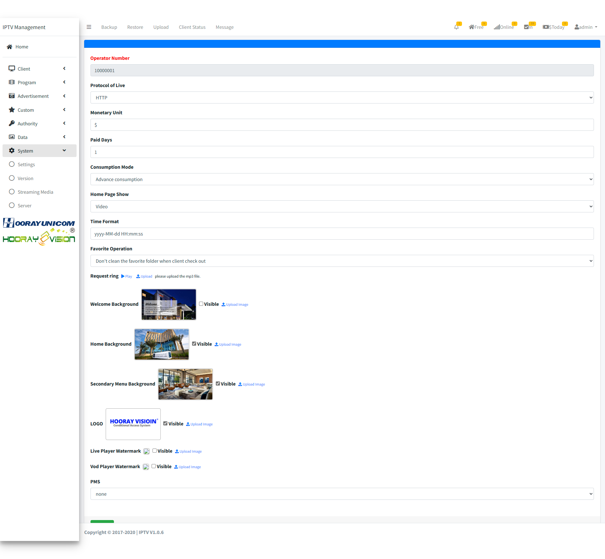
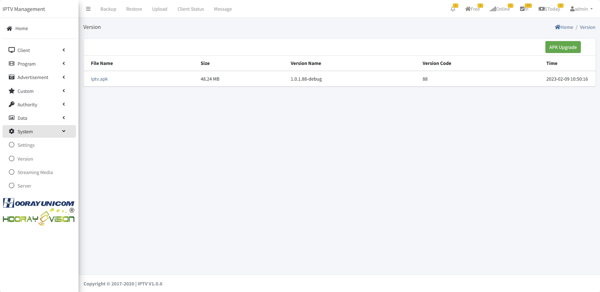

# System Setting

>Introducción

 

En `System`, el administrador puede modificar la información del sistema IPTV, incluyendo la importación de información de autorización, la copia de seguridad de la base de datos y la configuración de seguridad de la interfaz API externa.

## Setting

>Introducción

 

En `Setting`, el administrador configura la información básica que debe sincronizarse con el terminal, la imagen de fondo de cada página jerárquica, el formato de hora y algunos otros parámetros detallados.

**Monetary Unit**: En `Monetary Unit`, el administrador ingresa el equivalente local del símbolo del dólar, que se utiliza para mostrar el símbolo del dólar local en `Shopping`.

**Paid Days**: En `Paid Days`, cuando el huésped hace clic para comprar un paquete de transmisión en vivo o una película, es el tiempo de vencimiento establecido.

**Consumption Mode**: En `Consumption Mode`, el administrador selecciona el método de pago del huésped. En `Prepaid consumption`, cuando el huésped consume, primero necesita recargar el monto en la cuenta. Solo cuando hay suficiente monto en la cuenta pueden consumir. Si el monto es insuficiente, no pueden consumir. En `Advance Consumption`, los huéspedes pueden consumir sin recargar, y el consumo se registra en el monto de la habitación en forma de cuentas por cobrar.

**Home Page Show**: En `Home Page Show`, el administrador selecciona la forma en que se muestra el fondo de la página de inicio en la lista desplegable. Cuando se selecciona `Image`, se muestra la imagen de fondo cargada. Cuando se selecciona `Video`, se muestra el archivo de video cargado.

**Time Format**: En `Time Format`, el administrador establece manualmente el formato de hora que se muestra en el front-end.

**Favorite Operation**: En `Favorite Operation`, los administradores configuran si se debe borrar la lista de favoritos guardada por el huésped al hacer el check-out.

**Request ring**: En `Request ring`, el administrador carga el tono de alerta de pedido correspondiente. Actualmente está obsoleto debido a factores técnicos del navegador.

**Welcome Background**: En `Welcome Background`, el administrador necesita cargar la imagen de fondo de bienvenida que se sincronizará con el lado del TV.

**Home Background**: En `Home Background`, el administrador necesita cargar la imagen de fondo de inicio que se sincronizará con el lado del TV.

**Secondary Menu Background**: En `Secondary Menu Background`, el administrador necesita cargar la imagen de fondo del menú secundario que se sincronizará con el lado del TV.

**LOGO**: En `LOGO`, el administrador necesita cargar la imagen del logo que se sincronizará con el lado del TV y móvil.

**Live Player Watermark**: Esta función está actualmente obsoleta.

**Vod Player Watermark**: Esta función está actualmente obsoleta.

**City**: En `City`, el administrador ingresa el nombre de la ciudad correspondiente, y el servidor IPTV obtendrá la información del clima y la reenviará a diferentes terminales.

**Enable Remote Assistance**: Esta función está actualmente obsoleta.

## Version

>Introducción

 

En `APK Version Management`, los administradores pueden configurar políticas de actualización para diferentes terminales, admitiendo métodos de actualización tanto obligatorios como no obligatorios.

Presione el botón `APK Upgrade` para cargar el apk. Después de hacer clic en el botón `APK upgrade`, aparecerá una página de carga. Después de seleccionar el archivo APK que se va a actualizar, el sistema procesará automáticamente la información de la versión del archivo y la mostrará en la lista de actualización. El administrador necesita verificar si es correcta.
