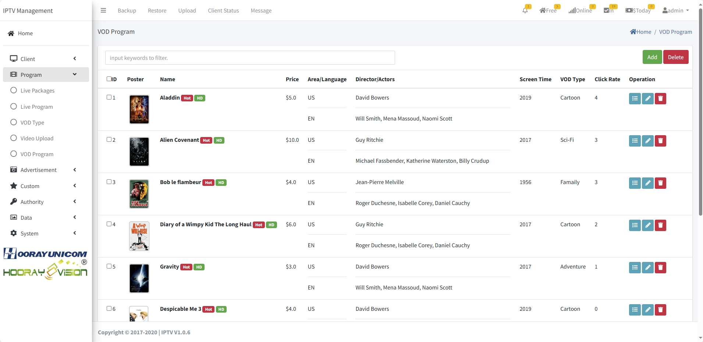

# Configuración de VOD

Gestione la biblioteca de video bajo demanda (VOD) en la plataforma Hooray Hotel IPTV.

## Categoría de VOD

## Carga de contenido

### Cargar videos

1. Vaya a **Configuración de VOD** → **Carga de contenido**
2. Haga clic en **Cargar video**
3. Seleccione archivos de su dispositivo
4. Ingrese metadatos:
   - Título
   - Descripción
   - Género
   - Año de lanzamiento
   - Duración
5. Haga clic en **Cargar**

### Formatos soportados

- MP4, MKV, AVI, MOV
- Resoluciones: SD, HD, 4K
- Códecs: H.264, H.265, VP9

## Organización de contenido

### Crear categorías

1. Vaya a **Categorías**
2. Haga clic en **Nueva categoría**
3. Nombre la categoría (películas, series, documentales)
4. Asigne orden de visualización

### Categorizar videos

1. Seleccione videos
2. Asigne categorías
3. Agregue etiquetas
4. Establish clasificaciones de contenido

## Carga de VOD

## Gestión de metadatos

### Editar información del video

1. Seleccione un video
2. Haga clic en **Editar**
3. Actualice:
   - Título y descripción
   - Portada/imagen en miniatura
   - Actores y directores
   - Clasificación de contenido

### Cargar carátulas

- Tamaño recomendado: 500x750px
- Formatos: JPG, PNG
- Proporción: 2:3

## Control de acceso

### Configurar permisos

1. Seleccione videos o categorías
2. Haga clic en **Permisos**
3. Seleccione qué dispositivos/habitaciones pueden acceder
4. Guarde cambios

### Restricciones de edad

- Configurar clasificación por edad
- Requerir PIN para contenido restringido
- Establecer horarios de visualización

## Búsqueda y recomendaciones

- Implementar búsqueda de texto completo
- Usar recomendaciones basadas en historial
- Crear listas personalizadas

## Analítica

- Monitorear contenido más visto
- Rastrear tiempo de visualización
- Evaluar preferencias de usuarios

## Resolución de problemas

- Verificar compatibilidad de formato
- Revisar registros de carga
- Comprobar espacio de almacenamiento disponible
