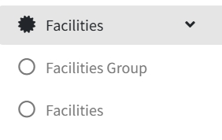

# Facilities Setting

> Introduction

In `Facilities Menu`, administrators can create facility groups and manage hotel facility information (such as swimming pool, gym, restaurant, etc.). The facility information will be displayed on the terminal devices in the guest rooms, allowing guests to browse the hotel facilities and surrounding attractions.

## Facilities Group

> Introduction

<!-- 📷 截图待补充：Facilities Group 列表页 -->

In `Facilities Group`, administrators create groups to categorize facilities. Grouping makes it easier to manage and display facilities of the same category together on the terminal.

Press `Add` button to create a new facilities group.

<!-- 📷 截图待补充：Facilities Group 新增/编辑弹窗 -->

**ID** In `ID`, IDs are managed and generated by the system. It does not need to be filled in.

**Name** In `Name`, enter the name used to identify this facilities group, e.g. `Hotel Facilities`, `Surrounding Attractions`.

## Facilities

> Introduction

<!-- 📷 截图待补充：Facilities 列表页 -->

In `Facilities`, administrators add, edit, and delete facility details. Each facility belongs to one or more facility groups and will be displayed on the terminal device for guests to browse.

Press `Add` button to create new facility information.

<!-- 📷 截图待补充：Facilities 新增/编辑弹窗 -->

**Type** In `Type`, enter the name of the facility, e.g. `Swimming Pool`, `Fitness Center`.

**Content** In `Content`, enter the detailed description of the facility. The content will be displayed on the terminal device.

**Group** In `Group`, select the facilities group(s) to which this facility belongs. A facility can belong to multiple groups.

> Terminal Screen

<!-- 📷 截图待补充：终端展示效果 -->
