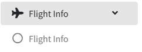
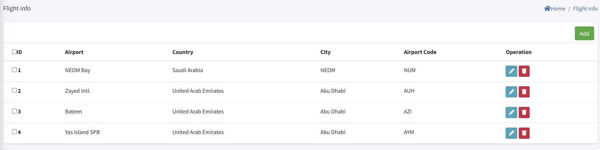
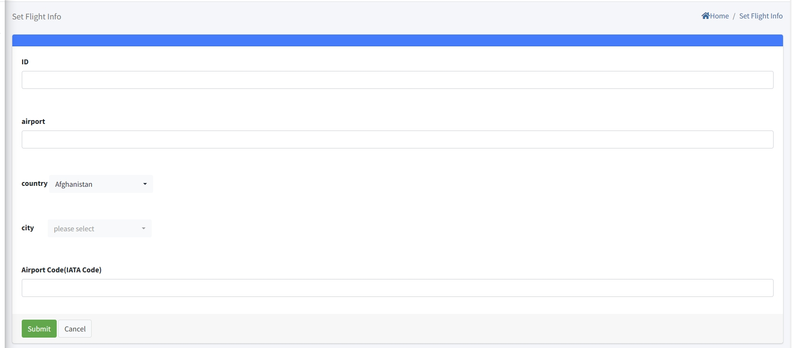
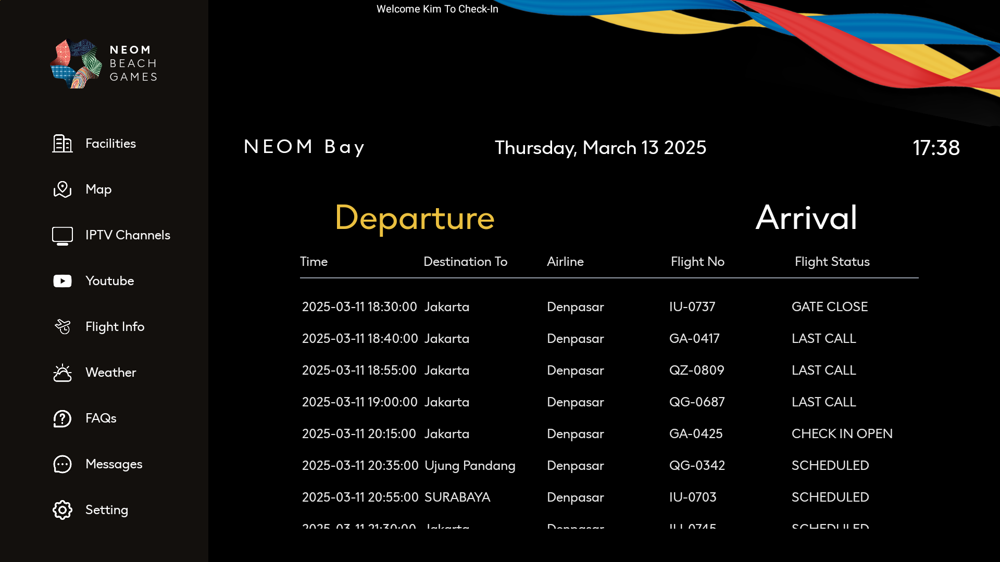

# Flight Info Setting

> Introduction

In `Flight Info Menu`, administrators can add, delete, and modify information about airports in destination cities. The IPTV system will automatically obtain the flight arrival and departure information of these airports through a third - party interface based on the airport information, and then forward this information to terminal devices through interface. The terminal devices will display the information on screen.

Press `Add` button to create the new airport information

**ID**: The ID number is the identification number. The smaller the identification number, the higher its position in the list. It should be noted that the identification number must be unique.

**airport**: `airport` refers to the name of the airport that needs to be displayed on the terminal.

**Country**: `Country` represents the country where the airport is located.

**City**: `City` represents the city where the airport is located.

**Airport Code(IATA Code)**: In the "Airport Code (IATA Code)" column, you need to accurately fill in the code of the airport. If you can't provide the airport code accurately, you can obtain it through search engines or other means. Only after filling in the correct code can you get the correct flight arrival and departure information.

> Terminal Screen

