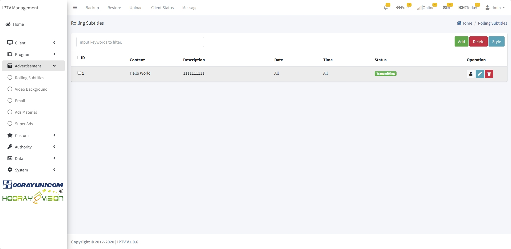

# Paramétrage des publicités

> Introduction

Dans le module Publicités, l'administrateur publie des informations et campagnes à destination des équipements en chambre.

## Sous-titres défilants

> Introduction

L'administrateur peut envoyer des sous-titres défilants différents selon les groupes de terminaux, avec choix des couleurs de police et d'arrière-plan.

Cliquez sur `Add` pour créer un sous-titre défilant.

**Content** : saisir le texte à diffuser.

**Client** : sélectionner un groupe ou des terminaux cibles.

**Description** : décrire ce sous-titre.

**Date** : définir la date de début et de fin.

**Time** : définir l'heure de début et de fin.

## Email

> Introduction

Le système peut pousser un message sous forme d'Email directement vers le client, qui l'ouvre sur le terminal pour en voir le détail.

Cliquez sur `Add` pour créer un message Email.

**Client** : sélectionner un groupe ou un terminal.

**Title** : objet affiché de l'email.

**Content** : contenu du message.

## Arrière-plan vidéo

> Introduction

Dans `Video Background`, activez la fonction puis importez un fichier MP4 (vidéo H.264, audio AAC). Les terminaux téléchargent et lisent automatiquement la vidéo en fond.

Cliquez sur `Add` pour créer un nouvel arrière-plan vidéo.

**Video** : choisir le fichier MP4 conforme (H.264/AAC).
**Clients** : sélectionner le groupe ou le terminal concerné.

**Description** : décrire l'opération ou le média.

## Matériels publicitaires

> Introduction

`Ads Material` liste les médias importés. L'administrateur peut ajouter, éditer ou supprimer des éléments.

### Ajouter / Éditer

Cliquez sur `Add` pour téléverser un média.

**Upload** : sélectionner l'image ou la vidéo à importer.

**Material Name** : nommer le média pour le retrouver ensuite.

**Material Type** : choisir `image` ou `video`.

**Ads Type** : associer le média au type de publicité cible (4 types disponibles).

### Supprimer

 Utiliser `Del` pour retirer un média. Si une campagne l'utilise encore, le terminal ne recevra plus ce média.

## Super Ads

> Introduction

Quatre types sont gérés : `boot ads`, `commercial ads`, `side ads` et `emergency ads`.

**Boot Ads** : affichés au démarrage avant l'écran de connexion.

**Commercial Ads** : diffusés avant la lecture live/VOD.

**Side Ads** : images superposées sur le côté durant le live.

**Emergency Ads** : images/vidéos poussées immédiatement à tous les terminaux ouverts.

### Créer / Modifier

Après `Add` ou `Edit`, renseignez les champs requis.

> Réglage des **Boot Ads**

**Ads Name** : nom de la campagne.

**Clients** : groupe d'appareils ciblé.

**Ads Type** : choisir `Boot Ads`.

**Material Type** : image ou vidéo jouée à l'ouverture de l'app.

**Material List** : sélectionner les médias à diffuser.

**Date** / **Time** : définir la fenêtre de diffusion.

**Publish** : activer l'envoi selon les dates/horaires définis.

> Réglage des **Commercial Ads**

**Ads Name** : nom de la campagne.

**Clients** : groupe d'appareils ciblé.

**Ads Type** : choisir `Commercial Ads`.

**Material Type** : uniquement vidéo.

**Program Setting** : sélectionner Live ou VOD.

**Play Setting** : `Manual broadcast` (choisir le média) ou `Random broadcast` (choix aléatoire par le terminal).

**Material** : cocher les médias utilisés.

**Date** / **Time** : fenêtre de diffusion.

**Publish** : activer l'envoi avec la fenêtre définie.

**Turn on channel switching** : si activé, la pub se joue au zapping live/VOD.

> Réglage des **Side Ads**

**Ads Name** : nom de la campagne.

**Clients** : groupe d'appareils ciblé.

**Ads Type** : choisir `Side Ads`.

**Material Type** : uniquement image.

**Program Setting** : utiliser sur Live ou VOD.

**Show Position** : position d'incrustation (gauche, droite, haut, bas).

 

 

**Interval** : temps d'intervalle entre deux affichages.

**Material** : médias à afficher.

**Images show time** : durée d'affichage de chaque image (en secondes).

**Date** / **Time** : fenêtre de diffusion.

**Publish** : activer l'envoi avec la fenêtre définie.

> Réglage des **Emergency Ads**

**Ads Name** : nom de la campagne.

**Clients** : groupe d'appareils ciblé.

**Ads Type** : choisir `Emergency Ads`.

**Material Type** : image ou vidéo.

**Program Setting**: In `Program Setting`, In Program Setting, the administrator needs to select whether the advertisement is to be used for live or VOD.

**Interval**: In `Play Setting`, administrator can select Manual boardcast or Random boardcast, when selecting Manual boardcast, administrator needs to select the advertisement material to be played in Material selection box, if selecting Random boardcast, the terminal will automatically select the advertisement materials to be played.

**Material**: In the `Material`, select the corresponding advertisement material by checking it.

**Images show time**: In `Image Show Time`, the administrator sets the image material show time, which is the number of seconds to show a single image, and if there are multiple images, each image will be shown for the same amount of time.

**Date**: In `Date`, the administrator can specify the start date and end date of the advertisement.

**Time**: In `Time`, the administrator can specify the start time and end time of the advertisement.
**Publish**: After checking `Pulish`, the advertisement will start to send, if Date and Time have been set, then the advertisement will be processed according to the Date and Time that has been set.
