# Paramétrage des publicités

> Introduction

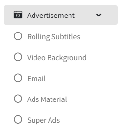

Dans le module Publicités, l'administrateur publie des informations et campagnes à destination des équipements en chambre.

## Sous-titres défilants

> Introduction

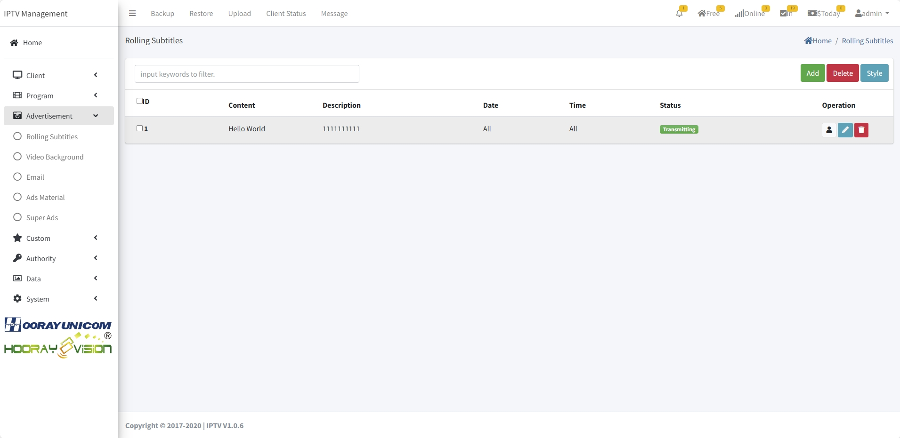

L'administrateur peut envoyer des sous-titres défilants différents selon les groupes de terminaux, avec choix des couleurs de police et d'arrière-plan.

Cliquez sur `Add` pour créer un sous-titre défilant.

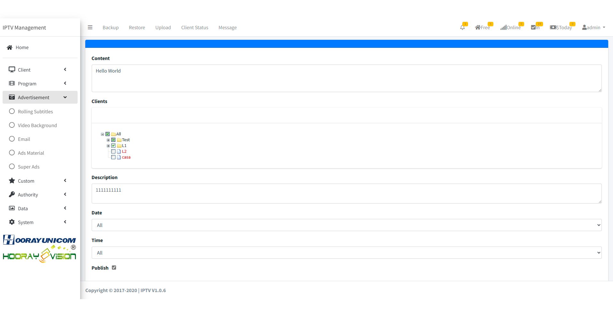

**Content** : saisir le texte à diffuser.

**Client** : sélectionner un groupe ou des terminaux cibles.

**Description** : décrire ce sous-titre.

**Date** : définir la date de début et de fin.

**Time** : définir l'heure de début et de fin. L'heure prend en charge le passage de minuit (ex. `22:00` - `06:00`) et utilise le format 24 heures.

## Email

> Introduction

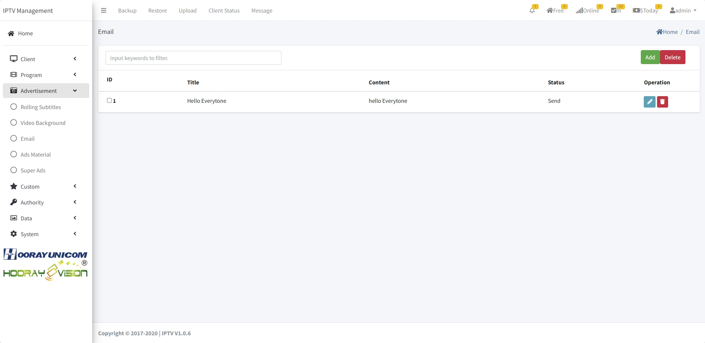

Le système peut pousser un message sous forme d'Email directement vers le client, qui l'ouvre sur le terminal pour en voir le détail.

Cliquez sur `Add` pour créer un message Email.

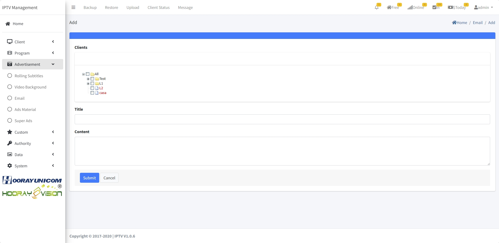

**Client** : sélectionner un groupe ou un terminal.

**Title** : objet affiché de l'email.

**Content** : contenu du message.

## Arrière-plan vidéo

> Introduction

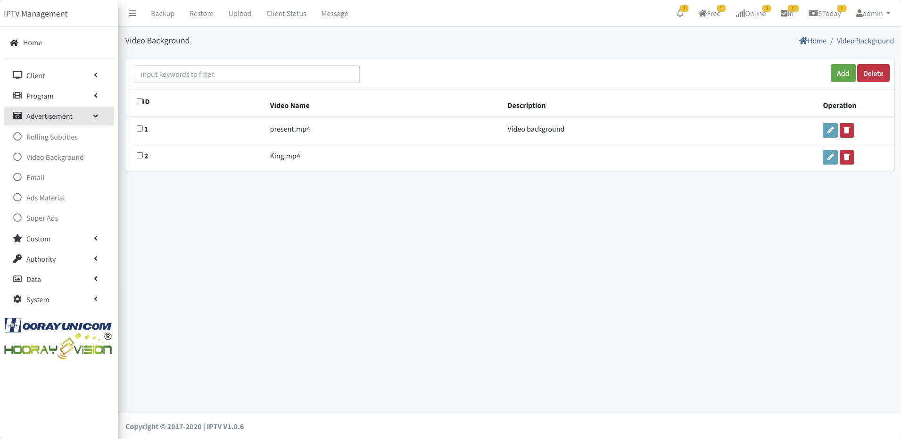

Dans `Video Background`, activez la fonction puis importez un fichier MP4 (vidéo H.264, audio AAC). Les terminaux téléchargent et lisent automatiquement la vidéo en fond.

Cliquez sur `Add` pour créer un nouvel arrière-plan vidéo.

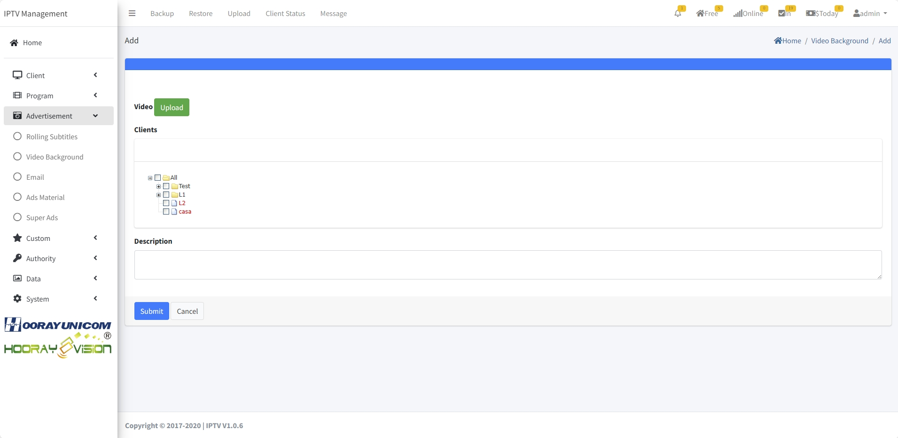

**Video** : choisir le fichier MP4 conforme (H.264/AAC).
**Clients** : sélectionner le groupe ou le terminal concerné.

**Description** : décrire l'opération ou le média.

## Matériels publicitaires

> Introduction

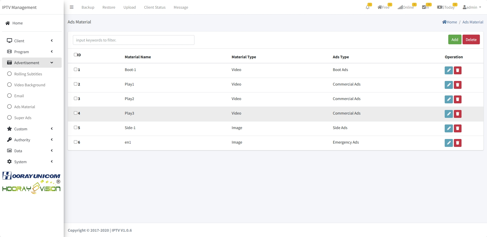

`Ads Material` liste les médias importés. L'administrateur peut ajouter, éditer ou supprimer des éléments.

### Ajouter / Éditer

Cliquez sur `Add` pour téléverser un média.

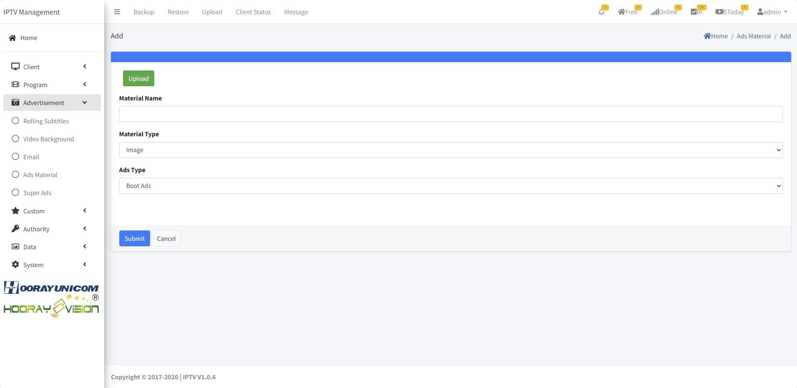

**Upload** : sélectionner l'image ou la vidéo à importer. Les fichiers volumineux sont téléchargés par fragments (téléchargement reprenable), de sorte qu'un téléchargement interrompu peut continuer au lieu de redémarrer.

**Material Name** : nommer le média pour le retrouver ensuite.

**Material Type** : choisir `image` ou `video`.

**Ads Type** : associer le média au type de publicité cible (4 types disponibles).

### Supprimer

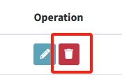 Utiliser `Del` pour retirer un média. Si une campagne l'utilise encore, le terminal ne recevra plus ce média.

## Super Ads

> Introduction

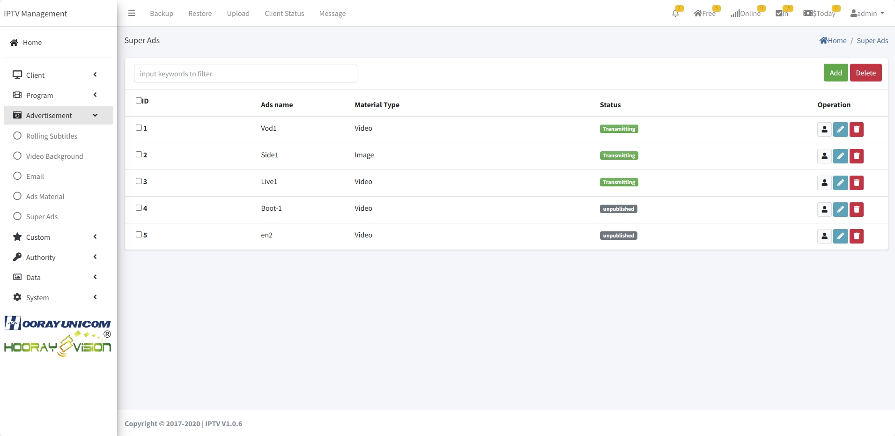

Quatre types sont gérés : `boot ads`, `commercial ads`, `side ads` et `emergency ads`.

**Boot Ads** : affichés au démarrage avant l'écran de connexion.

**Commercial Ads** : diffusés avant la lecture live/VOD.

**Side Ads** : images superposées sur le côté durant le live.

**Emergency Ads** : images/vidéos poussées immédiatement à tous les terminaux ouverts.

### Créer / Modifier

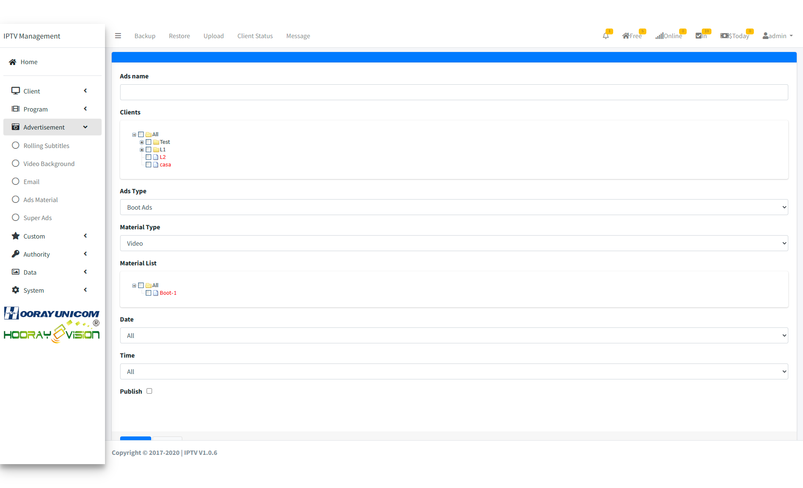

Après `Add` ou `Edit`, renseignez les champs requis.

> Réglage des **Boot Ads**

**Ads Name** : nom de la campagne.

**Clients** : groupe d'appareils ciblé.

**Ads Type** : choisir `Boot Ads`.

**Material Type** : image ou vidéo jouée à l'ouverture de l'app.

**Material List** : sélectionner les médias à diffuser.

**Date** / **Time** : définir la fenêtre de diffusion. L'heure prend en charge le passage de minuit (ex. `22:00` - `06:00`) et utilise le format 24 heures.

**Publish** : activer l'envoi selon les dates/horaires définis.

> Réglage des **Commercial Ads**

**Ads Name** : nom de la campagne.

**Clients** : groupe d'appareils ciblé.

**Ads Type** : choisir `Commercial Ads`.

**Material Type** : uniquement vidéo.

**Program Setting** : sélectionner Live ou VOD.

**Play Setting** : `Manual broadcast` (choisir le média) ou `Random broadcast` (choix aléatoire par le terminal).

**Material** : cocher les médias utilisés.

**Date** / **Time** : fenêtre de diffusion. L'heure prend en charge le passage de minuit (ex. `22:00` - `06:00`) et utilise le format 24 heures.

**Publish** : activer l'envoi avec la fenêtre définie.

**Turn on channel switching** : si activé, la pub se joue au zapping live/VOD.

> Réglage des **Side Ads**

**Ads Name** : nom de la campagne.

**Clients** : groupe d'appareils ciblé.

**Ads Type** : choisir `Side Ads`.

**Material Type** : uniquement image.

**Program Setting** : utiliser sur Live ou VOD.

**Show Position** : position d'incrustation (gauche, droite, haut, bas).

 

 

**Interval** : temps d'intervalle entre deux affichages.

**Material** : médias à afficher.

**Images show time** : durée d'affichage de chaque image (en secondes).

**Date** / **Time** : fenêtre de diffusion. L'heure prend en charge le passage de minuit (ex. `22:00` - `06:00`) et utilise le format 24 heures.

**Publish** : activer l'envoi avec la fenêtre définie.

> Réglage des **Emergency Ads**

**Ads Name** : nom de la campagne.

**Clients** : groupe d'appareils ciblé.

**Ads Type** : choisir `Emergency Ads`.

**Material Type** : image ou vidéo.

**Program Setting** : dans `Program Setting`, l'administrateur doit choisir si la publicité est destinée à la TV en direct ou à la VOD.

**Interval** : dans `Play Setting`, l'administrateur peut choisir `Manual boardcast` ou `Random boardcast` ; en mode manuel, sélectionnez le matériel à diffuser dans la zone Matériel ; en mode aléatoire, le terminal sélectionne automatiquement le matériel à diffuser.

**Matériel** : dans `Matériel`, cochez le matériel publicitaire correspondant.

**Images show time** : dans `Image Show Time`, l'administrateur définit la durée d'affichage d'une image en secondes ; si plusieurs images sont sélectionnées, chacune est affichée pendant la même durée.

**Date** : dans `Date`, l'administrateur peut préciser la date de début et de fin de la publicité.

**Time** : dans `Time`, l'administrateur peut préciser l'heure de début et de fin de la publicité. L'heure prend en charge le passage de minuit (ex. `22:00` - `06:00`) et utilise le format 24 heures.
**Publish** : après avoir coché `Publish`, la publicité commencera à être envoyée ; si `Date` et `Time` ont été définies, la publicité sera traitée selon celles-ci.
