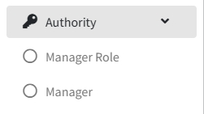
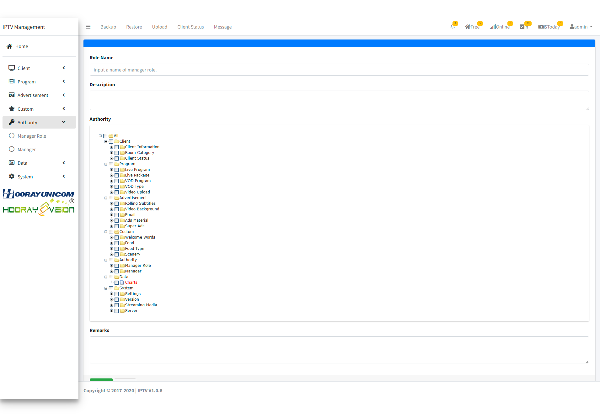
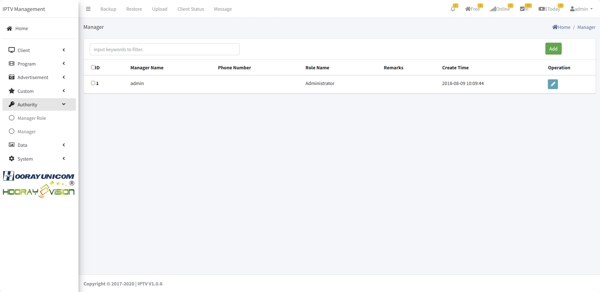
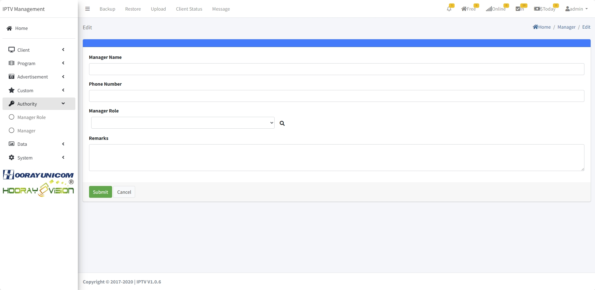

# Paramètres des autorisations

> Introduction

Dans `Authority`, le super administrateur crée les comptes et attribue les rôles aux administrateurs qui se connectent au système IPTV.

## Gestion des rôles

> Introduction

Dans `Manager Role`, les administrateurs système voient la liste des rôles créés. Le rôle System Administrator ne peut pas être supprimé. Les autres rôles peuvent être ajoutés, modifiés ou supprimés.

!> :warning: **Le rôle d'administrateur système ne peut pas être supprimé**

Cliquez sur `Add` pour créer un rôle.

**Role Name** : nom du rôle pour différencier les profils.

**Description** : description des permissions associées.

**Authority** : cocher les droits View/Add/Edit/Delete pour ce rôle.

**Remarks** : notes complémentaires sur le rôle.

## Comptes administrateurs

> Introduction

Dans `Manager`, les administrateurs ayant le droit Authority gèrent les comptes : liste, ajout, modification, suppression.

Cliquez sur `Add` pour créer un compte.

**Manager Name** : nom du compte administrateur.

**Phone Number** : numéro de téléphone du titulaire.

**Manager Role** : rôle attribué au compte (sélection dans la liste des rôles créés).

**Remarks** : notes complémentaires sur le compte.