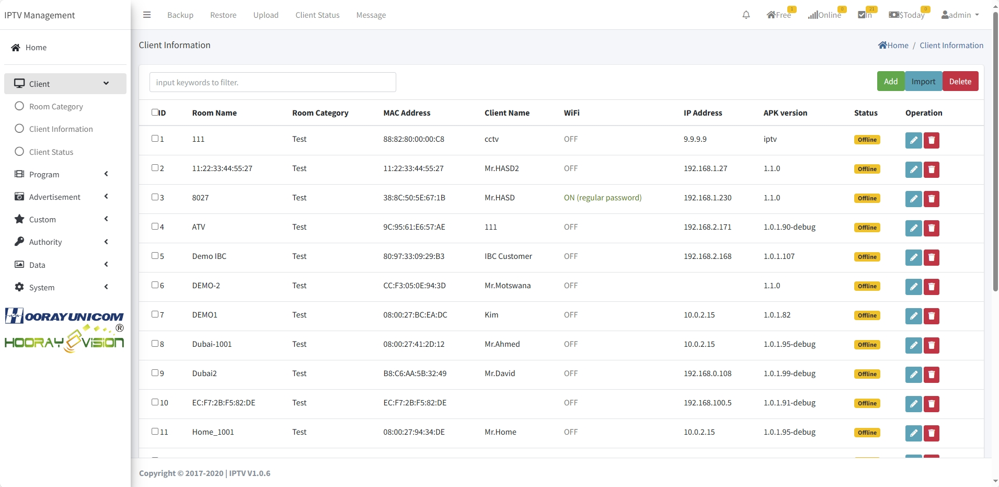

# Gestion des clients

> Introduction

Dans le `Client Menu`, l'administrateur configure les informations d'équipement via `Room Category`, `Client Information` et `Client Status`, puis gère les arrivées/départs des clients.

## Room Category

> Introduction

Créer des catégories logiques (par étage ou usage). Exemple : équipements du 1er étage → catégorie `L1`.

Cliquez sur `Add` pour créer une catégorie.

1. **Group Name** : nom de la catégorie.

## Client Information

> Introduction

Page listant tous les terminaux en ligne/hors ligne. On peut gérer le nom du terminal et voir sa catégorie, le numéro de chambre et autres infos.

Cliquez sur `Add` pour créer une fiche terminal.

 

**MAC Address** : ajouter manuellement le MAC si le terminal n'est pas découvert automatiquement. Sinon, il est en lecture seule.

**IP** : dernière IP vue en ligne.

**Room Name** : nom de la chambre associée.

**Room Category** : catégorie de chambre associée.

**WiFi** : activation du hotspot et configuration SSID/mot de passe (fonction désormais indisponible sur Android).

## Client Status

> Introduction

Permet d'enregistrer les arrivées/départs. Pour un appareil non check-in, on voit l'historique client/consommation. Pour un appareil check-in, on peut gérer commandes en ligne, consommations, infos invité, historiques et check-out.

**Request** : ouvre la page de réservation en cours pour valider ou supprimer la commande (retour d'état dans l'app hôtel).

**Consume** : affiche les consommations déjà passées depuis l'app.

**Edit** : modifier le nom de l'invité et le message de bienvenue.

**Records** : voir l'historique check-in/out et les consommations.

**Check-Out** : met l'appareil en état départ (services indisponibles).

**Check-In** : enregistrer l'invité (nom et message de bienvenue affiché sur l'écran).