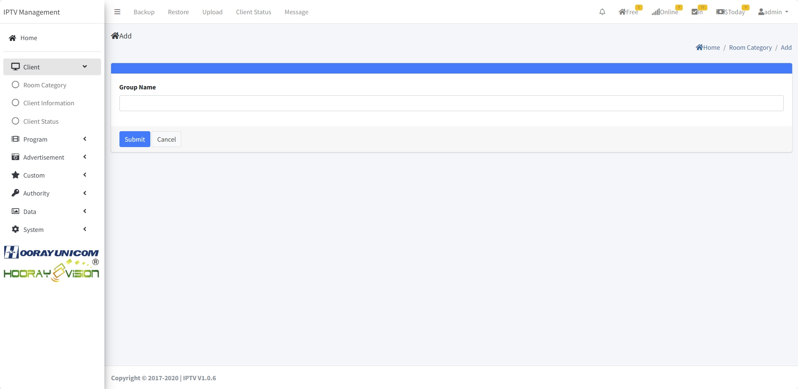
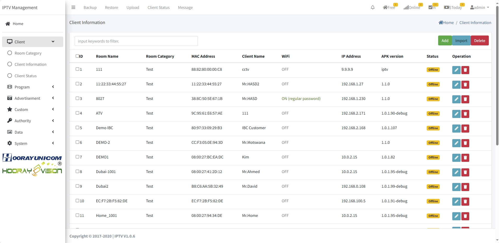
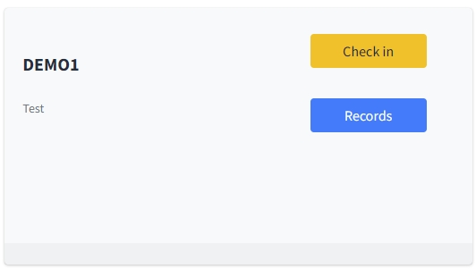

# Gestion des clients

> Introduction

Dans le `Client Menu`, l'administrateur configure les informations d'équipement via `Room Category`, `Client Information` et `Client Status`, puis gère les arrivées/départs des clients.

## Room Category

> Introduction

Créer des catégories logiques (par étage ou usage). Exemple : équipements du 1er étage → catégorie `L1`.

Cliquez sur `Add` pour créer une catégorie.

1. **Group Name** : nom de la catégorie.

## Client Information

> Introduction

Page listant tous les terminaux en ligne/hors ligne. On peut gérer le nom du terminal et voir sa catégorie, le numéro de chambre et autres infos.

Cliquez sur `Add` pour créer une fiche terminal.

 

**MAC Address** : ajouter manuellement le MAC si le terminal n'est pas découvert automatiquement. Sinon, il est en lecture seule.

**IP** : dernière IP vue en ligne.

**Room Name** : nom de la chambre associée.

**Room Category** : catégorie de chambre associée.

**WiFi** : activation du hotspot et configuration SSID/mot de passe (fonction désormais indisponible sur Android).

## Client Status

> Introduction

Permet d'enregistrer les arrivées/départs. Pour un appareil non check-in, on voit l'historique client/consommation. Pour un appareil check-in, on peut gérer commandes en ligne, consommations, infos invité, historiques et check-out.

**Request** : ouvre la page de réservation en cours pour valider ou supprimer la commande (retour d'état dans l'app hôtel).

**Consume** : affiche les consommations déjà passées depuis l'app.

**Edit** : modifier le nom de l'invité et le message de bienvenue.

**Records** : voir l'historique check-in/out et les consommations.

**Check-Out** : met l'appareil en état départ (services indisponibles).

**Check-In** : enregistrer l'invité (nom et message de bienvenue affiché sur l'écran).

## Gestion des appareils

> Introduction

<!-- 📷 Capture à compléter : vue de gestion des appareils dans Informations client -->

Dans `Informations client`, la liste des appareils est enrichie de capacités de gestion à distance. Lorsqu'un décodeur signale son état, l'administrateur peut opérer l'appareil à distance sans entrer dans la chambre, ce qui réduit considérablement le coût de maintenance informatique.

### Télémétrie de l'appareil

La liste des appareils affiche la télémétrie en temps réel signalée par chaque décodeur, notamment l'**utilisation du CPU** et l'**utilisation de la mémoire**, ce qui permet à l'administrateur de repérer rapidement les appareils présentant des problèmes de performance (ex. blocages ou forte utilisation de la mémoire).

### Détail de l'appareil

<!-- 📷 Capture à compléter : fenêtre de détail de l'appareil -->

Cliquez sur le bouton `Détail` de l'appareil pour ouvrir le dialogue de détail, où les informations sont regroupées pour une consultation facile :

- **Informations sur l'appareil** : adresse MAC, IP, nom de la chambre, catégorie de la chambre, modèle de l'appareil, etc.
- **Capacités** : les capacités de commande déclarées par l'appareil (ex. s'il prend en charge `clear_guest_data`, `get_logs`, `get_telemetry`).
- **Historique des commandes** : les dernières instructions de l'appareil (jusqu'à 10 enregistrements), avec leur état et leur résultat.
- **Voir le journal** : ouvrir le journal de l'appareil dans un dialogue indépendant.

### Commandes de l'appareil

L'administrateur peut envoyer à distance les commandes suivantes à un appareil :

| Commande | Description |
|---|---|
| **reboot** | Redémarrer le décodeur à distance. |
| **clear_guest_data** | Effacer les données client des applications tierces sur l'appareil (ex. état de connexion et cache de Netflix/YouTube). Les paquets à nettoyer sont contrôlés par la liste blanche de nettoyage au départ configurée dans la page `Informations client` (voir `Liste blanche de nettoyage au départ`). |
| **get_telemetry** | Demander à l'appareil de signaler immédiatement un cycle complet de télémétrie (CPU/mémoire), au lieu d'attendre le prochain rapport périodique. |
| **get_logs** | Demander à l'appareil de renvoyer son texte de journal (jusqu'à 100 Ko). Le contenu renvoyé peut être consulté dans l'historique des commandes. |

> **Remarque** : les commandes ne sont délivrées qu'aux appareils qui déclarent la capacité correspondante. Les appareils qui n'ont pas signalé de capacités ne recevront pas les commandes de nouvelle génération.

### Nettoyage manuel groupé

<!-- 📷 Capture à compléter : entrée de nettoyage manuel groupé -->

Sur la liste des appareils, l'administrateur peut sélectionner plusieurs appareils et effectuer un **nettoyage manuel groupé** (`clear_guest_data`), généralement utilisé avant l'arrivée d'un nouveau client pour protéger la confidentialité du client précédent.

### Liste blanche de nettoyage au départ

<!-- 📷 Capture à compléter : fenêtre de liste blanche de nettoyage au départ -->

La liste blanche de nettoyage au départ est configurée dans la page `Informations client` : appuyez sur le bouton `Liste blanche` pour ouvrir le dialogue et saisissez les noms de paquets des applications tierces à nettoyer (séparés par des virgules, ex. `com.netflix.ninja,com.google.android.youtube`). Lorsqu'un client part (ou qu'une commande de nettoyage est déclenchée), le terminal efface localement les données de ces paquets. Laissez vide pour désactiver le nettoyage automatique au départ.
