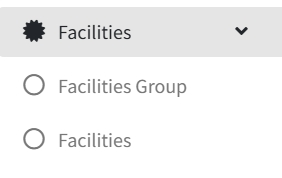
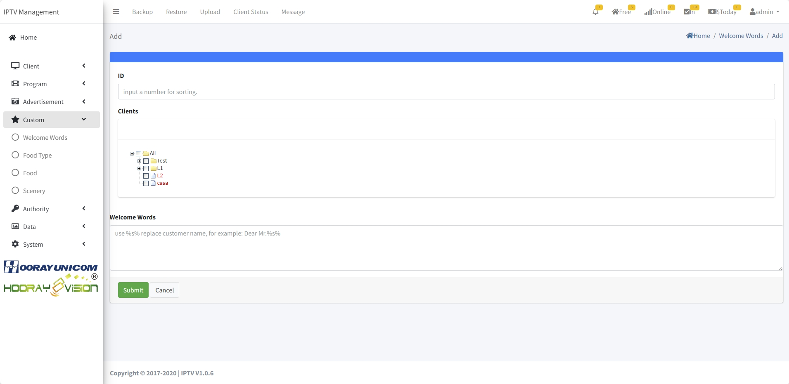
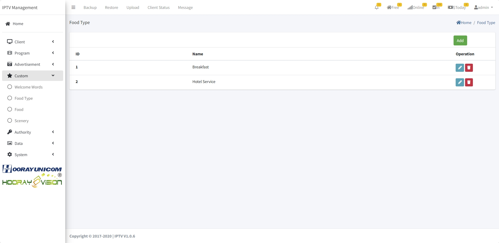

# Paramètres des installations

> Introduction

Ici, l'administrateur gère l'affichage du message d'accueil, la commande de repas et les informations sur les lieux à proximité.

## Welcome Words

> Introduction

Configurer le message de bienvenue affiché lors du check-in sur le terminal.

**ID** : généré automatiquement.

**Clients** : terminaux qui afficheront le message.

**Welcome Words** : texte du message de bienvenue.

## Food Type

> Introduction

Créer les catégories d'aliments.

**ID** : généré automatiquement.

**Name** : nom de la catégorie.

## Food

> Introduction

Liste des plats réservables avec image, nom, prix, catégorie, description. Ajout/édition/suppression possibles.

**Image** : image PNG/JPG du plat.

**Name** : nom du plat.

**Price($)** : prix du plat.

**Food Type** : catégorie liée.

**Description** : description affichée côté utilisateur.

## Scenery

> Introduction

Ajouter des visuels et descriptions pour présenter installations, services ou attractions alentour.

Téléverser l'image d'aperçu et le titre, soumettre, puis ajouter images détaillées et texte via l'icône plus.

 

