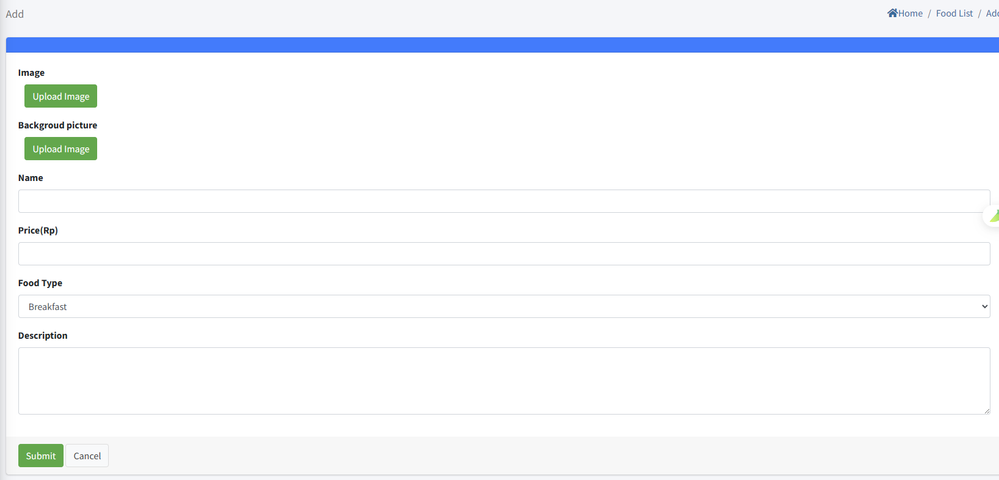

# Service de restauration

> Introduction

Dans `Hotel Service`, l'administrateur configure les types de plats et le menu pour la commande IPTV en chambre, et suit les commandes en temps réel (acceptation, finalisation, annulation). Les invités commandent depuis la TV, l'administrateur gère le flux complet.

## Food Type

> Introduction

Créer, modifier, supprimer les catégories de plats.

**ID** : généré automatiquement (plus petit = affiché plus haut).

**Name** : nom de la catégorie.

## Food List

> Introduction

Gérer les plats commandables (créer, éditer, supprimer).

**Image** : image du produit (1 image, PNG/JPG) affichée côté terminal.

**Backgroud picture** : image d'arrière-plan lors de la sélection du plat sur le terminal.

**Name** : nom affiché.

**Price** : prix unitaire.

**Food Type** : catégorie du plat (affichage dans la liste correspondante).

**Description** : description détaillée.

## Order Status

> Introduction

Vue des commandes envoyées depuis les terminaux. Actions possibles : `receive` pour accepter, `delete` pour annuler, puis `finish` pour clôturer une fois préparé/livré.