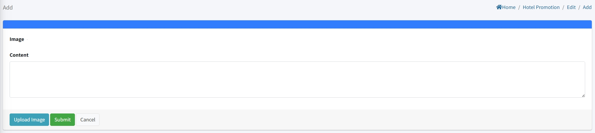

# Paramètres de la promotion de l'hôtel

> Introduction

Dans la section "Promotion de l'hôtel", les administrateurs peuvent créer, modifier et supprimer des annonces promotionnelles de l'hôtel.

Cliquez sur le bouton "Ajouter" pour créer une nouvelle promotion d'hôtel.

**Nom de la promotion** : Saisissez un nom unique pour la promotion de l'hôtel. Ce nom sera affiché sur le terminal IPTV pour les clients.

**Image de l'affiche** : Téléchargez la vignette principale ou l'image de couverture de cette promotion. Cette image sera affichée dans la liste des promotions sur l'IPTV. (Une seule image peut être téléchargée.)

**Image de fond** : Téléchargez une image de fond pour la page de détails de la promotion. Lorsqu'un client clique sur la promotion, cette image sera utilisée comme arrière-plan principal.

## Ajouter des détails à la promotion de l'hôtel

> Introduction

Cette section est disponible lors de la modification d'une promotion existante. Vous pouvez ici télécharger des images supplémentaires pour fournir plus de détails sur l'activité ou le service aux clients.

**Prise en charge de plusieurs images :** Contrairement aux champs à image unique (affiche et fond), cette section permet de télécharger plusieurs images pour la page de détails de la promotion.

**Image** : Téléchargez des images de la promotion de l'hôtel à afficher sur le terminal. Actuellement, une seule image peut être téléchargée.

**Contenu** : Utilisez "Contenu" pour décrire des informations et des détails spécifiques sur l'image téléchargée.
