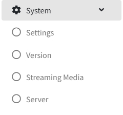

# Paramètres système

> Introduction

Dans `System`, l'administrateur gère les informations du système IPTV : import d'autorisations, sauvegardes de base de données, sécurité des API externes.

## Setting

> Introduction

Configurer les informations de base synchronisées vers les terminaux, les arrière-plans, le format d'heure et d'autres paramètres.

**Monetary Unit** : symbole monétaire local affiché dans Shopping.

**Paid Days** : durée de validité lors de l'achat d'un bouquet live ou d'un film.

**Consumption Mode** : `Prepaid` (consommation possible seulement si le compte est crédité) ou `Advance Consumption` (crédit en compte client, facturé en fin de séjour).

**Home Page Show** : choisir Image (fond statique) ou Video (fond vidéo) pour l'accueil.

**Time Format** : format horaire affiché côté front.

**Favorite Operation** : décider si la liste des favoris est effacée au check-out.

**Request ring** : sonnerie de commande (fonction obsolète).

**Welcome Background** : image de fond pour l'écran de bienvenue.

**Home Background** : image de fond pour la page d'accueil.

**Secondary Menu Background** : image de fond pour les sous-menus.

**LOGO** : logo synchronisé sur TV et mobile.

**Live Player Watermark** : fonction obsolète.

**Vod Player Watermark** : fonction obsolète.

**City** : ville utilisée pour récupérer la météo et la pousser aux terminaux.

**Enable Remote Assistance** : fonction obsolète.

**Protocole** : dans `Protocole`, sélectionnez le protocole de diffusion en direct utilisé par les terminaux (ex. `http`, `udp`, `rtsp`).

**Numéro d'opérateur** : dans `Numéro d'opérateur`, saisissez le numéro d'opérateur unique requis pour la maintenance du système et l'assistance technique. **Une fois saisi, il ne peut plus être modifié.**

**PMS** : dans `PMS`, sélectionnez le mode d'intégration du PMS (système de gestion de la propriété) :
- `Aucun` : l'intégration du PMS est désactivée.
- Lorsqu'un type de PMS est sélectionné, saisissez les `Informations du serveur PMS` (l'adresse du serveur PMS). Le système IPTV s'intégrera au PMS (ex. pour l'enregistrement/départ automatique des clients et la synchronisation des factures). L'interrupteur, l'adresse et le port du PMS sont configurés par l'administrateur.

## Version

> Introduction

Gérer les politiques de mise à jour APK (forcée ou non) selon les terminaux. Cliquer sur `APK Upgrade`, sélectionner l'APK : le système lit la version et l'affiche dans la liste pour vérification.

## Paramètres du média de diffusion

> Introduction

<!-- 📷 Capture à compléter : page des paramètres du média de diffusion -->

Dans `Paramètres du média de diffusion`, l'administrateur configure les adresses du serveur de streaming et du serveur de timeshift (TV en différé), utilisées par les terminaux pour lire les flux en direct et les programmes en différé.

**IP du média de diffusion** : Dans `IP du média de diffusion`, saisissez l'adresse IP du serveur de streaming.

**Port du média de diffusion** : Dans `Port du média de diffusion`, saisissez le port du serveur de streaming.

**IP du serveur Timeshift** : Dans `IP du serveur Timeshift`, saisissez l'adresse IP du serveur de timeshift.

**Port du serveur Timeshift** : Dans `Port du serveur Timeshift`, saisissez le port du serveur de timeshift.

**Heures de Timeshift** : Dans `Heures de Timeshift`, définissez combien d'heures de programmes le serveur de timeshift conserve, permettant aux clients de regarder des programmes antérieurs dans cette fenêtre.

## Graphiques de données

> Introduction

<!-- 📷 Capture à compléter : page de statistiques de données -->

Dans `Graphiques de données`, les administrateurs peuvent consulter les statistiques de fonctionnement du système IPTV, notamment :

- **Statistiques de chiffre d'affaires** : les statistiques totales des revenus d'activité.
- **Statistiques VOD** : statistiques des lectures de vidéo à la demande.
- **Type de consommation** : statistiques groupées par type de consommation.
- Graphiques à barres mensuels et graphiques circulaires, filtrables par année.
