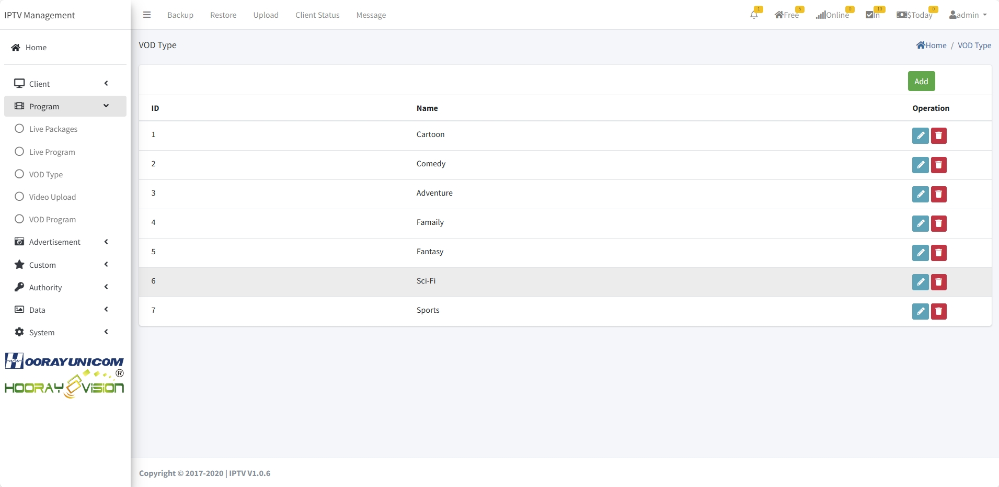
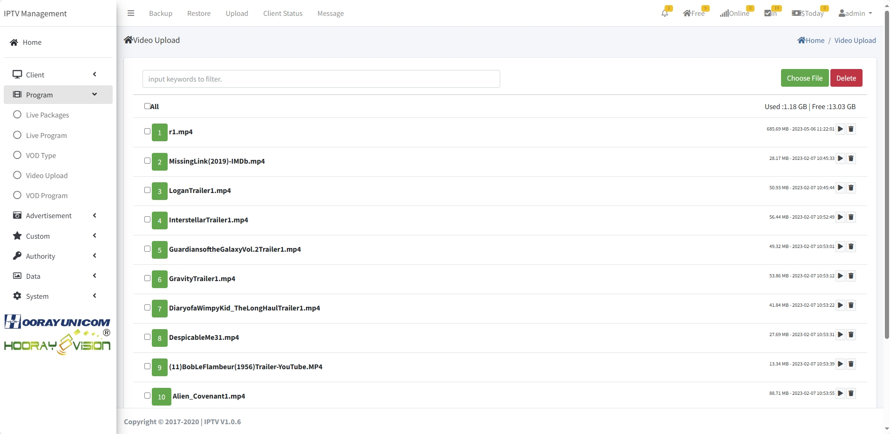

# Paramétrage VOD

> Introduction

Le module `Video On Demand` permet de gérer les `VOD Category`, `VOD Program` et `VOD Upload`.

## VOD Category

> Introduction

Créer/éditer/supprimer des catégories de films pour organiser la bibliothèque et faciliter la recherche côté abonné.

1. **ID** : généré automatiquement, modifiable (unique). Ordre d'affichage des catégories (plus petit = plus haut).

2. **Name** : nom de la catégorie affiché sur le set-top box.

## VOD Program

> Introduction

Ajouter/éditer/supprimer les films et lier les fichiers vidéo. Visualiser le poster, les infos et le nombre de vues.

1. **Poster** : image d'affiche du film, affichée sur le terminal.

2. **Name** : titre du film.

3. **Price** : prix (0 = gratuit, >0 = paiement demandé).

4. **Director** : affiché dans les détails du film.

5. **Actors** : affiché dans les détails du film.

6. **Area** : zone/région de sortie.

7. **Language** : langue audio par défaut.

8. **Screen Time** : durée du film.

9. **VOD Type** : catégorie du film (pour le classement côté abonné).

10. **Tag** : marquer comme Hot Movie pour l'afficher en tête de page VOD.

12. **Off Sale** : retirer le film de la vente dans l'app.

12. **Introduction** : résumé/détails du film.

## VOD Upload

> Introduction

Téléverser ou supprimer les fichiers vidéo. Le fichier doit respecter le standard Hooray : vidéo `HEVC/H.254/AV1`, audio `AAC/MP3/AC-3/E-AC-3/FLAC/DTS`, format OBLIGATOIREMENT `.MP4`.

!> :warning: **Le nom du fichier téléversé doit être sans symboles spéciaux ni espaces.**

Cliquer sur `Choose File`, sélectionner la vidéo ; la page se rafraîchit et liste le fichier.

!> Après l'upload, aller dans `VOD Program`, choisir le film puis cliquer sur l'icône de liaison pour associer le fichier.

Cliquer sur `Add` pour ajouter une entrée.

1. **ID** : généré automatiquement, sert à l'ordre d'affichage (plus petit = plus haut dans l'app).

2. **Source** : choisir `URL` ou `Local File` (fichier téléversé via le système IPTV).

3. **URL** : si `URL` est choisi, renseigner l'adresse du fichier distant.

