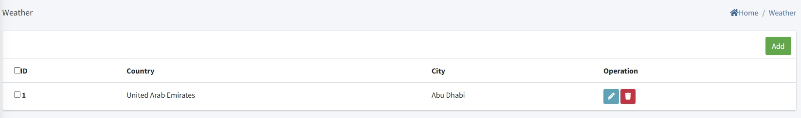

# Paramétrage météo

> Introduction

Dans `Weather`, l'administrateur ajoute/supprime/modifie les villes cibles. Le système récupère automatiquement la météo à 7 jours via une interface tierce puis la transmet aux terminaux pour affichage.

Cliquez sur `Add` pour ajouter une ville.

**ID** : identifiant unique (plus petit = plus haut dans la liste).

**Country** : pays de la ville.

**City** : choisir la ville cible dans la liste déroulante.

> Affichage terminal

