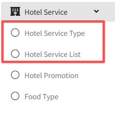

# Hotel Service

>Introduction

 

The `Hotel Service` module allows administrators to configure service categories and items for the in-room IPTV system. Administrators can view, accept, complete, or cancel guest orders in real time. Guests can place service orders directly from their TV, while administrators manage the entire order workflow through the platform.

## Hotel Service Type

>Introduction

 

In the `Hotel Service Type`, the administrator creates, modifies and deletes hotel service categories.

Press `Add` button to create the new hotel service category

**ID**: In `ID`, The IPTV system automatically creates an ID number, which is used to sort the different categories, the smaller the number, the more advanced the display is

**Name**: The `Name` is used to display the hotel service of the category.

## Hotel Service List

>Introduction

On the `Hotel Service List` page, the administrator manages the hotel service items available for in-room ordering by creating, editing, or deleting products as needed.

Press `Add` button to create the new service for online ordering.

**Image**: In `Image`, Upload hotel service images in Image and the images are displayed on the terminal, currently only one image upload is supported.

**Backgroud picture**: The background image that will be displayed on the terminal when the user selects or clicks on the hotel service item.

**Name**: `Name` is used to identify the name of the hotel service displayed in the terminal.

**Price**: In `Price`, it is used to display the unit price at which the hotel service is sold.

**Hotel Service Type**: Select the `Hotel Service Type` for the service, and the service will appear in the corresponding category list on the terminal.

**Description**: In `Description` is used to describe specific information and details about this hotel service.

## Order Status

>Introduction

 

In this page the administrator can view the details of the item order sent by the subscriber from the terminal. When the administrator receives the subscriber's order, he or she can `receive` the order by using the RECEIVE button or `cancel` the subscriber's order by using the DELETE button. After accepting the subscriber's order, when the order is completed, the administrator can click Finish button again to `complete` the whole order process.