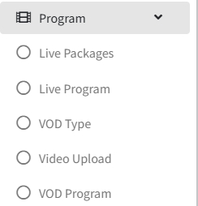
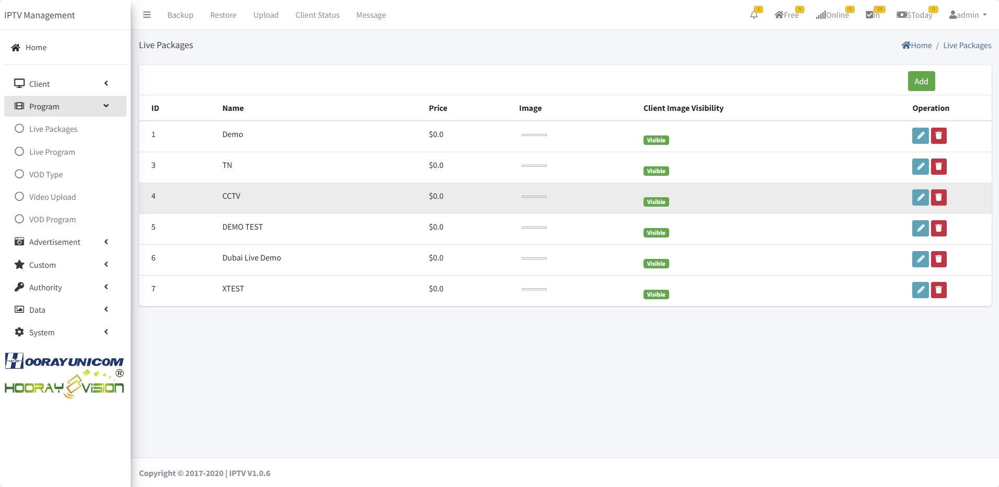
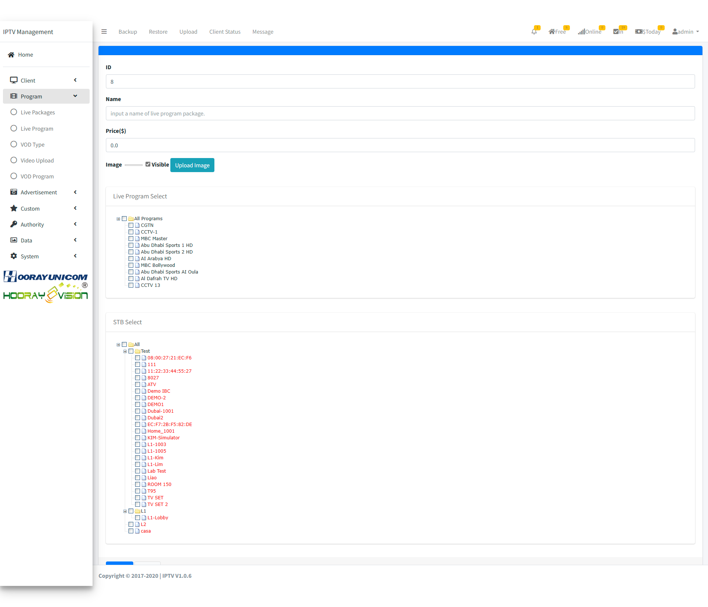
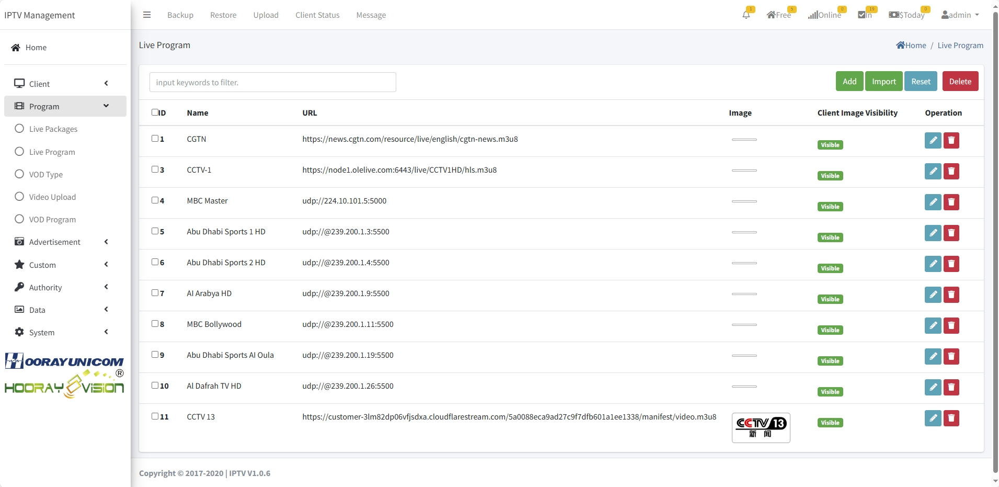
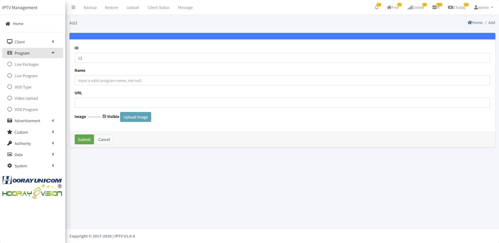

# Live Setting

>Introduction

The program menu allows administrators to create, modify, and delete `Live` and `VOD` settings.

## Live Packages

>Introduction

In the Live Package feature, administrators can create, modify, and delete categories for live channel sources. By creating Live categories, administrators can better organize and associate the corresponding live channel sources with the respective categories. This allows subscribers to conveniently search and categorize the live channels they want to watch.

Administrators can create new live categories by clicking on the `Add` button. Each channel category needs to be associated with a corresponding live channel source; each channel category can upload poster to specify their different.

1. **ID**: The `ID` is automatically generated by the system, the smaller the ID is, the higher it is displayed in the live category, you can adjust the ID in the edit page to arrange the order of different categories.

2. **Name**: The `Name` distinguishes between different categorical names.

3. **Price**: Administrator can set the `price` of live category charge, when the price is 0, it means the category is free, if the price is not 0, the guest access to the live category will be prompted to charge.

4. **Image**: By uploading the corresponding category `images`, the `image` will be displayed on the set-top box live category menu.

!>  **Warning: Live Package upload image size should 300x210**

5. **Live Program Select**: To `select` the corresponding live program to the specified live category, the administrator needs to select the corresponding live program to the current live category, and the selected live program will be displayed under the corresponding category in the terminal live category menu.

6. **STB Select**: The administrator select the corresponding device in the device list, and only the selected device can display this live category.

## Live Program

>Introduction

In the "Live Program" section, Administrators can manually or batch add live programs to the page, and then add live programs, administrators can edit and delete the specified live programs.it supports broadcasting UDP(unicast)/RTP(unicast)/HTTP-TS/HTTP-FLV/RTMP/RTMPS/HLS/DASH and other mainstream protocols.

Administrators can create new live channel by clicking on the `Add` button.

1.  **ID** : This `ID` is automatically generated by the system and can be manually edited. When manually editing, it should not conflict with other `ID numbers`. This `ID` is the live channel sequence number, and the lower the `ID number`, the earlier the live channel will be displayed on the set-top box for live broadcasting.

2.  **Name** : The `Name` is mainly used for displaying the live channel name on the set-top box. The text entered in the `Name` input box will be displayed in full as the live channel name on the set-top box.

4.  **URL** : Fill in the `URL` with the address that needs to be played in terminial

5.  **Image** : By uploading the corresponding `program logo`, the `program logo` will be displayed on the set-top box live channel list and channel detail.
