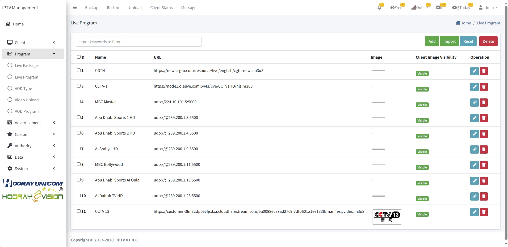

# Live Setting

>Introduction

The program menu allows administrators to create, modify, and delete `Live` and `VOD` settings.

## Live Packages

>Introduction

In the Live Package feature, administrators can create, modify, and delete categories for live channel sources. By creating Live categories, administrators can better organize and associate the corresponding live channel sources with the respective categories. This allows subscribers to conveniently search and categorize the live channels they want to watch.

Administrators can create new live categories by clicking on the `Add` button. Each channel category needs to be associated with a corresponding live channel source; each channel category can upload poster to specify their different.

1. **ID**: The `ID` is automatically generated by the system, the smaller the ID is, the higher it is displayed in the live category, you can adjust the ID in the edit page to arrange the order of different categories.

2. **Name**: The `Name` distinguishes between different categorical names.

3. **Price**: Administrator can set the `price` of live category charge, when the price is 0, it means the category is free, if the price is not 0, the guest access to the live category will be prompted to charge.

4. **Image**: By uploading the corresponding category `images`, the `image` will be displayed on the set-top box live category menu.

!>  **Warning: Live Package upload image size should 300x210**

5. **Live Program Select**: To `select` the corresponding live program to the specified live category, the administrator needs to select the corresponding live program to the current live category, and the selected live program will be displayed under the corresponding category in the terminal live category menu.

6. **STB Select**: The administrator select the corresponding device in the device list, and only the selected device can display this live category.

## Live Program

>Introduction

In the "Live Program" section, Administrators can manually or batch add live programs to the page, and then add live programs, administrators can edit and delete the specified live programs.it supports broadcasting UDP(unicast)/RTP(unicast)/HTTP-TS/HTTP-FLV/RTMP/RTMPS/HLS/DASH and other mainstream protocols.

Administrators can create new live channel by clicking on the `Add` button.

1.  **ID** : This `ID` is automatically generated by the system and can be manually edited. When manually editing, it should not conflict with other `ID numbers`. This `ID` is the live channel sequence number, and the lower the `ID number`, the earlier the live channel will be displayed on the set-top box for live broadcasting.

2.  **Name** : The `Name` is mainly used for displaying the live channel name on the set-top box. The text entered in the `Name` input box will be displayed in full as the live channel name on the set-top box.

4.  **URL** : Fill in the `URL` with the address that needs to be played in terminial

5.  **Image** : By uploading the corresponding `program logo`, the `program logo` will be displayed on the set-top box live channel list and channel detail.

## Radio Channel

> Introduction

<!-- 📷 截图待补充：Radio Channel 列表页 -->

In `Radio Channel`, administrators can add, edit, and delete radio channel information. Radio channels are broadcast as audio programs to the terminal devices, allowing guests to listen to radio stations in their rooms.

Press `Add` button to create a new radio channel.

<!-- 📷 截图待补充：Radio Channel 新增/编辑弹窗 -->

1. **ID**: The `ID` is automatically generated by the system. The smaller the `ID`, the earlier the radio channel is displayed in the list.

2. **Number**: In `Number`, set the display order of the radio channel. The smaller the number, the higher its position in the list.

3. **Name**: In `Name`, enter the name of the radio channel, e.g. `BBC World Service`. This name will be displayed on the terminal.

4. **URL**: In `URL`, fill in the play address of the radio channel. The terminal will use this address to play the radio program.

5. **Image**: By uploading the corresponding channel `image`, the `image` will be displayed on the terminal radio channel list.

## Forced Live Play

> Introduction

<!-- 📷 截图待补充：Forced Live Play 管理页面 -->

In `Forced Live Play`, administrators can create a forced live play task: all (or specified) registered set-top boxes will be forced to switch to a designated live source within a specified time window, and the playback page will be locked during the task. If the guest tries to exit, the terminal automatically switches back. This is typically used for hotel announcements or mandatory broadcasts (e.g. fire safety videos).

### Create a Forced Play Task

<!-- 📷 截图待补充：创建强制播放任务弹窗 -->

Press the `Add` / `Create Task` button to create a new forced play task. Only one task can be active at a time; creating a new task will cancel the previous active one.

1. **Play Source Type**: Select the source of the forced play:
   - `LiveTV Channel`: choose an existing live channel from the list.
   - `Custom URL`: fill in a custom live stream address (must be `http`/`https`, and cannot be an intranet address).

2. **Start Time**: The start time of the task, in the format `yyyy-MM-dd HH:mm`. You can also start immediately with a duration.

3. **End Time**: The end time of the task, in the format `yyyy-MM-dd HH:mm`. The end time must be later than the start time.

### Monitor Task Status

<!-- 📷 截图待补充：任务监控/设备明细 -->

After the task is created, the management page shows the execution statistics of all target terminals in real time:

- **Pending / Sent / Executed / Failed / Expired** counts and the total number of terminals.
- **Device details**: each terminal's command status (Pending / Sent / Executed / Failed / Expired), send time, confirmation time and failure reason.
- **History tasks**: view all past forced play tasks.
- **Resend**: batch re-send the failed commands of a task.
- **CSV Export**: export the command details of a task as a CSV file for record keeping.

Press the `Cancel` button to cancel the current active task at any time. Once cancelled, the terminals will stop being forced to play and return to normal.
