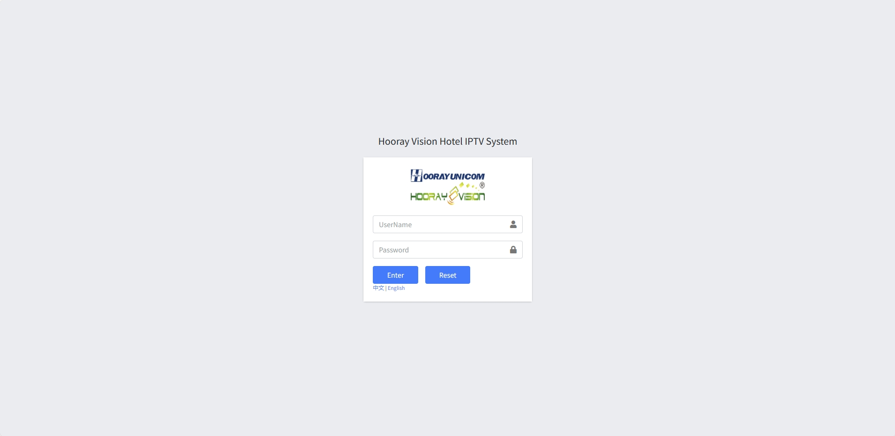

# Quick start

 This online document provides an overview of Hooray Hotel IPTV platform operations. It covers topics such as:

1. Client Setting
2. Live & VOD Setting
3. Ads Settings
4. Hotel Service Setting
5. Custom Setting
6. Flight Info Setting
7. Weather Info Setting
8. Facilities Setting
9. Authority Setting
10. System Basic Settings

This manual will provide administrators with instructions on how to operate these sections of the Hotel IPTV platform. Each setcion has different settings and functionalities:

By using this manual, you will gain a comprehensive understanding of the features and operations of the Hooray Hotel IPTV Service Platform, enabling you to better manage and work your Hotel IPTV service.

## Initialize

 Prepare a laptop or computer, the laptop or computer can access the IPTV platform web page, the web page address is `http://{server ip}:{8080}`, when the laptop or desktop correctly accessed to see the login page.

!> :warning: **Warning: If you enter the address can not be accessed troubleshooting as follows:**

1.  Make sure the network cable is correctly linked 
2.  Make sure the laptop or desktop can ping the Hotel IPTV Server IP 

## Developer Resources

Here is an example of how to fetch data from the server using JavaScript. This code is dynamically loaded from `_media/example.js`:

[Example Code](_media/example.js ':include :type=code javascript')

You can also [download the example file](_media/example.js ':ignore').
