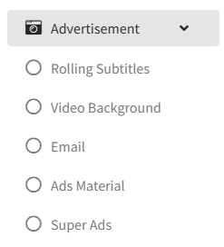
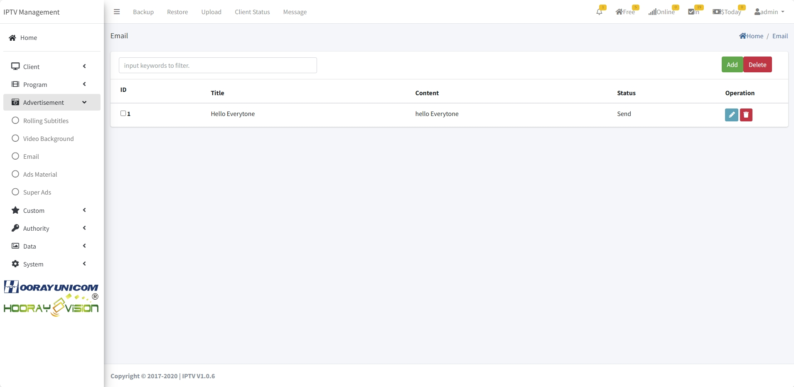
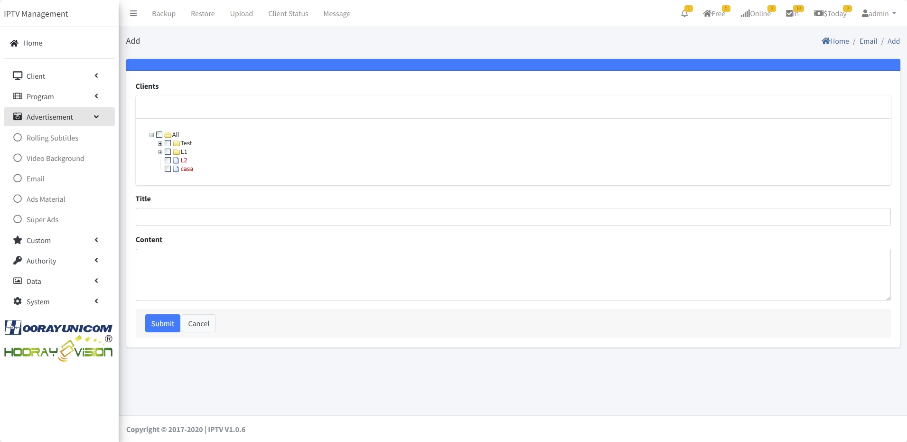
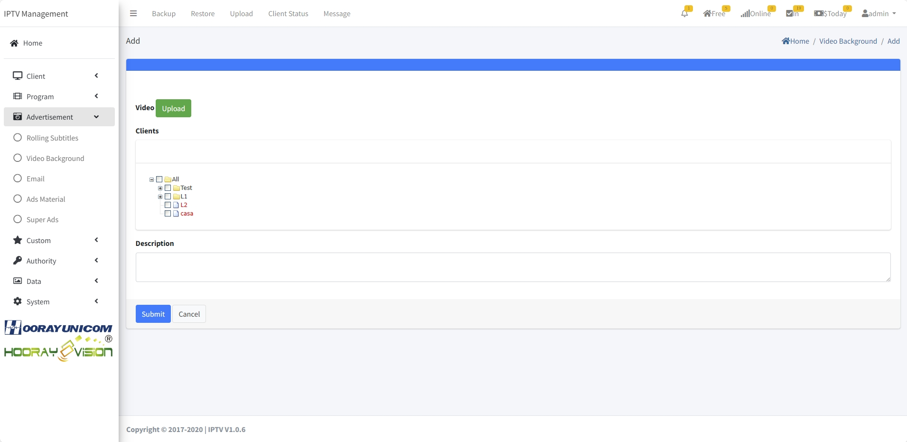
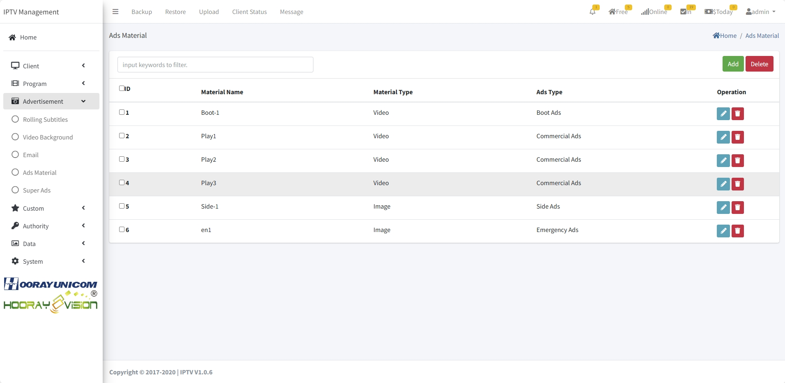
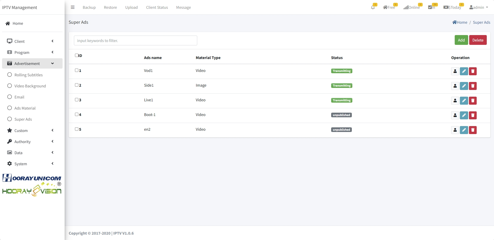

# Настройка рекламы

> Введение

Здесь администраторы публикуют информацию и объявления для устройств в номерах.

## Бегущие строки

> Введение

Можно отправлять разные тексты бегущих строк для разных групп устройств, задавая цвет шрифта и фона.

Нажмите `Add`, чтобы создать `Rolling Subtitles`.

**Content**: введите текст бегущей строки.

**Client**: выберите группу или конкретное устройство для отправки.

**Description**: опишите детали объявления.

**Date**: задайте дату начала и окончания показа.

**Time**: задайте время начала и окончания показа.

## Email

> Введение

Можно отправлять сообщение в виде Email, оно пушится нужному клиенту, который открывает его на терминале.

Нажмите `Add`, чтобы создать `Email Message`.

**Client**: выберите группу или устройство.

**Title**: тема письма.

**Content**: тело письма.

## Видеофон

> Введение

В меню `Video Background` администратор управляет видеозаставкой. После включения функции загрузите MP4 (видео H.264, аудио AAC); терминалы автоматически скачивают и воспроизводят ролик.

Нажмите `Add`, чтобы добавить видеофон.

**Video**: выберите MP4-файл (H.264/AAC).

**Clients**: выберите группу или устройство, где показывать видеофон.

**Description**: опишите настройку видеофона.

## Рекламные материалы

> Введение

В `Ads Material` загруженные материалы показаны списком; их можно добавлять, редактировать и удалять.

### Добавление/редактирование материалов

> Введение

Нажмите `Add`, чтобы загрузить материал.

**Upload**: нажмите кнопку загрузки и выберите изображение или видео — оно загрузится в систему.

**Material Name**: задайте имя материала для дальнейшего выбора.

**Material Type**: укажите, это `image` или `video`.

**Ads Type**: выберите тип объявления, к которому относится материал (4 варианта — важно выбрать верный).

### Удаление материалов

 Нажмите `Del`, чтобы удалить материал. Если материал удалить, пока реклама активна, терминалы перестанут его получать.

## Super Ads

> Введение

Здесь создаются/редактируются/удаляются 4 категории: `boot ads`, `commercial ads`, `side ads`, `emergency ads`.

**Boot Ads**: при запуске приложения сначала показываются рекламные изображения/видео перед экраном логина.

**Commercial Ads**: при просмотре live или VOD нужно досмотреть рекламное видео перед контентом.

**Side Ads**: во время live поверх экрана показывается рекламное изображение сбоку, контент — на остальной части экрана.

**Emergency Ads**: все устройства получают экстренные изображения/видео; при открытии приложения они показываются независимо от действий пользователя.

### Создание/редактирование Super Ads

> Введение

Нажмите `Add` или `Edit`, чтобы открыть форму и заполнить данные.

> Настройка **Boot Ads**

**Ads Name**: имя рекламы.

**Clients**: группа устройств, где реклама включена.

**Ads Type**: выберите `Boot Ads`.

**Material Type**: поддерживаются изображения и видео; выберите тип для показа при запуске приложения.

**Material List**: отметьте нужные материалы.

**Date**: даты начала и окончания кампании.

**Time**: время начала и окончания показа.

**Publish**: включает отправку; если заданы дата/время — учитываются.

> Настройка **Commercial Ads**

**Ads Name**: имя рекламы.

**Clients**: группа устройств.

**Ads Type**: выберите `Commercial Ads`.

**Material Type**: поддерживается только видео.

**Program Setting**: указать, для Live или VOD.

**Play Setting**: Manual broadcast — выбрать материал вручную; Random broadcast — терминал выберет материал случайно.

**Material**: отметьте материалы.

**Date**: даты кампании.

**Time**: время показов.

**Publish**: включает отправку, учитывая дату/время.

**Turn on channel switching**: если включено, реклама показывается при переключении каналов (Live) или VOD.

> Настройка **Side Ads**

**Ads Name**: имя рекламы.

**Clients**: группа устройств.

**Ads Type**: выберите `Side Ads`.

**Material Type**: поддерживаются только изображения.

**Program Setting**: указать Live или VOD.

**Show Position**: выберите позицию изображения — слева, справа, сверху или снизу.

 

 

**Interval**: интервал между показами; пока реклама активна, она повторяется с этим интервалом.

**Material**: отметьте материалы.

**Images show time**: время показа одного изображения (секунды); при нескольких изображениях время одинаковое для каждого.

**Date**: даты кампании.

**Time**: время показов.

**Publish**: включает отправку, учитывая дату/время.

> Настройка **Emergency Ads**

**Ads Name**: имя рекламы.

**Clients**: группа устройств.

**Ads Type**: выберите `Emergency Ads`.

**Material Type**: поддерживаются видео и изображения.

**Program Setting**: указать Live или VOD.

**Interval / Play Setting**: Manual broadcast — выбрать материал вручную; Random broadcast — материалы выбираются автоматически.

**Material**: отметьте материалы.

**Images show time**: время показа одного изображения (секунды); при нескольких изображениях время одинаковое.

**Date**: даты кампании.

**Time**: время показов.

**Publish**: включает отправку, учитывая дату/время.

