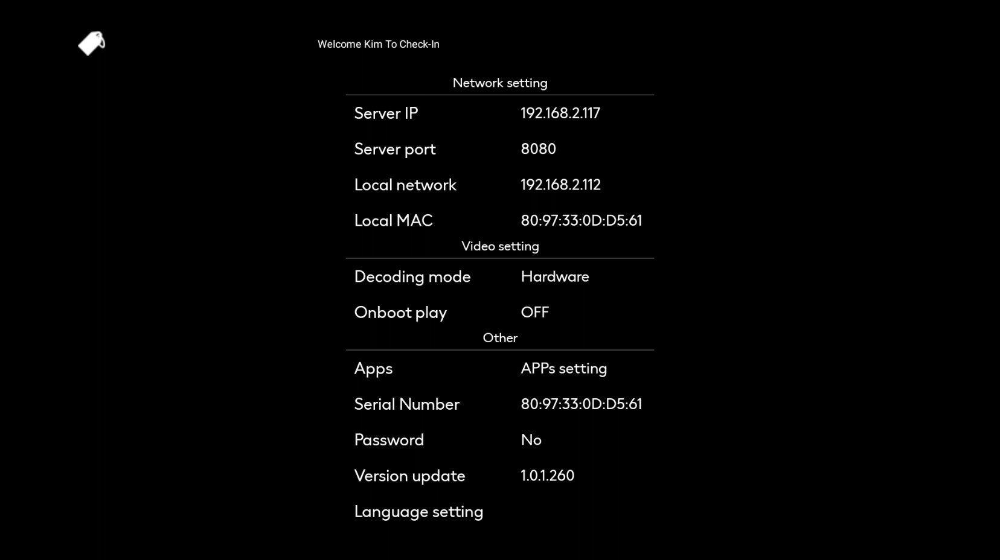

> Introduction

On the `Setting` menu of the APK, you can configure the communication address between the terminal device and the IPTV server, as well as other setting information of the APK.

## Network Setting

>Introduction

In `Network Setting`, you can view and configure the IPTV server IP address and port, as well as the local communication IP and MAC address.

 

**Server IP**: In `Server IP`, both IP addresses and domain names can be filled in, and they must point to the IPTV server. If the filled - in IP address or domain name fails to access the IPTV server, the device needs to be re - configured so that the device can access the IP or domain name of the IPTV server and thus conduct data communication with the IPTV server.

**Server Port**: In `Server Port`, Only by filling in the correct Server Port can communication with the server be established. The Server Port is the same as the Port number on the Web page. Just fill in that Port number.

**Local Network**: `Local network` indicates the IP address acquired by the current device, which is provided by the Android system. Please confirm that this address can communicate with the server's IP or domain name.

**Local MAC**: `Local MAC` represents the MAC information obtained by the current device. This MAC information will be stored in the system as the unique credential of the system. In the management system, the MAC information will be used to manage the corresponding device and assign the hotel room number.