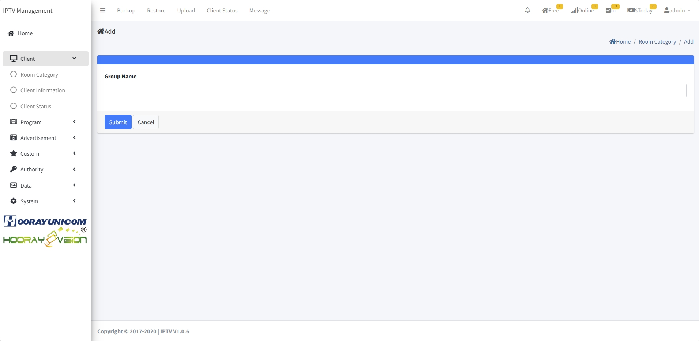
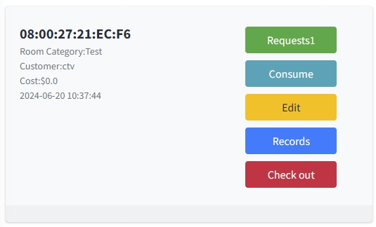
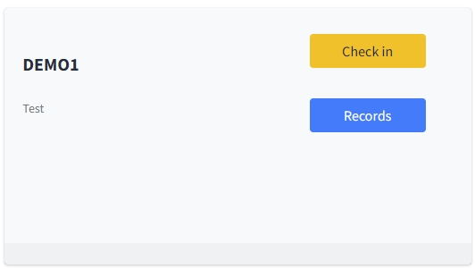

# Управление клиентами

> Введение

В `Client Menu` администратор настраивает информацию об оборудовании в `Room Category`, `Client Information` и `Client Status`, а также выполняет заселение/выезд гостей.

## Категории комнат

> Введение

В `Room Category` задайте логические группы (этажи/зоны/назначения). Например, для техники на 1‑м этаже можно создать категорию `L1`.

Нажмите `Add`, чтобы создать категорию.

1. **Group Name**: имя логической категории.

## Информация об устройствах

> Введение

В `Client Information` показаны онлайн/офлайн устройства. Здесь управляют именем устройства, категорией, номером комнаты и др. Переключатель хотспота Wi‑Fi оставлен для совместимости (функция недоступна на Android).

Нажмите `Add`, чтобы добавить устройство.

 

**MAC Address**: если устройства нет в списке, его можно добавить вручную по MAC; найденные сервером устройства показывают MAC только для просмотра.

**IP**: IP‑адрес последнего выхода онлайн.

**Room Name**: имя комнаты.

**Room Category**: категория комнаты.

**WiFi**: включение/выключение хотспота, имя и пароль (функция заблокирована в Android).

## Статус клиентов

> Введение

В `Client Status` выполняются заселение/выезд устройств, просмотр истории гостей и их покупок. Для заселённых устройств доступны онлайн-заказы, записи потребления, редактирование данных гостя и история заездов.

**Request**: перейти к заявкам гостя, подтвердить или удалить бронь; результат отображается в приложении.

**Consume**: открыть записи текущих покупок гостя.

**Edit**: изменить имя гостя и приветственное сообщение.

**Records**: посмотреть историю заселений устройства (гость, время заезда/выезда, покупки).

**Check-Out**: вывести устройство в статус выезда — сервисы становятся недоступны.

**Check-In**: заселение; укажите имя гостя и приветствие на экране.

