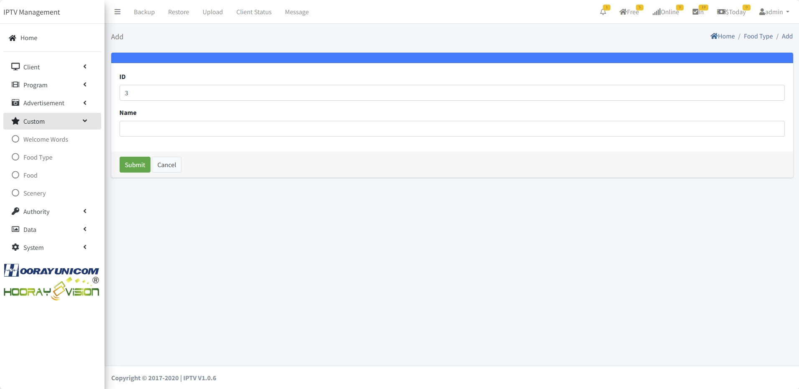

# Настройки сервиса (кастом)

> Введение

В `Custom Menu` управляется показ приветствия на главной, онлайн-заказ еды и блок информации о достопримечательностях.

## Приветствие

> Введение

В `Welcome Words` задаётся текст приветствия на терминале; при заселении сообщение показывается на главной.

Нажмите `Add`, чтобы добавить приветствие.

**ID**: генерируется системой.

**Clients**: устройства, где будет показано приветствие.

**Welcome Words**: текст приветствия.

## Категории блюд

> Введение

В `Food Type` создаются категории блюд для удобной навигации.

Нажмите `Add`, чтобы добавить категорию.

**ID**: генерируется системой.

**Name**: название категории.

## Блюда

> Введение

В `Food` показаны блюда для заказа: фото, название, цена, категория, описание, количество заказов. Можно добавлять, редактировать и удалять.

Нажмите `Add`, чтобы добавить блюдо.

**Image**: загрузите изображение (PNG/JPG).

**Name**: название блюда.

**Price($)**: цена.

**Food Type**: категория блюда.

**Description**: описание для отображения на терминале.

## Достопримечательности

> Введение

В `Scenery` добавляются изображения и описания — об услугах отеля или окрестных местах.

Нажмите `Add`, чтобы добавить карточку.

Загрузите обложку и заголовок, сохраните, затем добавьте подробные изображения и текст через кнопку «+».

 

