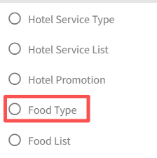

# Настройка питания

>Введение

 

В разделе `Hotel Service` администраторы настраивают типы питания и элементы меню для системы заказов IPTV в номере, а также могут просматривать, принимать, завершать или отменять заказы гостей в режиме реального времени. Гости размещают заказы непосредственно со своего телевизора, а администраторы управляют всем процессом заказа через платформу.

## Тип питания

>Введение

 

В разделе `Тип питания` администратор создает, изменяет и удаляет категории элементов.

Нажмите кнопку `Добавить`, чтобы создать новую категорию элемента

**ID**: В `ID` система IPTV автоматически создает номер ID, который используется для сортировки различных категорий; чем меньше число, тем выше его позиция в списке.

**Название**: `Название` используется для отображения питания категории.

## Список питания

>Введение

На странице `Список питания` администратор управляет элементами питания, доступными для заказа в номерах, путем создания, редактирования или удаления продуктов по мере необходимости.

Нажмите кнопку `Добавить`, чтобы создать новый элемент для онлайн-заказов.

**Изображение**: В `Изображение` загрузите изображения продуктов, и изображения будут отображаться на терминале; в настоящее время поддерживается загрузка только одного изображения.

**Фоновое изображение**: Фоновое изображение, которое будет отображаться на терминале, когда пользователь выбирает или нажимает на элемент питания.

**Название**: `Название` используется для идентификации названия питания, отображаемого на терминале.

**Цена**: В `Цена` используется для отображения цены за единицу, по которой продается питание.

**Тип питания**: Выберите `Тип питания` для питания, и питание появится в соответствующем списке категорий на терминале.

**Описание**: В `Описание` используется для описания конкретной информации и деталей об этом питании.

## Состояние заказа

>Введение

 

На этой странице администратор может просматривать детали заказа элементов, отправленного подписчиком с терминала. Когда администратор получает заказ подписчика, он может `принять` заказ с помощью кнопки RECEIVE или `отменить` заказ подписчика с помощью кнопки DELETE. После принятия заказа подписчика, когда заказ будет выполнен, администратор может снова нажать кнопку Finish, чтобы `завершить` весь процесс заказа.
