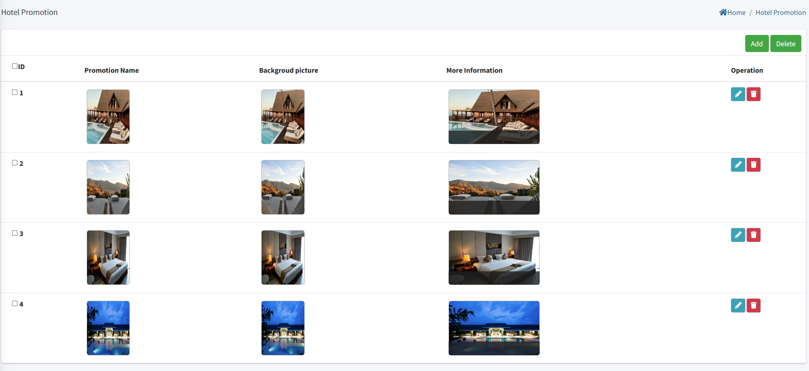

# Настройка промо-акций отеля

> Введение

В разделе «Промо-акции отеля» администраторы могут создавать, изменять и удалять рекламные объявления отеля.

Нажмите кнопку «Добавить», чтобы создать новую промо-акцию отеля.

**Название промо-акции**: Введите уникальное название для промо-акции отеля. Это название будет отображаться на терминале IPTV для гостей.

**Изображение постера**: Загрузите основную миниатюру или обложку для этой промо-акции. Это изображение будет отображаться в списке промо-акций на IPTV. (Можно загрузить только одно изображение.)

**Фоновое изображение**: Загрузите фоновое изображение для страницы деталей промо-акции. Когда гость нажимает на промо-акцию, это изображение будет использоваться как основной фон.

## Добавить детали промо-акции отеля

> Введение

Этот раздел доступен при редактировании существующей промо-акции. Здесь вы можете загрузить дополнительные изображения, чтобы предоставить гостям больше информации о мероприятии или услуге.

**Поддержка нескольких изображений:** В отличие от полей с одним изображением (постер и фон), этот раздел позволяет загружать несколько изображений для страницы деталей промо-акции.

**Детальное содержание:** Эти изображения дополняют описание промо-акции, отображаемое на терминале IPTV, позволяя гостям увидеть больше аспектов предложения (например, виды объектов, отдельные блюда или сцены мероприятий).

**Изображение**: Загрузите изображения промо-акции отеля для отображения на терминале. В настоящее время можно загрузить только одно изображение.

**Содержание**: Используйте «Содержание» для описания конкретной информации и деталей о загруженном изображении.
