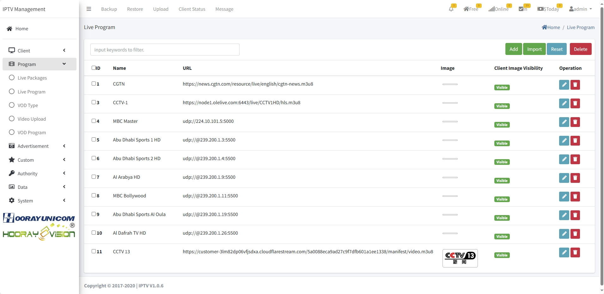

# Настройки Live

> Введение

Здесь настраиваются разделы `Live` и `VOD`.

## Live Packages

> Введение

Здесь создаются категории live-каналов. Категории упорядочивают источники и упрощают поиск. Нажмите `Add`, чтобы добавить категорию; привяжите источники и загрузите постер.

1. **ID**: генерируется системой; меньший ID — выше в списке (можно менять в редактировании).
2. **Name**: название категории.
3. **Price**: цена; 0 — бесплатно, иначе гостю предложат оплату.
4. **Image**: постер категории.
!>  **Рекомендация: размер постера 300x210**
5. **Live Program Select**: выберите каналы для категории.
6. **STB Select**: выберите устройства, которым доступна категория.

## Live Program

> Введение

Здесь добавляются/редактируются/удаляются live-каналы (поддерживаются UDP/RTP/HTTP-TS/FLV/RTMP/RTMPS/HLS/DASH и др.). Нажмите `Add`, чтобы создать канал.

1.  **ID** : генерируется системой; можно править без конфликтов. Меньший ID — выше в списке.
2.  **Name** : имя канала на приставке.
4.  **URL** : адрес потока.
5.  **Image** : логотип канала.
